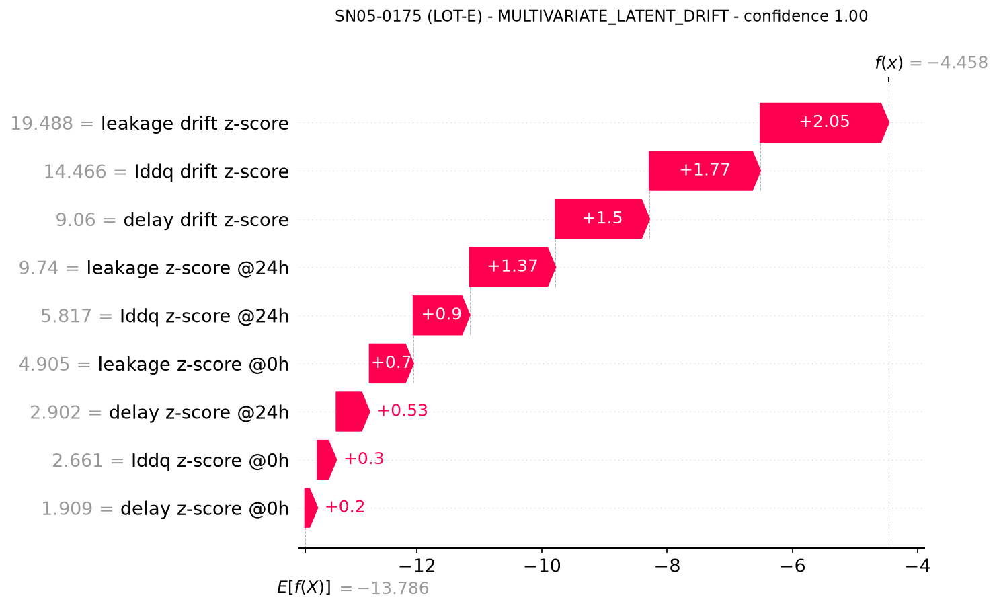
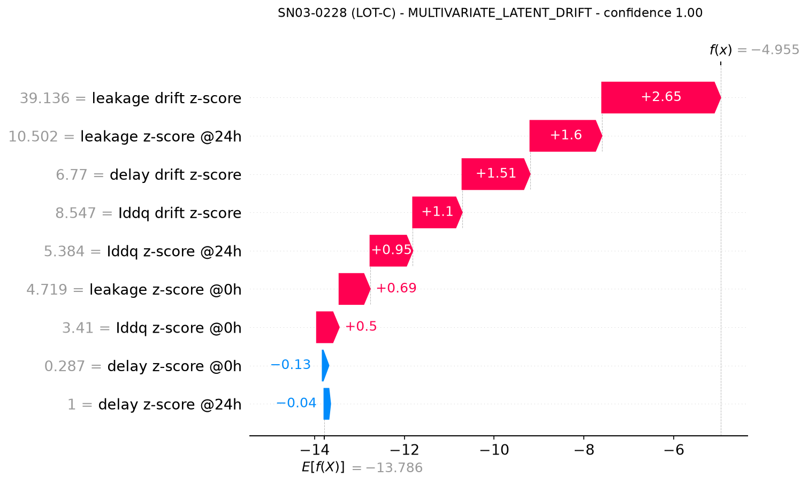
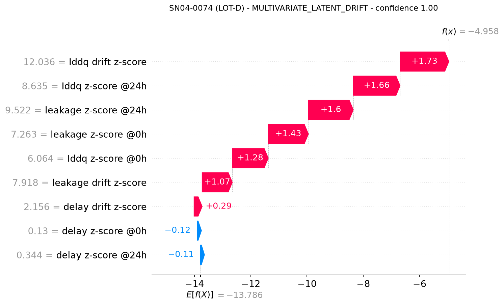
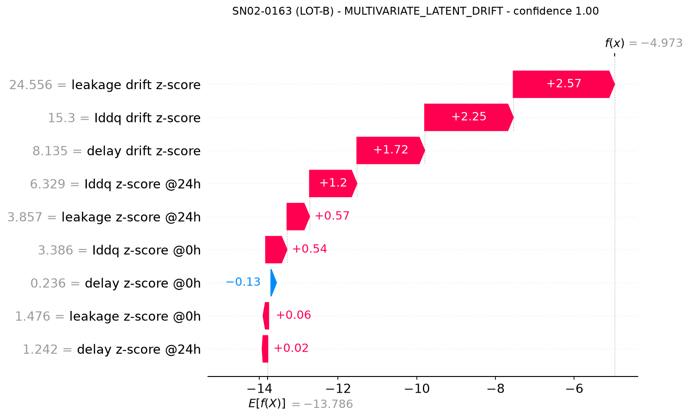
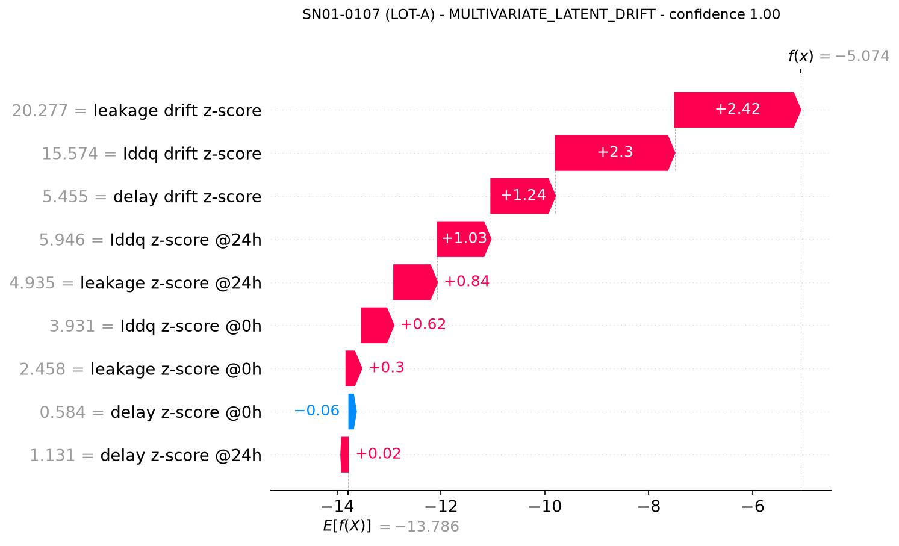
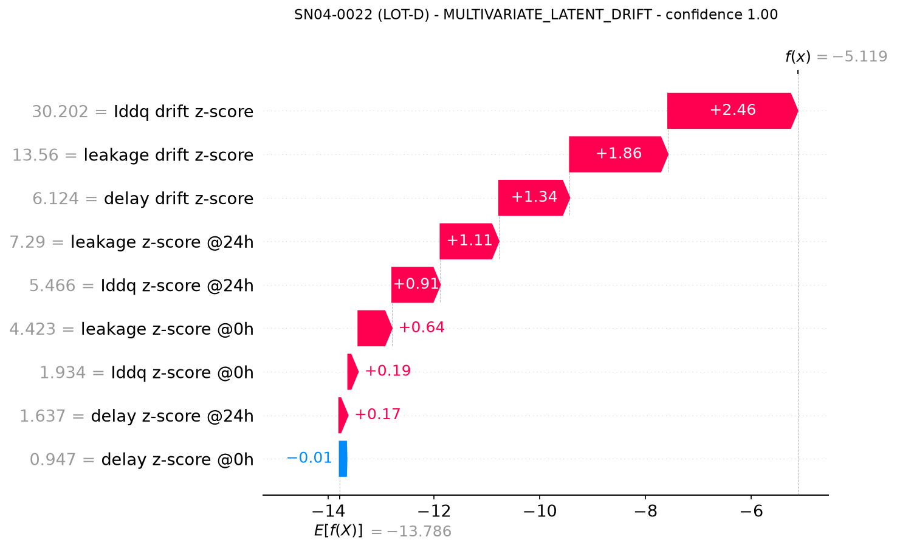
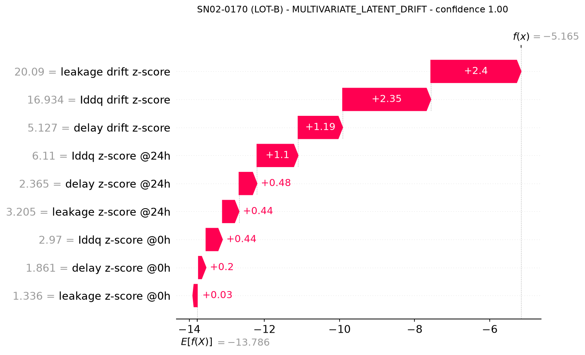
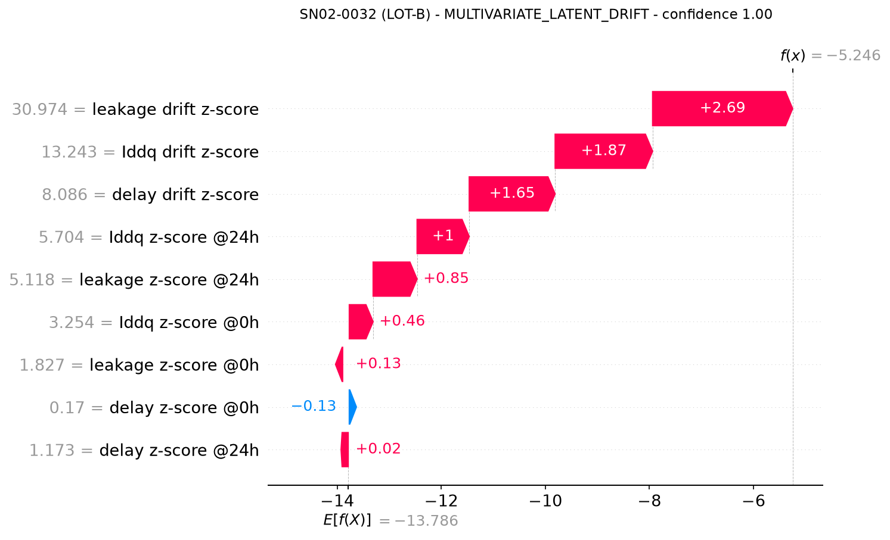
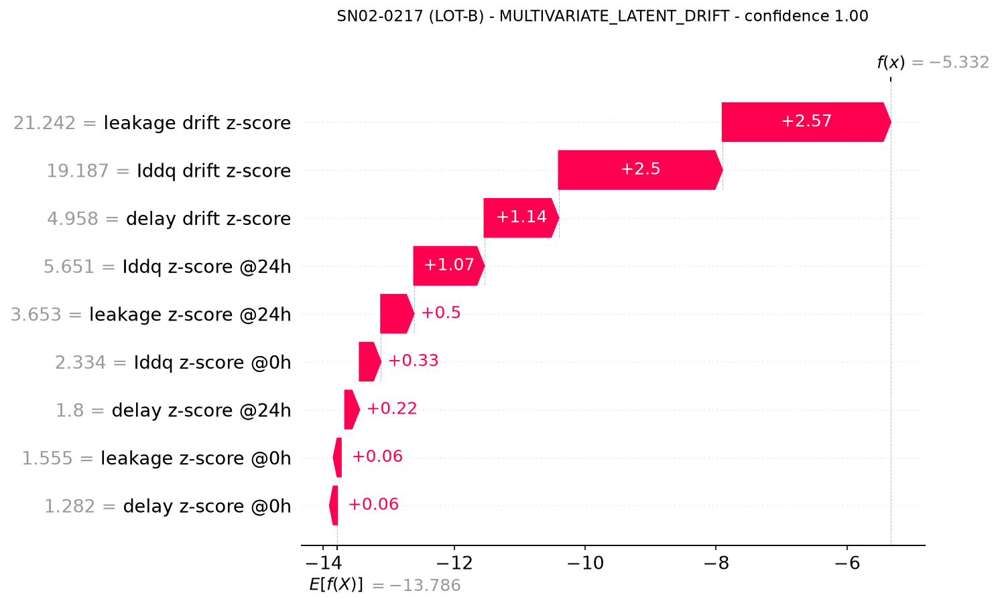

# QA Inspection Report - Module A Dynamic Outlier Detection

_Generated 2026-09-30 07:19 UTC | attribution method: shap_

## Executive Summary

- Chips screened: **1978** across **8** lots
- Chips rejected: **222** (11.22%)
- Static-limit breaches: **0**
- Root causes: SINGLE_PARAMETER_PEER_OUTLIER: 121, MULTIVARIATE_LATENT_DRIFT: 101
- Risk levels: CRITICAL: 139, ELEVATED: 50, HIGH: 33

### Detection Metrics (ground truth available)

| Scope | Recall | Precision | F2 | TN | FP | FN | TP |
|---|---|---|---|---|---|---|---|
| Full population | 0.993 | 0.640 | 0.894 | 1755 | 80 | 1 | 142 |
| Calibration split | 1.000 | 0.632 | 0.896 | 875 | 42 | 0 | 72 |
| Held-out split | 0.986 | 0.648 | 0.893 | 880 | 38 | 1 | 70 |
| Static-limit screening (baseline) | 0.000 | 0.000 | 0.000 | 1835 | 0 | 143 | 0 |
| Isolation Forest only | 0.916 | 0.814 | 0.894 | 1805 | 30 | 12 | 131 |
| DPAT rule only | 0.993 | 0.676 | 0.908 | 1767 | 68 | 1 | 142 |

## Rejected Serial Numbers

| Serial | Lot | Root cause | Risk | Confidence |
|---|---|---|---|---|
| SN05-0175 | LOT-E | MULTIVARIATE_LATENT_DRIFT | CRITICAL | 1.000 |
| SN03-0228 | LOT-C | MULTIVARIATE_LATENT_DRIFT | CRITICAL | 1.000 |
| SN04-0074 | LOT-D | MULTIVARIATE_LATENT_DRIFT | CRITICAL | 1.000 |
| SN02-0163 | LOT-B | MULTIVARIATE_LATENT_DRIFT | CRITICAL | 1.000 |
| SN01-0107 | LOT-A | MULTIVARIATE_LATENT_DRIFT | CRITICAL | 1.000 |
| SN07-0071 | LOT-G | MULTIVARIATE_LATENT_DRIFT | CRITICAL | 1.000 |
| SN04-0022 | LOT-D | MULTIVARIATE_LATENT_DRIFT | CRITICAL | 1.000 |
| SN02-0170 | LOT-B | MULTIVARIATE_LATENT_DRIFT | CRITICAL | 1.000 |
| SN02-0032 | LOT-B | MULTIVARIATE_LATENT_DRIFT | CRITICAL | 1.000 |
| SN02-0217 | LOT-B | MULTIVARIATE_LATENT_DRIFT | CRITICAL | 1.000 |
| SN04-0051 | LOT-D | MULTIVARIATE_LATENT_DRIFT | CRITICAL | 1.000 |
| SN03-0265 | LOT-C | MULTIVARIATE_LATENT_DRIFT | CRITICAL | 1.000 |
| SN01-0187 | LOT-A | MULTIVARIATE_LATENT_DRIFT | CRITICAL | 1.000 |
| SN08-0028 | LOT-H | MULTIVARIATE_LATENT_DRIFT | CRITICAL | 1.000 |
| SN08-0226 | LOT-H | SINGLE_PARAMETER_PEER_OUTLIER | CRITICAL | 1.000 |
| SN08-0231 | LOT-H | SINGLE_PARAMETER_PEER_OUTLIER | CRITICAL | 1.000 |
| SN08-0164 | LOT-H | SINGLE_PARAMETER_PEER_OUTLIER | CRITICAL | 1.000 |
| SN08-0139 | LOT-H | MULTIVARIATE_LATENT_DRIFT | CRITICAL | 1.000 |
| SN05-0044 | LOT-E | MULTIVARIATE_LATENT_DRIFT | CRITICAL | 1.000 |
| SN01-0018 | LOT-A | MULTIVARIATE_LATENT_DRIFT | CRITICAL | 1.000 |
| SN04-0052 | LOT-D | MULTIVARIATE_LATENT_DRIFT | CRITICAL | 1.000 |
| SN05-0119 | LOT-E | SINGLE_PARAMETER_PEER_OUTLIER | CRITICAL | 1.000 |
| SN05-0051 | LOT-E | MULTIVARIATE_LATENT_DRIFT | CRITICAL | 1.000 |
| SN07-0172 | LOT-G | MULTIVARIATE_LATENT_DRIFT | CRITICAL | 1.000 |
| SN01-0057 | LOT-A | MULTIVARIATE_LATENT_DRIFT | CRITICAL | 1.000 |
| SN01-0072 | LOT-A | MULTIVARIATE_LATENT_DRIFT | CRITICAL | 1.000 |
| SN03-0100 | LOT-C | SINGLE_PARAMETER_PEER_OUTLIER | CRITICAL | 1.000 |
| SN02-0012 | LOT-B | MULTIVARIATE_LATENT_DRIFT | CRITICAL | 1.000 |
| SN08-0219 | LOT-H | MULTIVARIATE_LATENT_DRIFT | CRITICAL | 1.000 |
| SN08-0098 | LOT-H | MULTIVARIATE_LATENT_DRIFT | CRITICAL | 1.000 |
| SN02-0105 | LOT-B | SINGLE_PARAMETER_PEER_OUTLIER | CRITICAL | 1.000 |
| SN03-0086 | LOT-C | MULTIVARIATE_LATENT_DRIFT | CRITICAL | 1.000 |
| SN06-0037 | LOT-F | SINGLE_PARAMETER_PEER_OUTLIER | CRITICAL | 1.000 |
| SN07-0146 | LOT-G | MULTIVARIATE_LATENT_DRIFT | CRITICAL | 1.000 |
| SN01-0225 | LOT-A | MULTIVARIATE_LATENT_DRIFT | CRITICAL | 1.000 |
| SN02-0019 | LOT-B | SINGLE_PARAMETER_PEER_OUTLIER | CRITICAL | 1.000 |
| SN08-0041 | LOT-H | SINGLE_PARAMETER_PEER_OUTLIER | CRITICAL | 1.000 |
| SN03-0077 | LOT-C | MULTIVARIATE_LATENT_DRIFT | CRITICAL | 1.000 |
| SN03-0071 | LOT-C | MULTIVARIATE_LATENT_DRIFT | CRITICAL | 1.000 |
| SN05-0090 | LOT-E | SINGLE_PARAMETER_PEER_OUTLIER | CRITICAL | 1.000 |
| SN08-0016 | LOT-H | SINGLE_PARAMETER_PEER_OUTLIER | CRITICAL | 1.000 |
| SN05-0112 | LOT-E | SINGLE_PARAMETER_PEER_OUTLIER | CRITICAL | 1.000 |
| SN03-0218 | LOT-C | SINGLE_PARAMETER_PEER_OUTLIER | CRITICAL | 0.999 |
| SN04-0249 | LOT-D | MULTIVARIATE_LATENT_DRIFT | CRITICAL | 0.999 |
| SN02-0195 | LOT-B | SINGLE_PARAMETER_PEER_OUTLIER | CRITICAL | 0.999 |
| SN06-0166 | LOT-F | SINGLE_PARAMETER_PEER_OUTLIER | CRITICAL | 0.999 |
| SN02-0140 | LOT-B | SINGLE_PARAMETER_PEER_OUTLIER | CRITICAL | 0.999 |
| SN07-0188 | LOT-G | MULTIVARIATE_LATENT_DRIFT | CRITICAL | 0.999 |
| SN03-0045 | LOT-C | MULTIVARIATE_LATENT_DRIFT | CRITICAL | 0.999 |
| SN03-0154 | LOT-C | SINGLE_PARAMETER_PEER_OUTLIER | CRITICAL | 0.999 |
| SN02-0044 | LOT-B | SINGLE_PARAMETER_PEER_OUTLIER | CRITICAL | 0.999 |
| SN01-0243 | LOT-A | MULTIVARIATE_LATENT_DRIFT | CRITICAL | 0.999 |
| SN02-0134 | LOT-B | MULTIVARIATE_LATENT_DRIFT | CRITICAL | 0.999 |
| SN02-0254 | LOT-B | SINGLE_PARAMETER_PEER_OUTLIER | CRITICAL | 0.999 |
| SN08-0181 | LOT-H | MULTIVARIATE_LATENT_DRIFT | CRITICAL | 0.998 |
| SN01-0177 | LOT-A | SINGLE_PARAMETER_PEER_OUTLIER | CRITICAL | 0.998 |
| SN05-0103 | LOT-E | MULTIVARIATE_LATENT_DRIFT | CRITICAL | 0.998 |
| SN01-0251 | LOT-A | MULTIVARIATE_LATENT_DRIFT | CRITICAL | 0.998 |
| SN04-0231 | LOT-D | MULTIVARIATE_LATENT_DRIFT | CRITICAL | 0.998 |
| SN05-0082 | LOT-E | MULTIVARIATE_LATENT_DRIFT | CRITICAL | 0.998 |
| SN07-0098 | LOT-G | MULTIVARIATE_LATENT_DRIFT | CRITICAL | 0.998 |
| SN08-0171 | LOT-H | SINGLE_PARAMETER_PEER_OUTLIER | CRITICAL | 0.998 |
| SN03-0224 | LOT-C | MULTIVARIATE_LATENT_DRIFT | CRITICAL | 0.998 |
| SN03-0167 | LOT-C | SINGLE_PARAMETER_PEER_OUTLIER | CRITICAL | 0.997 |
| SN02-0071 | LOT-B | SINGLE_PARAMETER_PEER_OUTLIER | CRITICAL | 0.997 |
| SN04-0087 | LOT-D | MULTIVARIATE_LATENT_DRIFT | CRITICAL | 0.997 |
| SN02-0183 | LOT-B | MULTIVARIATE_LATENT_DRIFT | CRITICAL | 0.997 |
| SN02-0232 | LOT-B | SINGLE_PARAMETER_PEER_OUTLIER | CRITICAL | 0.997 |
| SN03-0050 | LOT-C | MULTIVARIATE_LATENT_DRIFT | CRITICAL | 0.996 |
| SN03-0016 | LOT-C | SINGLE_PARAMETER_PEER_OUTLIER | CRITICAL | 0.996 |
| SN02-0124 | LOT-B | MULTIVARIATE_LATENT_DRIFT | CRITICAL | 0.996 |
| SN07-0141 | LOT-G | SINGLE_PARAMETER_PEER_OUTLIER | CRITICAL | 0.996 |
| SN06-0136 | LOT-F | MULTIVARIATE_LATENT_DRIFT | CRITICAL | 0.996 |
| SN07-0205 | LOT-G | MULTIVARIATE_LATENT_DRIFT | CRITICAL | 0.995 |
| SN02-0017 | LOT-B | SINGLE_PARAMETER_PEER_OUTLIER | CRITICAL | 0.995 |
| SN02-0088 | LOT-B | SINGLE_PARAMETER_PEER_OUTLIER | CRITICAL | 0.993 |
| SN02-0206 | LOT-B | SINGLE_PARAMETER_PEER_OUTLIER | CRITICAL | 0.993 |
| SN03-0133 | LOT-C | SINGLE_PARAMETER_PEER_OUTLIER | CRITICAL | 0.993 |
| SN03-0212 | LOT-C | MULTIVARIATE_LATENT_DRIFT | CRITICAL | 0.993 |
| SN08-0151 | LOT-H | SINGLE_PARAMETER_PEER_OUTLIER | CRITICAL | 0.993 |
| SN07-0029 | LOT-G | MULTIVARIATE_LATENT_DRIFT | CRITICAL | 0.991 |
| SN01-0004 | LOT-A | MULTIVARIATE_LATENT_DRIFT | CRITICAL | 0.991 |
| SN03-0140 | LOT-C | SINGLE_PARAMETER_PEER_OUTLIER | CRITICAL | 0.991 |
| SN08-0034 | LOT-H | MULTIVARIATE_LATENT_DRIFT | CRITICAL | 0.991 |
| SN02-0152 | LOT-B | SINGLE_PARAMETER_PEER_OUTLIER | CRITICAL | 0.990 |
| SN06-0117 | LOT-F | MULTIVARIATE_LATENT_DRIFT | CRITICAL | 0.990 |
| SN04-0270 | LOT-D | SINGLE_PARAMETER_PEER_OUTLIER | CRITICAL | 0.989 |
| SN03-0259 | LOT-C | MULTIVARIATE_LATENT_DRIFT | CRITICAL | 0.989 |
| SN01-0159 | LOT-A | MULTIVARIATE_LATENT_DRIFT | CRITICAL | 0.989 |
| SN08-0029 | LOT-H | SINGLE_PARAMETER_PEER_OUTLIER | CRITICAL | 0.989 |
| SN08-0073 | LOT-H | SINGLE_PARAMETER_PEER_OUTLIER | CRITICAL | 0.987 |
| SN05-0100 | LOT-E | SINGLE_PARAMETER_PEER_OUTLIER | CRITICAL | 0.986 |
| SN01-0007 | LOT-A | SINGLE_PARAMETER_PEER_OUTLIER | CRITICAL | 0.984 |
| SN06-0107 | LOT-F | SINGLE_PARAMETER_PEER_OUTLIER | CRITICAL | 0.984 |
| SN05-0053 | LOT-E | SINGLE_PARAMETER_PEER_OUTLIER | CRITICAL | 0.984 |
| SN08-0015 | LOT-H | MULTIVARIATE_LATENT_DRIFT | CRITICAL | 0.984 |
| SN03-0248 | LOT-C | SINGLE_PARAMETER_PEER_OUTLIER | CRITICAL | 0.977 |
| SN06-0051 | LOT-F | MULTIVARIATE_LATENT_DRIFT | CRITICAL | 0.977 |
| SN08-0170 | LOT-H | MULTIVARIATE_LATENT_DRIFT | CRITICAL | 0.975 |
| SN04-0064 | LOT-D | MULTIVARIATE_LATENT_DRIFT | CRITICAL | 0.974 |
| SN05-0007 | LOT-E | MULTIVARIATE_LATENT_DRIFT | CRITICAL | 0.974 |
| SN03-0168 | LOT-C | SINGLE_PARAMETER_PEER_OUTLIER | CRITICAL | 0.972 |
| SN08-0221 | LOT-H | SINGLE_PARAMETER_PEER_OUTLIER | CRITICAL | 0.971 |
| SN06-0125 | LOT-F | MULTIVARIATE_LATENT_DRIFT | CRITICAL | 0.971 |
| SN02-0028 | LOT-B | MULTIVARIATE_LATENT_DRIFT | CRITICAL | 0.970 |
| SN05-0017 | LOT-E | SINGLE_PARAMETER_PEER_OUTLIER | CRITICAL | 0.969 |
| SN02-0243 | LOT-B | MULTIVARIATE_LATENT_DRIFT | CRITICAL | 0.966 |
| SN07-0120 | LOT-G | MULTIVARIATE_LATENT_DRIFT | CRITICAL | 0.960 |
| SN02-0016 | LOT-B | SINGLE_PARAMETER_PEER_OUTLIER | CRITICAL | 0.958 |
| SN07-0156 | LOT-G | MULTIVARIATE_LATENT_DRIFT | CRITICAL | 0.954 |
| SN02-0274 | LOT-B | SINGLE_PARAMETER_PEER_OUTLIER | CRITICAL | 0.953 |
| SN01-0194 | LOT-A | SINGLE_PARAMETER_PEER_OUTLIER | CRITICAL | 0.951 |
| SN08-0048 | LOT-H | SINGLE_PARAMETER_PEER_OUTLIER | CRITICAL | 0.950 |
| SN04-0225 | LOT-D | SINGLE_PARAMETER_PEER_OUTLIER | CRITICAL | 0.933 |
| SN01-0193 | LOT-A | MULTIVARIATE_LATENT_DRIFT | CRITICAL | 0.928 |
| SN07-0102 | LOT-G | MULTIVARIATE_LATENT_DRIFT | CRITICAL | 0.926 |
| SN01-0035 | LOT-A | SINGLE_PARAMETER_PEER_OUTLIER | CRITICAL | 0.924 |
| SN06-0024 | LOT-F | SINGLE_PARAMETER_PEER_OUTLIER | CRITICAL | 0.924 |
| SN02-0218 | LOT-B | SINGLE_PARAMETER_PEER_OUTLIER | CRITICAL | 0.922 |
| SN05-0179 | LOT-E | SINGLE_PARAMETER_PEER_OUTLIER | CRITICAL | 0.919 |
| SN01-0203 | LOT-A | SINGLE_PARAMETER_PEER_OUTLIER | CRITICAL | 0.914 |
| SN03-0172 | LOT-C | MULTIVARIATE_LATENT_DRIFT | CRITICAL | 0.912 |
| SN01-0160 | LOT-A | SINGLE_PARAMETER_PEER_OUTLIER | CRITICAL | 0.912 |
| SN08-0007 | LOT-H | SINGLE_PARAMETER_PEER_OUTLIER | CRITICAL | 0.910 |
| SN04-0063 | LOT-D | SINGLE_PARAMETER_PEER_OUTLIER | CRITICAL | 0.909 |
| SN04-0120 | LOT-D | MULTIVARIATE_LATENT_DRIFT | CRITICAL | 0.906 |
| SN01-0058 | LOT-A | MULTIVARIATE_LATENT_DRIFT | CRITICAL | 0.892 |
| SN03-0081 | LOT-C | MULTIVARIATE_LATENT_DRIFT | CRITICAL | 0.876 |
| SN08-0232 | LOT-H | SINGLE_PARAMETER_PEER_OUTLIER | CRITICAL | 0.875 |
| SN03-0247 | LOT-C | SINGLE_PARAMETER_PEER_OUTLIER | CRITICAL | 0.869 |
| SN03-0201 | LOT-C | MULTIVARIATE_LATENT_DRIFT | CRITICAL | 0.862 |
| SN04-0065 | LOT-D | MULTIVARIATE_LATENT_DRIFT | CRITICAL | 0.849 |
| SN03-0138 | LOT-C | SINGLE_PARAMETER_PEER_OUTLIER | CRITICAL | 0.824 |
| SN07-0103 | LOT-G | SINGLE_PARAMETER_PEER_OUTLIER | HIGH | 0.816 |
| SN08-0097 | LOT-H | SINGLE_PARAMETER_PEER_OUTLIER | HIGH | 0.814 |
| SN04-0050 | LOT-D | SINGLE_PARAMETER_PEER_OUTLIER | CRITICAL | 0.812 |
| SN03-0126 | LOT-C | MULTIVARIATE_LATENT_DRIFT | CRITICAL | 0.810 |
| SN08-0207 | LOT-H | SINGLE_PARAMETER_PEER_OUTLIER | CRITICAL | 0.795 |
| SN02-0237 | LOT-B | MULTIVARIATE_LATENT_DRIFT | HIGH | 0.794 |
| SN05-0101 | LOT-E | MULTIVARIATE_LATENT_DRIFT | CRITICAL | 0.782 |
| SN08-0115 | LOT-H | SINGLE_PARAMETER_PEER_OUTLIER | CRITICAL | 0.782 |
| SN03-0040 | LOT-C | SINGLE_PARAMETER_PEER_OUTLIER | CRITICAL | 0.782 |
| SN05-0019 | LOT-E | SINGLE_PARAMETER_PEER_OUTLIER | HIGH | 0.779 |
| SN08-0077 | LOT-H | MULTIVARIATE_LATENT_DRIFT | HIGH | 0.778 |
| SN01-0218 | LOT-A | MULTIVARIATE_LATENT_DRIFT | HIGH | 0.777 |
| SN04-0023 | LOT-D | MULTIVARIATE_LATENT_DRIFT | HIGH | 0.762 |
| SN02-0094 | LOT-B | SINGLE_PARAMETER_PEER_OUTLIER | HIGH | 0.757 |
| SN03-0260 | LOT-C | MULTIVARIATE_LATENT_DRIFT | HIGH | 0.757 |
| SN05-0061 | LOT-E | MULTIVARIATE_LATENT_DRIFT | HIGH | 0.752 |
| SN05-0172 | LOT-E | MULTIVARIATE_LATENT_DRIFT | HIGH | 0.743 |
| SN08-0137 | LOT-H | SINGLE_PARAMETER_PEER_OUTLIER | HIGH | 0.742 |
| SN01-0106 | LOT-A | MULTIVARIATE_LATENT_DRIFT | HIGH | 0.740 |
| SN02-0214 | LOT-B | MULTIVARIATE_LATENT_DRIFT | HIGH | 0.740 |
| SN04-0036 | LOT-D | MULTIVARIATE_LATENT_DRIFT | HIGH | 0.737 |
| SN08-0184 | LOT-H | SINGLE_PARAMETER_PEER_OUTLIER | HIGH | 0.732 |
| SN07-0184 | LOT-G | SINGLE_PARAMETER_PEER_OUTLIER | HIGH | 0.729 |
| SN05-0201 | LOT-E | SINGLE_PARAMETER_PEER_OUTLIER | HIGH | 0.722 |
| SN03-0002 | LOT-C | SINGLE_PARAMETER_PEER_OUTLIER | HIGH | 0.718 |
| SN06-0090 | LOT-F | MULTIVARIATE_LATENT_DRIFT | HIGH | 0.709 |
| SN01-0146 | LOT-A | SINGLE_PARAMETER_PEER_OUTLIER | HIGH | 0.706 |
| SN07-0173 | LOT-G | MULTIVARIATE_LATENT_DRIFT | HIGH | 0.701 |
| SN02-0202 | LOT-B | MULTIVARIATE_LATENT_DRIFT | HIGH | 0.697 |
| SN05-0035 | LOT-E | MULTIVARIATE_LATENT_DRIFT | HIGH | 0.690 |
| SN03-0095 | LOT-C | SINGLE_PARAMETER_PEER_OUTLIER | HIGH | 0.690 |
| SN08-0058 | LOT-H | SINGLE_PARAMETER_PEER_OUTLIER | HIGH | 0.680 |
| SN02-0076 | LOT-B | SINGLE_PARAMETER_PEER_OUTLIER | HIGH | 0.679 |
| SN06-0027 | LOT-F | MULTIVARIATE_LATENT_DRIFT | HIGH | 0.675 |
| SN02-0104 | LOT-B | SINGLE_PARAMETER_PEER_OUTLIER | HIGH | 0.674 |
| SN01-0219 | LOT-A | SINGLE_PARAMETER_PEER_OUTLIER | HIGH | 0.662 |
| SN03-0060 | LOT-C | SINGLE_PARAMETER_PEER_OUTLIER | HIGH | 0.659 |
| SN08-0092 | LOT-H | SINGLE_PARAMETER_PEER_OUTLIER | HIGH | 0.651 |
| SN01-0158 | LOT-A | MULTIVARIATE_LATENT_DRIFT | ELEVATED | 0.643 |
| SN02-0027 | LOT-B | SINGLE_PARAMETER_PEER_OUTLIER | HIGH | 0.643 |
| SN04-0007 | LOT-D | SINGLE_PARAMETER_PEER_OUTLIER | ELEVATED | 0.636 |
| SN04-0157 | LOT-D | MULTIVARIATE_LATENT_DRIFT | ELEVATED | 0.635 |
| SN07-0013 | LOT-G | SINGLE_PARAMETER_PEER_OUTLIER | ELEVATED | 0.626 |
| SN01-0221 | LOT-A | SINGLE_PARAMETER_PEER_OUTLIER | ELEVATED | 0.625 |
| SN03-0084 | LOT-C | SINGLE_PARAMETER_PEER_OUTLIER | ELEVATED | 0.622 |
| SN02-0224 | LOT-B | SINGLE_PARAMETER_PEER_OUTLIER | ELEVATED | 0.622 |
| SN03-0051 | LOT-C | SINGLE_PARAMETER_PEER_OUTLIER | ELEVATED | 0.613 |
| SN03-0075 | LOT-C | MULTIVARIATE_LATENT_DRIFT | ELEVATED | 0.611 |
| SN08-0023 | LOT-H | SINGLE_PARAMETER_PEER_OUTLIER | ELEVATED | 0.610 |
| SN08-0174 | LOT-H | MULTIVARIATE_LATENT_DRIFT | ELEVATED | 0.605 |
| SN02-0255 | LOT-B | SINGLE_PARAMETER_PEER_OUTLIER | ELEVATED | 0.601 |
| SN07-0034 | LOT-G | SINGLE_PARAMETER_PEER_OUTLIER | ELEVATED | 0.597 |
| SN04-0208 | LOT-D | MULTIVARIATE_LATENT_DRIFT | ELEVATED | 0.594 |
| SN04-0073 | LOT-D | MULTIVARIATE_LATENT_DRIFT | ELEVATED | 0.594 |
| SN05-0013 | LOT-E | SINGLE_PARAMETER_PEER_OUTLIER | ELEVATED | 0.589 |
| SN08-0159 | LOT-H | SINGLE_PARAMETER_PEER_OUTLIER | ELEVATED | 0.583 |
| SN04-0123 | LOT-D | SINGLE_PARAMETER_PEER_OUTLIER | ELEVATED | 0.579 |
| SN02-0031 | LOT-B | SINGLE_PARAMETER_PEER_OUTLIER | ELEVATED | 0.579 |
| SN04-0244 | LOT-D | SINGLE_PARAMETER_PEER_OUTLIER | ELEVATED | 0.574 |
| SN03-0254 | LOT-C | SINGLE_PARAMETER_PEER_OUTLIER | ELEVATED | 0.569 |
| SN03-0101 | LOT-C | SINGLE_PARAMETER_PEER_OUTLIER | ELEVATED | 0.568 |
| SN01-0052 | LOT-A | SINGLE_PARAMETER_PEER_OUTLIER | ELEVATED | 0.564 |
| SN03-0022 | LOT-C | MULTIVARIATE_LATENT_DRIFT | ELEVATED | 0.561 |
| SN04-0040 | LOT-D | SINGLE_PARAMETER_PEER_OUTLIER | ELEVATED | 0.556 |
| SN08-0149 | LOT-H | SINGLE_PARAMETER_PEER_OUTLIER | ELEVATED | 0.556 |
| SN07-0031 | LOT-G | SINGLE_PARAMETER_PEER_OUTLIER | ELEVATED | 0.555 |
| SN02-0072 | LOT-B | MULTIVARIATE_LATENT_DRIFT | ELEVATED | 0.551 |
| SN08-0102 | LOT-H | SINGLE_PARAMETER_PEER_OUTLIER | ELEVATED | 0.548 |
| SN06-0077 | LOT-F | SINGLE_PARAMETER_PEER_OUTLIER | ELEVATED | 0.547 |
| SN01-0215 | LOT-A | SINGLE_PARAMETER_PEER_OUTLIER | ELEVATED | 0.541 |
| SN06-0139 | LOT-F | SINGLE_PARAMETER_PEER_OUTLIER | ELEVATED | 0.534 |
| SN07-0101 | LOT-G | MULTIVARIATE_LATENT_DRIFT | ELEVATED | 0.533 |
| SN04-0207 | LOT-D | MULTIVARIATE_LATENT_DRIFT | ELEVATED | 0.531 |
| SN02-0125 | LOT-B | SINGLE_PARAMETER_PEER_OUTLIER | ELEVATED | 0.529 |
| SN02-0057 | LOT-B | MULTIVARIATE_LATENT_DRIFT | ELEVATED | 0.525 |
| SN01-0191 | LOT-A | SINGLE_PARAMETER_PEER_OUTLIER | ELEVATED | 0.524 |
| SN06-0004 | LOT-F | SINGLE_PARAMETER_PEER_OUTLIER | ELEVATED | 0.524 |
| SN02-0248 | LOT-B | SINGLE_PARAMETER_PEER_OUTLIER | ELEVATED | 0.521 |
| SN03-0160 | LOT-C | SINGLE_PARAMETER_PEER_OUTLIER | ELEVATED | 0.520 |
| SN03-0150 | LOT-C | SINGLE_PARAMETER_PEER_OUTLIER | ELEVATED | 0.519 |
| SN06-0124 | LOT-F | SINGLE_PARAMETER_PEER_OUTLIER | ELEVATED | 0.517 |
| SN06-0135 | LOT-F | SINGLE_PARAMETER_PEER_OUTLIER | ELEVATED | 0.517 |
| SN03-0005 | LOT-C | SINGLE_PARAMETER_PEER_OUTLIER | ELEVATED | 0.517 |
| SN01-0206 | LOT-A | SINGLE_PARAMETER_PEER_OUTLIER | ELEVATED | 0.517 |
| SN02-0193 | LOT-B | SINGLE_PARAMETER_PEER_OUTLIER | ELEVATED | 0.516 |
| SN04-0273 | LOT-D | SINGLE_PARAMETER_PEER_OUTLIER | ELEVATED | 0.515 |
| SN02-0167 | LOT-B | SINGLE_PARAMETER_PEER_OUTLIER | ELEVATED | 0.509 |
| SN04-0241 | LOT-D | SINGLE_PARAMETER_PEER_OUTLIER | ELEVATED | 0.508 |
| SN04-0061 | LOT-D | SINGLE_PARAMETER_PEER_OUTLIER | ELEVATED | 0.501 |

## Inspection Certificates

### Certificate 001 - SN05-0175 (LOT-E)

**Verdict:** REJECT | **Risk:** CRITICAL | **Root cause:** `MULTIVARIATE_LATENT_DRIFT` | **Confidence:** 1.000

| Parameter | 0h | 24h | Lot median (24h) | Deviation ratio | Peak robust z | Static limit used |
|---|---|---|---|---|---|---|
| Standby Current (Iddq) | 36.20 µA | 56.58 µA | 21.74 µA | 2.60x | 14.5 | 57% |
| Leakage Current (Ileak) | 13.94 µA | 24.69 µA | 5.71 µA | 4.33x | 19.5 | 49% |
| Propagation Delay (tpd) | 9.79 ns | 10.48 ns | 8.87 ns | 1.18x | 9.1 | 70% |

**Parameter contribution:** Standby Current (Iddq) 32%, Leakage Current (Ileak) 44%, Propagation Delay (tpd) 24%

**Top attribution features:** leakage drift z-score (+2.053); Iddq drift z-score (+1.772); delay drift z-score (+1.501)

**Evidence:** Leakage Current (Ileak) reads 24.69 µA at 24h against a lot median of 5.71 µA (4.33x lot median) and uses 49% of the 50 µA datasheet limit. Drift is +77.1% versus a lot-median drift of +6.7%. Coordinated shifts also appear in Standby Current (Iddq), Propagation Delay (tpd).

### Certificate 002 - SN03-0228 (LOT-C)

**Verdict:** REJECT | **Risk:** CRITICAL | **Root cause:** `MULTIVARIATE_LATENT_DRIFT` | **Confidence:** 1.000

| Parameter | 0h | 24h | Lot median (24h) | Deviation ratio | Peak robust z | Static limit used |
|---|---|---|---|---|---|---|
| Standby Current (Iddq) | 29.29 µA | 41.60 µA | 14.53 µA | 2.86x | 8.5 | 42% |
| Leakage Current (Ileak) | 23.50 µA | 44.73 µA | 8.19 µA | 5.46x | 39.1 | 89% |
| Propagation Delay (tpd) | 8.36 ns | 8.83 ns | 8.33 ns | 1.06x | 6.8 | 59% |

**Parameter contribution:** Standby Current (Iddq) 28%, Leakage Current (Ileak) 55%, Propagation Delay (tpd) 17%

**Top attribution features:** leakage drift z-score (+2.645); leakage z-score @24h (+1.599); delay drift z-score (+1.513)

**Evidence:** Leakage Current (Ileak) reads 44.73 µA at 24h against a lot median of 8.19 µA (5.46x lot median) and uses 89% of the 50 µA datasheet limit. Drift is +90.4% versus a lot-median drift of +4.4%. Coordinated shifts also appear in Standby Current (Iddq), Propagation Delay (tpd).

### Certificate 003 - SN04-0074 (LOT-D)

**Verdict:** REJECT | **Risk:** CRITICAL | **Root cause:** `MULTIVARIATE_LATENT_DRIFT` | **Confidence:** 1.000

| Parameter | 0h | 24h | Lot median (24h) | Deviation ratio | Peak robust z | Static limit used |
|---|---|---|---|---|---|---|
| Standby Current (Iddq) | 52.40 µA | 71.06 µA | 17.67 µA | 4.02x | 12.0 | 71% |
| Leakage Current (Ileak) | 24.63 µA | 33.31 µA | 6.43 µA | 5.18x | 9.5 | 67% |
| Propagation Delay (tpd) | 10.25 ns | 10.57 ns | 10.33 ns | 1.02x | 2.2 | 70% |

**Parameter contribution:** Standby Current (Iddq) 52%, Leakage Current (Ileak) 45%, Propagation Delay (tpd) 3%

**Top attribution features:** Iddq drift z-score (+1.734); Iddq z-score @24h (+1.662); leakage z-score @24h (+1.595)

**Evidence:** Standby Current (Iddq) reads 71.06 µA at 24h against a lot median of 17.67 µA (4.02x lot median) and uses 71% of the 100 µA datasheet limit. Drift is +35.6% versus a lot-median drift of +4.5%. Coordinated shifts also appear in Leakage Current (Ileak), Propagation Delay (tpd).

### Certificate 004 - SN02-0163 (LOT-B)

**Verdict:** REJECT | **Risk:** CRITICAL | **Root cause:** `MULTIVARIATE_LATENT_DRIFT` | **Confidence:** 1.000

| Parameter | 0h | 24h | Lot median (24h) | Deviation ratio | Peak robust z | Static limit used |
|---|---|---|---|---|---|---|
| Standby Current (Iddq) | 32.63 µA | 52.66 µA | 18.95 µA | 2.78x | 15.3 | 53% |
| Leakage Current (Ileak) | 10.38 µA | 17.47 µA | 6.95 µA | 2.51x | 24.6 | 35% |
| Propagation Delay (tpd) | 9.79 ns | 10.62 ns | 9.82 ns | 1.08x | 8.1 | 71% |

**Parameter contribution:** Standby Current (Iddq) 45%, Leakage Current (Ileak) 36%, Propagation Delay (tpd) 19%

**Top attribution features:** leakage drift z-score (+2.573); Iddq drift z-score (+2.253); delay drift z-score (+1.722)

**Evidence:** Standby Current (Iddq) reads 52.66 µA at 24h against a lot median of 18.95 µA (2.78x lot median) and uses 53% of the 100 µA datasheet limit. Drift is +61.4% versus a lot-median drift of +6.1%. Coordinated shifts also appear in Leakage Current (Ileak), Propagation Delay (tpd).

### Certificate 005 - SN01-0107 (LOT-A)

**Verdict:** REJECT | **Risk:** CRITICAL | **Root cause:** `MULTIVARIATE_LATENT_DRIFT` | **Confidence:** 1.000

| Parameter | 0h | 24h | Lot median (24h) | Deviation ratio | Peak robust z | Static limit used |
|---|---|---|---|---|---|---|
| Standby Current (Iddq) | 61.49 µA | 84.53 µA | 24.51 µA | 3.45x | 15.6 | 85% |
| Leakage Current (Ileak) | 18.30 µA | 29.98 µA | 9.64 µA | 3.11x | 20.3 | 60% |
| Propagation Delay (tpd) | 8.61 ns | 9.02 ns | 8.46 ns | 1.07x | 5.5 | 60% |

**Parameter contribution:** Standby Current (Iddq) 45%, Leakage Current (Ileak) 41%, Propagation Delay (tpd) 14%

**Top attribution features:** leakage drift z-score (+2.423); Iddq drift z-score (+2.300); delay drift z-score (+1.239)

**Evidence:** Standby Current (Iddq) reads 84.53 µA at 24h against a lot median of 24.51 µA (3.45x lot median) and uses 85% of the 100 µA datasheet limit. Drift is +37.5% versus a lot-median drift of +3.8%. Coordinated shifts also appear in Leakage Current (Ileak), Propagation Delay (tpd).

### Certificate 006 - SN07-0071 (LOT-G)

**Verdict:** REJECT | **Risk:** CRITICAL | **Root cause:** `MULTIVARIATE_LATENT_DRIFT` | **Confidence:** 1.000

| Parameter | 0h | 24h | Lot median (24h) | Deviation ratio | Peak robust z | Static limit used |
|---|---|---|---|---|---|---|
| Standby Current (Iddq) | 30.39 µA | 46.59 µA | 17.12 µA | 2.72x | 15.3 | 47% |
| Leakage Current (Ileak) | 15.20 µA | 24.84 µA | 10.67 µA | 2.33x | 23.5 | 50% |
| Propagation Delay (tpd) | 9.68 ns | 10.20 ns | 8.96 ns | 1.14x | 5.1 | 68% |

**Parameter contribution:** Standby Current (Iddq) 43%, Leakage Current (Ileak) 35%, Propagation Delay (tpd) 22%

**Top attribution features:** leakage drift z-score (+2.532); Iddq drift z-score (+2.273); delay drift z-score (+1.099)

**Evidence:** Standby Current (Iddq) reads 46.59 µA at 24h against a lot median of 17.12 µA (2.72x lot median) and uses 47% of the 100 µA datasheet limit. Drift is +53.3% versus a lot-median drift of +5.2%. Coordinated shifts also appear in Leakage Current (Ileak), Propagation Delay (tpd).

### Certificate 007 - SN04-0022 (LOT-D)

**Verdict:** REJECT | **Risk:** CRITICAL | **Root cause:** `MULTIVARIATE_LATENT_DRIFT` | **Confidence:** 1.000

| Parameter | 0h | 24h | Lot median (24h) | Deviation ratio | Peak robust z | Static limit used |
|---|---|---|---|---|---|---|
| Standby Current (Iddq) | 28.18 µA | 51.47 µA | 17.67 µA | 2.91x | 30.2 | 51% |
| Leakage Current (Ileak) | 17.34 µA | 27.01 µA | 6.43 µA | 4.20x | 13.6 | 54% |
| Propagation Delay (tpd) | 10.76 ns | 11.46 ns | 10.33 ns | 1.11x | 6.1 | 76% |

**Parameter contribution:** Standby Current (Iddq) 41%, Leakage Current (Ileak) 42%, Propagation Delay (tpd) 17%

**Top attribution features:** Iddq drift z-score (+2.455); leakage drift z-score (+1.858); delay drift z-score (+1.338)

**Evidence:** Leakage Current (Ileak) reads 27.01 µA at 24h against a lot median of 6.43 µA (4.20x lot median) and uses 54% of the 50 µA datasheet limit. Drift is +55.8% versus a lot-median drift of +6.5%. Coordinated shifts also appear in Standby Current (Iddq), Propagation Delay (tpd).

### Certificate 008 - SN02-0170 (LOT-B)

**Verdict:** REJECT | **Risk:** CRITICAL | **Root cause:** `MULTIVARIATE_LATENT_DRIFT` | **Confidence:** 1.000

| Parameter | 0h | 24h | Lot median (24h) | Deviation ratio | Peak robust z | Static limit used |
|---|---|---|---|---|---|---|
| Standby Current (Iddq) | 30.78 µA | 51.49 µA | 18.95 µA | 2.72x | 16.9 | 51% |
| Leakage Current (Ileak) | 10.01 µA | 15.69 µA | 6.95 µA | 2.26x | 20.1 | 31% |
| Propagation Delay (tpd) | 10.71 ns | 11.34 ns | 9.82 ns | 1.15x | 5.1 | 76% |

**Parameter contribution:** Standby Current (Iddq) 45%, Leakage Current (Ileak) 33%, Propagation Delay (tpd) 22%

**Top attribution features:** leakage drift z-score (+2.404); Iddq drift z-score (+2.348); delay drift z-score (+1.185)

**Evidence:** Standby Current (Iddq) reads 51.49 µA at 24h against a lot median of 18.95 µA (2.72x lot median) and uses 51% of the 100 µA datasheet limit. Drift is +67.3% versus a lot-median drift of +6.1%. Coordinated shifts also appear in Leakage Current (Ileak), Propagation Delay (tpd).

### Certificate 009 - SN02-0032 (LOT-B)

**Verdict:** REJECT | **Risk:** CRITICAL | **Root cause:** `MULTIVARIATE_LATENT_DRIFT` | **Confidence:** 1.000

| Parameter | 0h | 24h | Lot median (24h) | Deviation ratio | Peak robust z | Static limit used |
|---|---|---|---|---|---|---|
| Standby Current (Iddq) | 32.04 µA | 49.33 µA | 18.95 µA | 2.60x | 13.2 | 49% |
| Leakage Current (Ileak) | 11.30 µA | 20.91 µA | 6.95 µA | 3.01x | 31.0 | 42% |
| Propagation Delay (tpd) | 9.76 ns | 10.57 ns | 9.82 ns | 1.08x | 8.1 | 70% |

**Parameter contribution:** Standby Current (Iddq) 38%, Leakage Current (Ileak) 42%, Propagation Delay (tpd) 19%

**Top attribution features:** leakage drift z-score (+2.692); Iddq drift z-score (+1.873); delay drift z-score (+1.651)

**Evidence:** Leakage Current (Ileak) reads 20.91 µA at 24h against a lot median of 6.95 µA (3.01x lot median) and uses 42% of the 50 µA datasheet limit. Drift is +85.0% versus a lot-median drift of +4.6%. Coordinated shifts also appear in Standby Current (Iddq), Propagation Delay (tpd).

### Certificate 010 - SN02-0217 (LOT-B)

**Verdict:** REJECT | **Risk:** CRITICAL | **Root cause:** `MULTIVARIATE_LATENT_DRIFT` | **Confidence:** 1.000

| Parameter | 0h | 24h | Lot median (24h) | Deviation ratio | Peak robust z | Static limit used |
|---|---|---|---|---|---|---|
| Standby Current (Iddq) | 27.96 µA | 49.05 µA | 18.95 µA | 2.59x | 19.2 | 49% |
| Leakage Current (Ileak) | 10.59 µA | 16.91 µA | 6.95 µA | 2.43x | 21.2 | 34% |
| Propagation Delay (tpd) | 10.38 ns | 10.97 ns | 9.82 ns | 1.12x | 5.0 | 73% |

**Parameter contribution:** Standby Current (Iddq) 46%, Leakage Current (Ileak) 37%, Propagation Delay (tpd) 17%

**Top attribution features:** leakage drift z-score (+2.571); Iddq drift z-score (+2.501); delay drift z-score (+1.137)

**Evidence:** Standby Current (Iddq) reads 49.05 µA at 24h against a lot median of 18.95 µA (2.59x lot median) and uses 49% of the 100 µA datasheet limit. Drift is +75.4% versus a lot-median drift of +6.1%. Coordinated shifts also appear in Leakage Current (Ileak), Propagation Delay (tpd).

### Certificate 011 - SN04-0051 (LOT-D)

**Verdict:** REJECT | **Risk:** CRITICAL | **Root cause:** `MULTIVARIATE_LATENT_DRIFT` | **Confidence:** 1.000

| Parameter | 0h | 24h | Lot median (24h) | Deviation ratio | Peak robust z | Static limit used |
|---|---|---|---|---|---|---|
| Standby Current (Iddq) | 33.14 µA | 48.11 µA | 17.67 µA | 2.72x | 15.7 | 48% |
| Leakage Current (Ileak) | 16.72 µA | 27.07 µA | 6.43 µA | 4.21x | 15.2 | 54% |
| Propagation Delay (tpd) | 10.85 ns | 11.47 ns | 10.33 ns | 1.11x | 5.3 | 76% |

**Parameter contribution:** Standby Current (Iddq) 40%, Leakage Current (Ileak) 44%, Propagation Delay (tpd) 16%

**Top attribution features:** Iddq drift z-score (+2.154); leakage drift z-score (+1.996); delay drift z-score (+1.164)

**Evidence:** Leakage Current (Ileak) reads 27.07 µA at 24h against a lot median of 6.43 µA (4.21x lot median) and uses 54% of the 50 µA datasheet limit. Drift is +61.9% versus a lot-median drift of +6.5%. Coordinated shifts also appear in Standby Current (Iddq), Propagation Delay (tpd).

### Certificate 012 - SN03-0265 (LOT-C)

**Verdict:** REJECT | **Risk:** CRITICAL | **Root cause:** `MULTIVARIATE_LATENT_DRIFT` | **Confidence:** 1.000

| Parameter | 0h | 24h | Lot median (24h) | Deviation ratio | Peak robust z | Static limit used |
|---|---|---|---|---|---|---|
| Standby Current (Iddq) | 31.55 µA | 43.74 µA | 14.53 µA | 3.01x | 7.7 | 44% |
| Leakage Current (Ileak) | 39.78 µA | 46.80 µA | 8.19 µA | 5.72x | 11.1 | 94% |
| Propagation Delay (tpd) | 8.44 ns | 8.96 ns | 8.33 ns | 1.08x | 7.4 | 60% |

**Parameter contribution:** Standby Current (Iddq) 31%, Leakage Current (Ileak) 52%, Propagation Delay (tpd) 17%

**Top attribution features:** leakage z-score @0h (+1.875); leakage z-score @24h (+1.713); delay drift z-score (+1.453)

**Evidence:** Leakage Current (Ileak) reads 46.80 µA at 24h against a lot median of 8.19 µA (5.72x lot median) and uses 94% of the 50 µA datasheet limit. Drift is +17.6% versus a lot-median drift of +4.4%. Coordinated shifts also appear in Standby Current (Iddq), Propagation Delay (tpd).

### Certificate 013 - SN01-0187 (LOT-A)

**Verdict:** REJECT | **Risk:** CRITICAL | **Root cause:** `MULTIVARIATE_LATENT_DRIFT` | **Confidence:** 1.000

| Parameter | 0h | 24h | Lot median (24h) | Deviation ratio | Peak robust z | Static limit used |
|---|---|---|---|---|---|---|
| Standby Current (Iddq) | 59.26 µA | 85.24 µA | 24.51 µA | 3.48x | 18.5 | 85% |
| Leakage Current (Ileak) | 16.07 µA | 24.07 µA | 9.64 µA | 2.50x | 15.4 | 48% |
| Propagation Delay (tpd) | 8.38 ns | 8.85 ns | 8.46 ns | 1.05x | 6.9 | 59% |

**Parameter contribution:** Standby Current (Iddq) 49%, Leakage Current (Ileak) 33%, Propagation Delay (tpd) 18%

**Top attribution features:** Iddq drift z-score (+2.469); leakage drift z-score (+2.149); delay drift z-score (+1.568)

**Evidence:** Standby Current (Iddq) reads 85.24 µA at 24h against a lot median of 24.51 µA (3.48x lot median) and uses 85% of the 100 µA datasheet limit. Drift is +43.8% versus a lot-median drift of +3.8%. Coordinated shifts also appear in Leakage Current (Ileak), Propagation Delay (tpd).

### Certificate 014 - SN08-0028 (LOT-H)

**Verdict:** REJECT | **Risk:** CRITICAL | **Root cause:** `MULTIVARIATE_LATENT_DRIFT` | **Confidence:** 1.000

| Parameter | 0h | 24h | Lot median (24h) | Deviation ratio | Peak robust z | Static limit used |
|---|---|---|---|---|---|---|
| Standby Current (Iddq) | 25.09 µA | 37.57 µA | 12.78 µA | 2.94x | 16.2 | 38% |
| Leakage Current (Ileak) | 12.89 µA | 18.59 µA | 5.03 µA | 3.70x | 20.5 | 37% |
| Propagation Delay (tpd) | 8.41 ns | 8.67 ns | 8.48 ns | 1.02x | 2.1 | 58% |

**Parameter contribution:** Standby Current (Iddq) 44%, Leakage Current (Ileak) 53%, Propagation Delay (tpd) 3%

**Top attribution features:** leakage drift z-score (+2.632); Iddq drift z-score (+2.510); leakage z-score @24h (+1.193)

**Evidence:** Leakage Current (Ileak) reads 18.59 µA at 24h against a lot median of 5.03 µA (3.70x lot median) and uses 37% of the 50 µA datasheet limit. Drift is +44.2% versus a lot-median drift of +3.5%. Coordinated shifts also appear in Standby Current (Iddq), Propagation Delay (tpd).

### Certificate 015 - SN08-0226 (LOT-H)

**Verdict:** REJECT | **Risk:** CRITICAL | **Root cause:** `SINGLE_PARAMETER_PEER_OUTLIER` | **Confidence:** 1.000

| Parameter | 0h | 24h | Lot median (24h) | Deviation ratio | Peak robust z | Static limit used |
|---|---|---|---|---|---|---|
| Standby Current (Iddq) | 20.39 µA | 21.46 µA | 12.78 µA | 1.68x | 1.6 | 21% |
| Leakage Current (Ileak) | 4.65 µA | 4.69 µA | 5.03 µA | 0.93x | 1.2 | 9% |
| Propagation Delay (tpd) | 11.80 ns | 12.90 ns | 8.48 ns | 1.52x | 11.8 | 86% |

**Parameter contribution:** Standby Current (Iddq) 5%, Leakage Current (Ileak) 1%, Propagation Delay (tpd) 95%

**Top attribution features:** delay z-score @24h (+3.150); delay z-score @0h (+2.426); delay drift z-score (+2.265)

**Evidence:** Propagation Delay (tpd) reads 12.90 ns at 24h against a lot median of 8.48 ns (1.52x lot median) and uses 86% of the 15 ns datasheet limit. Drift is +9.3% versus a lot-median drift of +1.3%.

### Certificate 016 - SN08-0231 (LOT-H)

**Verdict:** REJECT | **Risk:** CRITICAL | **Root cause:** `SINGLE_PARAMETER_PEER_OUTLIER` | **Confidence:** 1.000

| Parameter | 0h | 24h | Lot median (24h) | Deviation ratio | Peak robust z | Static limit used |
|---|---|---|---|---|---|---|
| Standby Current (Iddq) | 16.62 µA | 17.29 µA | 12.78 µA | 1.35x | 0.9 | 17% |
| Leakage Current (Ileak) | 9.55 µA | 9.66 µA | 5.03 µA | 1.92x | 2.3 | 19% |
| Propagation Delay (tpd) | 10.67 ns | 11.82 ns | 8.48 ns | 1.39x | 11.4 | 79% |

**Parameter contribution:** Standby Current (Iddq) 0%, Leakage Current (Ileak) 7%, Propagation Delay (tpd) 93%

**Top attribution features:** delay z-score @24h (+2.812); delay drift z-score (+2.447); delay z-score @0h (+2.242)

**Evidence:** Propagation Delay (tpd) reads 11.82 ns at 24h against a lot median of 8.48 ns (1.39x lot median) and uses 79% of the 15 ns datasheet limit. Drift is +10.7% versus a lot-median drift of +1.3%.

### Certificate 017 - SN08-0164 (LOT-H)

**Verdict:** REJECT | **Risk:** CRITICAL | **Root cause:** `SINGLE_PARAMETER_PEER_OUTLIER` | **Confidence:** 1.000

| Parameter | 0h | 24h | Lot median (24h) | Deviation ratio | Peak robust z | Static limit used |
|---|---|---|---|---|---|---|
| Standby Current (Iddq) | 11.84 µA | 12.01 µA | 12.78 µA | 0.94x | 1.3 | 12% |
| Leakage Current (Ileak) | 5.19 µA | 5.38 µA | 5.03 µA | 1.07x | 0.2 | 11% |
| Propagation Delay (tpd) | 11.51 ns | 13.29 ns | 8.48 ns | 1.57x | 17.2 | 89% |

**Parameter contribution:** Standby Current (Iddq) 1%, Leakage Current (Ileak) 0%, Propagation Delay (tpd) 99%

**Top attribution features:** delay z-score @24h (+3.139); delay drift z-score (+2.783); delay z-score @0h (+2.540)

**Evidence:** Propagation Delay (tpd) reads 13.29 ns at 24h against a lot median of 8.48 ns (1.57x lot median) and uses 89% of the 15 ns datasheet limit. Drift is +15.5% versus a lot-median drift of +1.3%.

### Certificate 018 - SN08-0139 (LOT-H)

**Verdict:** REJECT | **Risk:** CRITICAL | **Root cause:** `MULTIVARIATE_LATENT_DRIFT` | **Confidence:** 1.000

| Parameter | 0h | 24h | Lot median (24h) | Deviation ratio | Peak robust z | Static limit used |
|---|---|---|---|---|---|---|
| Standby Current (Iddq) | 19.69 µA | 27.71 µA | 12.78 µA | 2.17x | 12.9 | 28% |
| Leakage Current (Ileak) | 7.72 µA | 12.27 µA | 5.03 µA | 2.44x | 27.9 | 25% |
| Propagation Delay (tpd) | 8.39 ns | 8.98 ns | 8.48 ns | 1.06x | 6.9 | 60% |

**Parameter contribution:** Standby Current (Iddq) 33%, Leakage Current (Ileak) 44%, Propagation Delay (tpd) 23%

**Top attribution features:** leakage drift z-score (+2.945); Iddq drift z-score (+2.169); delay drift z-score (+1.762)

**Evidence:** Leakage Current (Ileak) reads 12.27 µA at 24h against a lot median of 5.03 µA (2.44x lot median) and uses 25% of the 50 µA datasheet limit. Drift is +59.0% versus a lot-median drift of +3.5%. Coordinated shifts also appear in Standby Current (Iddq), Propagation Delay (tpd).

### Certificate 019 - SN05-0044 (LOT-E)

**Verdict:** REJECT | **Risk:** CRITICAL | **Root cause:** `MULTIVARIATE_LATENT_DRIFT` | **Confidence:** 1.000

| Parameter | 0h | 24h | Lot median (24h) | Deviation ratio | Peak robust z | Static limit used |
|---|---|---|---|---|---|---|
| Standby Current (Iddq) | 43.61 µA | 46.59 µA | 21.74 µA | 2.14x | 4.1 | 47% |
| Leakage Current (Ileak) | 27.59 µA | 30.61 µA | 5.71 µA | 5.36x | 12.8 | 61% |
| Propagation Delay (tpd) | 7.60 ns | 7.66 ns | 8.87 ns | 0.86x | 2.2 | 51% |

**Parameter contribution:** Standby Current (Iddq) 21%, Leakage Current (Ileak) 65%, Propagation Delay (tpd) 14%

**Top attribution features:** leakage z-score @0h (+2.711); leakage z-score @24h (+2.564); Iddq z-score @24h (+0.850)

**Evidence:** Leakage Current (Ileak) reads 30.61 µA at 24h against a lot median of 5.71 µA (5.36x lot median) and uses 61% of the 50 µA datasheet limit. Drift is +11.0% versus a lot-median drift of +6.7%. Coordinated shifts also appear in Standby Current (Iddq), Propagation Delay (tpd).

### Certificate 020 - SN01-0018 (LOT-A)

**Verdict:** REJECT | **Risk:** CRITICAL | **Root cause:** `MULTIVARIATE_LATENT_DRIFT` | **Confidence:** 1.000

| Parameter | 0h | 24h | Lot median (24h) | Deviation ratio | Peak robust z | Static limit used |
|---|---|---|---|---|---|---|
| Standby Current (Iddq) | 39.31 µA | 61.03 µA | 24.51 µA | 2.49x | 23.8 | 61% |
| Leakage Current (Ileak) | 14.77 µA | 22.22 µA | 9.64 µA | 2.31x | 15.7 | 44% |
| Propagation Delay (tpd) | 8.90 ns | 9.23 ns | 8.46 ns | 1.09x | 4.0 | 62% |

**Parameter contribution:** Standby Current (Iddq) 48%, Leakage Current (Ileak) 37%, Propagation Delay (tpd) 15%

**Top attribution features:** Iddq drift z-score (+2.878); leakage drift z-score (+2.332); delay drift z-score (+0.984)

**Evidence:** Standby Current (Iddq) reads 61.03 µA at 24h against a lot median of 24.51 µA (2.49x lot median) and uses 61% of the 100 µA datasheet limit. Drift is +55.2% versus a lot-median drift of +3.8%. Coordinated shifts also appear in Leakage Current (Ileak), Propagation Delay (tpd).

### Certificate 021 - SN04-0052 (LOT-D)

**Verdict:** REJECT | **Risk:** CRITICAL | **Root cause:** `MULTIVARIATE_LATENT_DRIFT` | **Confidence:** 1.000

| Parameter | 0h | 24h | Lot median (24h) | Deviation ratio | Peak robust z | Static limit used |
|---|---|---|---|---|---|---|
| Standby Current (Iddq) | 29.24 µA | 39.49 µA | 17.67 µA | 2.24x | 11.8 | 39% |
| Leakage Current (Ileak) | 8.81 µA | 14.22 µA | 6.43 µA | 2.21x | 15.1 | 28% |
| Propagation Delay (tpd) | 11.69 ns | 12.38 ns | 10.33 ns | 1.20x | 5.4 | 83% |

**Parameter contribution:** Standby Current (Iddq) 37%, Leakage Current (Ileak) 30%, Propagation Delay (tpd) 33%

**Top attribution features:** leakage drift z-score (+2.062); Iddq drift z-score (+1.978); delay drift z-score (+1.286)

**Evidence:** Standby Current (Iddq) reads 39.49 µA at 24h against a lot median of 17.67 µA (2.24x lot median) and uses 39% of the 100 µA datasheet limit. Drift is +35.1% versus a lot-median drift of +4.5%. Coordinated shifts also appear in Leakage Current (Ileak), Propagation Delay (tpd).

### Certificate 022 - SN05-0119 (LOT-E)

**Verdict:** REJECT | **Risk:** CRITICAL | **Root cause:** `SINGLE_PARAMETER_PEER_OUTLIER` | **Confidence:** 1.000

| Parameter | 0h | 24h | Lot median (24h) | Deviation ratio | Peak robust z | Static limit used |
|---|---|---|---|---|---|---|
| Standby Current (Iddq) | 20.60 µA | 23.26 µA | 21.74 µA | 1.07x | 2.0 | 23% |
| Leakage Current (Ileak) | 5.41 µA | 5.79 µA | 5.71 µA | 1.01x | 0.1 | 12% |
| Propagation Delay (tpd) | 12.73 ns | 14.08 ns | 8.87 ns | 1.59x | 14.4 | 94% |

**Parameter contribution:** Standby Current (Iddq) 3%, Leakage Current (Ileak) 0%, Propagation Delay (tpd) 97%

**Top attribution features:** delay z-score @24h (+2.940); delay drift z-score (+2.682); delay z-score @0h (+2.396)

**Evidence:** Propagation Delay (tpd) reads 14.08 ns at 24h against a lot median of 8.87 ns (1.59x lot median) and uses 94% of the 15 ns datasheet limit. Drift is +10.6% versus a lot-median drift of +1.1%.

### Certificate 023 - SN05-0051 (LOT-E)

**Verdict:** REJECT | **Risk:** CRITICAL | **Root cause:** `MULTIVARIATE_LATENT_DRIFT` | **Confidence:** 1.000

| Parameter | 0h | 24h | Lot median (24h) | Deviation ratio | Peak robust z | Static limit used |
|---|---|---|---|---|---|---|
| Standby Current (Iddq) | 31.98 µA | 45.04 µA | 21.74 µA | 2.07x | 10.0 | 45% |
| Leakage Current (Ileak) | 9.37 µA | 14.23 µA | 5.71 µA | 2.49x | 12.5 | 28% |
| Propagation Delay (tpd) | 8.88 ns | 9.60 ns | 8.87 ns | 1.08x | 10.7 | 64% |

**Parameter contribution:** Standby Current (Iddq) 31%, Leakage Current (Ileak) 40%, Propagation Delay (tpd) 29%

**Top attribution features:** delay drift z-score (+2.165); leakage drift z-score (+2.002); Iddq drift z-score (+1.562)

**Evidence:** Leakage Current (Ileak) reads 14.23 µA at 24h against a lot median of 5.71 µA (2.49x lot median) and uses 28% of the 50 µA datasheet limit. Drift is +51.9% versus a lot-median drift of +6.7%. Coordinated shifts also appear in Standby Current (Iddq), Propagation Delay (tpd).

### Certificate 024 - SN07-0172 (LOT-G)

**Verdict:** REJECT | **Risk:** CRITICAL | **Root cause:** `MULTIVARIATE_LATENT_DRIFT` | **Confidence:** 1.000

| Parameter | 0h | 24h | Lot median (24h) | Deviation ratio | Peak robust z | Static limit used |
|---|---|---|---|---|---|---|
| Standby Current (Iddq) | 25.04 µA | 36.56 µA | 17.12 µA | 2.14x | 13.0 | 37% |
| Leakage Current (Ileak) | 15.83 µA | 25.32 µA | 10.67 µA | 2.37x | 22.1 | 51% |
| Propagation Delay (tpd) | 9.13 ns | 9.55 ns | 8.96 ns | 1.07x | 4.1 | 64% |

**Parameter contribution:** Standby Current (Iddq) 40%, Leakage Current (Ileak) 47%, Propagation Delay (tpd) 14%

**Top attribution features:** leakage drift z-score (+2.847); Iddq drift z-score (+2.174); delay drift z-score (+1.006)

**Evidence:** Leakage Current (Ileak) reads 25.32 µA at 24h against a lot median of 10.67 µA (2.37x lot median) and uses 51% of the 50 µA datasheet limit. Drift is +59.9% versus a lot-median drift of +5.0%. Coordinated shifts also appear in Standby Current (Iddq), Propagation Delay (tpd).

### Certificate 025 - SN01-0057 (LOT-A)

**Verdict:** REJECT | **Risk:** CRITICAL | **Root cause:** `MULTIVARIATE_LATENT_DRIFT` | **Confidence:** 1.000

| Parameter | 0h | 24h | Lot median (24h) | Deviation ratio | Peak robust z | Static limit used |
|---|---|---|---|---|---|---|
| Standby Current (Iddq) | 23.60 µA | 24.21 µA | 24.51 µA | 0.99x | 0.6 | 24% |
| Leakage Current (Ileak) | 9.03 µA | 10.78 µA | 9.64 µA | 1.12x | 4.9 | 22% |
| Propagation Delay (tpd) | 11.26 ns | 12.52 ns | 8.46 ns | 1.48x | 15.2 | 83% |

**Parameter contribution:** Standby Current (Iddq) 0%, Leakage Current (Ileak) 11%, Propagation Delay (tpd) 89%

**Top attribution features:** delay drift z-score (+2.522); delay z-score @24h (+2.503); delay z-score @0h (+2.172)

**Evidence:** Propagation Delay (tpd) reads 12.52 ns at 24h against a lot median of 8.46 ns (1.48x lot median) and uses 83% of the 15 ns datasheet limit. Drift is +11.2% versus a lot-median drift of +1.1%. Coordinated shifts also appear in Leakage Current (Ileak).

### Certificate 026 - SN01-0072 (LOT-A)

**Verdict:** REJECT | **Risk:** CRITICAL | **Root cause:** `MULTIVARIATE_LATENT_DRIFT` | **Confidence:** 1.000

| Parameter | 0h | 24h | Lot median (24h) | Deviation ratio | Peak robust z | Static limit used |
|---|---|---|---|---|---|---|
| Standby Current (Iddq) | 37.88 µA | 51.70 µA | 24.51 µA | 2.11x | 15.1 | 52% |
| Leakage Current (Ileak) | 14.48 µA | 23.48 µA | 9.64 µA | 2.44x | 19.7 | 47% |
| Propagation Delay (tpd) | 8.79 ns | 9.08 ns | 8.46 ns | 1.07x | 3.5 | 61% |

**Parameter contribution:** Standby Current (Iddq) 44%, Leakage Current (Ileak) 46%, Propagation Delay (tpd) 10%

**Top attribution features:** leakage drift z-score (+2.815); Iddq drift z-score (+2.709); delay drift z-score (+0.762)

**Evidence:** Leakage Current (Ileak) reads 23.48 µA at 24h against a lot median of 9.64 µA (2.44x lot median) and uses 47% of the 50 µA datasheet limit. Drift is +62.2% versus a lot-median drift of +5.1%. Coordinated shifts also appear in Standby Current (Iddq), Propagation Delay (tpd).

### Certificate 027 - SN03-0100 (LOT-C)

**Verdict:** REJECT | **Risk:** CRITICAL | **Root cause:** `SINGLE_PARAMETER_PEER_OUTLIER` | **Confidence:** 1.000

| Parameter | 0h | 24h | Lot median (24h) | Deviation ratio | Peak robust z | Static limit used |
|---|---|---|---|---|---|---|
| Standby Current (Iddq) | 12.31 µA | 13.03 µA | 14.53 µA | 0.90x | 0.3 | 13% |
| Leakage Current (Ileak) | 7.53 µA | 7.76 µA | 8.19 µA | 0.95x | 0.7 | 16% |
| Propagation Delay (tpd) | 13.15 ns | 14.06 ns | 8.33 ns | 1.69x | 11.3 | 94% |

**Parameter contribution:** Standby Current (Iddq) 0%, Leakage Current (Ileak) 0%, Propagation Delay (tpd) 100%

**Top attribution features:** delay z-score @24h (+3.093); delay z-score @0h (+2.618); delay drift z-score (+2.418)

**Evidence:** Propagation Delay (tpd) reads 14.06 ns at 24h against a lot median of 8.33 ns (1.69x lot median) and uses 94% of the 15 ns datasheet limit. Drift is +6.9% versus a lot-median drift of +1.1%.

### Certificate 028 - SN02-0012 (LOT-B)

**Verdict:** REJECT | **Risk:** CRITICAL | **Root cause:** `MULTIVARIATE_LATENT_DRIFT` | **Confidence:** 1.000

| Parameter | 0h | 24h | Lot median (24h) | Deviation ratio | Peak robust z | Static limit used |
|---|---|---|---|---|---|---|
| Standby Current (Iddq) | 27.03 µA | 37.80 µA | 18.95 µA | 1.99x | 9.3 | 38% |
| Leakage Current (Ileak) | 12.12 µA | 18.60 µA | 6.95 µA | 2.68x | 18.8 | 37% |
| Propagation Delay (tpd) | 9.78 ns | 10.44 ns | 9.82 ns | 1.06x | 6.2 | 70% |

**Parameter contribution:** Standby Current (Iddq) 30%, Leakage Current (Ileak) 48%, Propagation Delay (tpd) 22%

**Top attribution features:** leakage drift z-score (+2.675); delay drift z-score (+1.654); Iddq drift z-score (+1.450)

**Evidence:** Leakage Current (Ileak) reads 18.60 µA at 24h against a lot median of 6.95 µA (2.68x lot median) and uses 37% of the 50 µA datasheet limit. Drift is +53.5% versus a lot-median drift of +4.6%. Coordinated shifts also appear in Standby Current (Iddq), Propagation Delay (tpd).

### Certificate 029 - SN08-0219 (LOT-H)

**Verdict:** REJECT | **Risk:** CRITICAL | **Root cause:** `MULTIVARIATE_LATENT_DRIFT` | **Confidence:** 1.000

| Parameter | 0h | 24h | Lot median (24h) | Deviation ratio | Peak robust z | Static limit used |
|---|---|---|---|---|---|---|
| Standby Current (Iddq) | 23.12 µA | 31.34 µA | 12.78 µA | 2.45x | 11.0 | 31% |
| Leakage Current (Ileak) | 7.96 µA | 11.69 µA | 5.03 µA | 2.33x | 21.8 | 23% |
| Propagation Delay (tpd) | 8.49 ns | 8.92 ns | 8.48 ns | 1.05x | 4.5 | 59% |

**Parameter contribution:** Standby Current (Iddq) 37%, Leakage Current (Ileak) 46%, Propagation Delay (tpd) 17%

**Top attribution features:** leakage drift z-score (+2.904); Iddq drift z-score (+1.962); delay drift z-score (+1.197)

**Evidence:** Leakage Current (Ileak) reads 11.69 µA at 24h against a lot median of 5.03 µA (2.33x lot median) and uses 23% of the 50 µA datasheet limit. Drift is +46.9% versus a lot-median drift of +3.5%. Coordinated shifts also appear in Standby Current (Iddq), Propagation Delay (tpd).

### Certificate 030 - SN08-0098 (LOT-H)

**Verdict:** REJECT | **Risk:** CRITICAL | **Root cause:** `MULTIVARIATE_LATENT_DRIFT` | **Confidence:** 1.000

| Parameter | 0h | 24h | Lot median (24h) | Deviation ratio | Peak robust z | Static limit used |
|---|---|---|---|---|---|---|
| Standby Current (Iddq) | 18.35 µA | 26.51 µA | 12.78 µA | 2.07x | 14.2 | 27% |
| Leakage Current (Ileak) | 8.22 µA | 10.66 µA | 5.03 µA | 2.12x | 13.1 | 21% |
| Propagation Delay (tpd) | 9.28 ns | 9.50 ns | 8.48 ns | 1.12x | 2.8 | 63% |

**Parameter contribution:** Standby Current (Iddq) 43%, Leakage Current (Ileak) 36%, Propagation Delay (tpd) 22%

**Top attribution features:** Iddq drift z-score (+2.603); leakage drift z-score (+2.143); delay z-score @24h (+0.789)

**Evidence:** Standby Current (Iddq) reads 26.51 µA at 24h against a lot median of 12.78 µA (2.07x lot median) and uses 27% of the 100 µA datasheet limit. Drift is +44.4% versus a lot-median drift of +5.2%. Coordinated shifts also appear in Leakage Current (Ileak), Propagation Delay (tpd).

### Certificate 031 - SN02-0105 (LOT-B)

**Verdict:** REJECT | **Risk:** CRITICAL | **Root cause:** `SINGLE_PARAMETER_PEER_OUTLIER` | **Confidence:** 1.000

| Parameter | 0h | 24h | Lot median (24h) | Deviation ratio | Peak robust z | Static limit used |
|---|---|---|---|---|---|---|
| Standby Current (Iddq) | 27.62 µA | 30.15 µA | 18.95 µA | 1.59x | 2.3 | 30% |
| Leakage Current (Ileak) | 39.99 µA | 46.12 µA | 6.95 µA | 6.64x | 14.4 | 92% |
| Propagation Delay (tpd) | 9.55 ns | 9.63 ns | 9.82 ns | 0.98x | 0.7 | 64% |

**Parameter contribution:** Standby Current (Iddq) 8%, Leakage Current (Ileak) 92%, Propagation Delay (tpd) 0%

**Top attribution features:** leakage z-score @24h (+3.184); leakage z-score @0h (+3.153); leakage drift z-score (+0.629)

**Evidence:** Leakage Current (Ileak) reads 46.12 µA at 24h against a lot median of 6.95 µA (6.64x lot median) and uses 92% of the 50 µA datasheet limit. Drift is +15.3% versus a lot-median drift of +4.6%.

### Certificate 032 - SN03-0086 (LOT-C)

**Verdict:** REJECT | **Risk:** CRITICAL | **Root cause:** `MULTIVARIATE_LATENT_DRIFT` | **Confidence:** 1.000

| Parameter | 0h | 24h | Lot median (24h) | Deviation ratio | Peak robust z | Static limit used |
|---|---|---|---|---|---|---|
| Standby Current (Iddq) | 22.18 µA | 30.99 µA | 14.53 µA | 2.13x | 8.0 | 31% |
| Leakage Current (Ileak) | 23.08 µA | 33.30 µA | 8.19 µA | 4.07x | 18.2 | 67% |
| Propagation Delay (tpd) | 8.20 ns | 8.48 ns | 8.33 ns | 1.02x | 3.3 | 57% |

**Parameter contribution:** Standby Current (Iddq) 27%, Leakage Current (Ileak) 64%, Propagation Delay (tpd) 9%

**Top attribution features:** leakage drift z-score (+2.623); leakage z-score @24h (+1.294); Iddq drift z-score (+1.282)

**Evidence:** Leakage Current (Ileak) reads 33.30 µA at 24h against a lot median of 8.19 µA (4.07x lot median) and uses 67% of the 50 µA datasheet limit. Drift is +44.3% versus a lot-median drift of +4.4%. Coordinated shifts also appear in Standby Current (Iddq), Propagation Delay (tpd).

### Certificate 033 - SN06-0037 (LOT-F)

**Verdict:** REJECT | **Risk:** CRITICAL | **Root cause:** `SINGLE_PARAMETER_PEER_OUTLIER` | **Confidence:** 1.000

| Parameter | 0h | 24h | Lot median (24h) | Deviation ratio | Peak robust z | Static limit used |
|---|---|---|---|---|---|---|
| Standby Current (Iddq) | 20.36 µA | 21.00 µA | 21.75 µA | 0.97x | 0.7 | 21% |
| Leakage Current (Ileak) | 7.56 µA | 7.76 µA | 7.94 µA | 0.98x | 0.7 | 16% |
| Propagation Delay (tpd) | 13.56 ns | 14.30 ns | 9.80 ns | 1.46x | 8.9 | 95% |

**Parameter contribution:** Standby Current (Iddq) 0%, Leakage Current (Ileak) 0%, Propagation Delay (tpd) 100%

**Top attribution features:** delay z-score @24h (+2.932); delay drift z-score (+2.445); delay z-score @0h (+2.409)

**Evidence:** Propagation Delay (tpd) reads 14.30 ns at 24h against a lot median of 9.80 ns (1.46x lot median) and uses 95% of the 15 ns datasheet limit. Drift is +5.5% versus a lot-median drift of +0.8%.

### Certificate 034 - SN07-0146 (LOT-G)

**Verdict:** REJECT | **Risk:** CRITICAL | **Root cause:** `MULTIVARIATE_LATENT_DRIFT` | **Confidence:** 1.000

| Parameter | 0h | 24h | Lot median (24h) | Deviation ratio | Peak robust z | Static limit used |
|---|---|---|---|---|---|---|
| Standby Current (Iddq) | 22.90 µA | 30.12 µA | 17.12 µA | 1.76x | 8.4 | 30% |
| Leakage Current (Ileak) | 20.54 µA | 28.92 µA | 10.67 µA | 2.71x | 14.4 | 58% |
| Propagation Delay (tpd) | 9.15 ns | 9.63 ns | 8.96 ns | 1.07x | 5.0 | 64% |

**Parameter contribution:** Standby Current (Iddq) 27%, Leakage Current (Ileak) 54%, Propagation Delay (tpd) 19%

**Top attribution features:** leakage drift z-score (+2.386); Iddq drift z-score (+1.381); delay drift z-score (+1.253)

**Evidence:** Leakage Current (Ileak) reads 28.92 µA at 24h against a lot median of 10.67 µA (2.71x lot median) and uses 58% of the 50 µA datasheet limit. Drift is +40.8% versus a lot-median drift of +5.0%. Coordinated shifts also appear in Standby Current (Iddq), Propagation Delay (tpd).

### Certificate 035 - SN01-0225 (LOT-A)

**Verdict:** REJECT | **Risk:** CRITICAL | **Root cause:** `MULTIVARIATE_LATENT_DRIFT` | **Confidence:** 1.000

| Parameter | 0h | 24h | Lot median (24h) | Deviation ratio | Peak robust z | Static limit used |
|---|---|---|---|---|---|---|
| Standby Current (Iddq) | 64.84 µA | 83.64 µA | 24.51 µA | 3.41x | 11.7 | 84% |
| Leakage Current (Ileak) | 13.45 µA | 18.69 µA | 9.64 µA | 1.94x | 11.7 | 37% |
| Propagation Delay (tpd) | 8.37 ns | 8.62 ns | 8.46 ns | 1.02x | 3.0 | 57% |

**Parameter contribution:** Standby Current (Iddq) 60%, Leakage Current (Ileak) 31%, Propagation Delay (tpd) 8%

**Top attribution features:** Iddq drift z-score (+2.187); leakage drift z-score (+2.023); Iddq z-score @24h (+1.284)

**Evidence:** Standby Current (Iddq) reads 83.64 µA at 24h against a lot median of 24.51 µA (3.41x lot median) and uses 84% of the 100 µA datasheet limit. Drift is +29.0% versus a lot-median drift of +3.8%. Coordinated shifts also appear in Leakage Current (Ileak), Propagation Delay (tpd).

### Certificate 036 - SN02-0019 (LOT-B)

**Verdict:** REJECT | **Risk:** CRITICAL | **Root cause:** `SINGLE_PARAMETER_PEER_OUTLIER` | **Confidence:** 1.000

| Parameter | 0h | 24h | Lot median (24h) | Deviation ratio | Peak robust z | Static limit used |
|---|---|---|---|---|---|---|
| Standby Current (Iddq) | 23.12 µA | 24.16 µA | 18.95 µA | 1.27x | 1.2 | 24% |
| Leakage Current (Ileak) | 46.24 µA | 46.42 µA | 6.95 µA | 6.68x | 15.1 | 93% |
| Propagation Delay (tpd) | 9.55 ns | 9.78 ns | 9.82 ns | 1.00x | 1.1 | 65% |

**Parameter contribution:** Standby Current (Iddq) 1%, Leakage Current (Ileak) 99%, Propagation Delay (tpd) 0%

**Top attribution features:** leakage z-score @0h (+3.523); leakage z-score @24h (+3.510); leakage drift z-score (+0.212)

**Evidence:** Leakage Current (Ileak) reads 46.42 µA at 24h against a lot median of 6.95 µA (6.68x lot median) and uses 93% of the 50 µA datasheet limit. Drift is +0.4% versus a lot-median drift of +4.6%.

### Certificate 037 - SN08-0041 (LOT-H)

**Verdict:** REJECT | **Risk:** CRITICAL | **Root cause:** `SINGLE_PARAMETER_PEER_OUTLIER` | **Confidence:** 1.000

| Parameter | 0h | 24h | Lot median (24h) | Deviation ratio | Peak robust z | Static limit used |
|---|---|---|---|---|---|---|
| Standby Current (Iddq) | 11.84 µA | 13.02 µA | 12.78 µA | 1.02x | 1.7 | 13% |
| Leakage Current (Ileak) | 27.06 µA | 31.37 µA | 5.03 µA | 6.24x | 13.0 | 63% |
| Propagation Delay (tpd) | 8.51 ns | 8.62 ns | 8.48 ns | 1.02x | 0.5 | 57% |

**Parameter contribution:** Standby Current (Iddq) 1%, Leakage Current (Ileak) 99%, Propagation Delay (tpd) 0%

**Top attribution features:** leakage z-score @0h (+3.048); leakage z-score @24h (+2.995); leakage drift z-score (+1.279)

**Evidence:** Leakage Current (Ileak) reads 31.37 µA at 24h against a lot median of 5.03 µA (6.24x lot median) and uses 63% of the 50 µA datasheet limit. Drift is +16.0% versus a lot-median drift of +3.5%.

### Certificate 038 - SN03-0077 (LOT-C)

**Verdict:** REJECT | **Risk:** CRITICAL | **Root cause:** `MULTIVARIATE_LATENT_DRIFT` | **Confidence:** 1.000

| Parameter | 0h | 24h | Lot median (24h) | Deviation ratio | Peak robust z | Static limit used |
|---|---|---|---|---|---|---|
| Standby Current (Iddq) | 40.97 µA | 53.41 µA | 14.53 µA | 3.68x | 7.7 | 53% |
| Leakage Current (Ileak) | 11.78 µA | 15.33 µA | 8.19 µA | 1.87x | 11.7 | 31% |
| Propagation Delay (tpd) | 8.62 ns | 8.83 ns | 8.33 ns | 1.06x | 2.0 | 59% |

**Parameter contribution:** Standby Current (Iddq) 63%, Leakage Current (Ileak) 33%, Propagation Delay (tpd) 4%

**Top attribution features:** leakage drift z-score (+2.111); Iddq z-score @24h (+1.811); Iddq z-score @0h (+1.634)

**Evidence:** Standby Current (Iddq) reads 53.41 µA at 24h against a lot median of 14.53 µA (3.68x lot median) and uses 53% of the 100 µA datasheet limit. Drift is +30.4% versus a lot-median drift of +7.1%. Coordinated shifts also appear in Leakage Current (Ileak), Propagation Delay (tpd).

### Certificate 039 - SN03-0071 (LOT-C)

**Verdict:** REJECT | **Risk:** CRITICAL | **Root cause:** `MULTIVARIATE_LATENT_DRIFT` | **Confidence:** 1.000

| Parameter | 0h | 24h | Lot median (24h) | Deviation ratio | Peak robust z | Static limit used |
|---|---|---|---|---|---|---|
| Standby Current (Iddq) | 21.91 µA | 27.55 µA | 14.53 µA | 1.90x | 4.6 | 28% |
| Leakage Current (Ileak) | 14.34 µA | 21.16 µA | 8.19 µA | 2.58x | 19.7 | 42% |
| Propagation Delay (tpd) | 9.50 ns | 9.75 ns | 8.33 ns | 1.17x | 2.8 | 65% |

**Parameter contribution:** Standby Current (Iddq) 19%, Leakage Current (Ileak) 53%, Propagation Delay (tpd) 29%

**Top attribution features:** leakage drift z-score (+2.884); delay z-score @0h (+0.748); delay z-score @24h (+0.731)

**Evidence:** Leakage Current (Ileak) reads 21.16 µA at 24h against a lot median of 8.19 µA (2.58x lot median) and uses 42% of the 50 µA datasheet limit. Drift is +47.6% versus a lot-median drift of +4.4%. Coordinated shifts also appear in Standby Current (Iddq), Propagation Delay (tpd).

### Certificate 040 - SN05-0090 (LOT-E)

**Verdict:** REJECT | **Risk:** CRITICAL | **Root cause:** `SINGLE_PARAMETER_PEER_OUTLIER` | **Confidence:** 1.000

| Parameter | 0h | 24h | Lot median (24h) | Deviation ratio | Peak robust z | Static limit used |
|---|---|---|---|---|---|---|
| Standby Current (Iddq) | 20.60 µA | 21.18 µA | 21.74 µA | 0.97x | 0.9 | 21% |
| Leakage Current (Ileak) | 32.17 µA | 36.24 µA | 5.71 µA | 6.35x | 15.7 | 72% |
| Propagation Delay (tpd) | 9.06 ns | 9.13 ns | 8.87 ns | 1.03x | 0.6 | 61% |

**Parameter contribution:** Standby Current (Iddq) 0%, Leakage Current (Ileak) 100%, Propagation Delay (tpd) 0%

**Top attribution features:** leakage z-score @0h (+3.848); leakage z-score @24h (+3.620); leakage drift z-score (-0.003)

**Evidence:** Leakage Current (Ileak) reads 36.24 µA at 24h against a lot median of 5.71 µA (6.35x lot median) and uses 72% of the 50 µA datasheet limit. Drift is +12.7% versus a lot-median drift of +6.7%.

### Certificate 041 - SN08-0016 (LOT-H)

**Verdict:** REJECT | **Risk:** CRITICAL | **Root cause:** `SINGLE_PARAMETER_PEER_OUTLIER` | **Confidence:** 1.000

| Parameter | 0h | 24h | Lot median (24h) | Deviation ratio | Peak robust z | Static limit used |
|---|---|---|---|---|---|---|
| Standby Current (Iddq) | 19.35 µA | 19.64 µA | 12.78 µA | 1.54x | 1.4 | 20% |
| Leakage Current (Ileak) | 32.38 µA | 35.72 µA | 5.03 µA | 7.11x | 15.2 | 71% |
| Propagation Delay (tpd) | 8.25 ns | 8.37 ns | 8.48 ns | 0.99x | 0.3 | 56% |

**Parameter contribution:** Standby Current (Iddq) 2%, Leakage Current (Ileak) 98%, Propagation Delay (tpd) 0%

**Top attribution features:** leakage z-score @24h (+3.354); leakage z-score @0h (+3.338); leakage drift z-score (+0.435)

**Evidence:** Leakage Current (Ileak) reads 35.72 µA at 24h against a lot median of 5.03 µA (7.11x lot median) and uses 71% of the 50 µA datasheet limit. Drift is +10.3% versus a lot-median drift of +3.5%.

### Certificate 042 - SN05-0112 (LOT-E)

**Verdict:** REJECT | **Risk:** CRITICAL | **Root cause:** `SINGLE_PARAMETER_PEER_OUTLIER` | **Confidence:** 1.000

| Parameter | 0h | 24h | Lot median (24h) | Deviation ratio | Peak robust z | Static limit used |
|---|---|---|---|---|---|---|
| Standby Current (Iddq) | 20.60 µA | 23.08 µA | 21.74 µA | 1.06x | 1.8 | 23% |
| Leakage Current (Ileak) | 32.63 µA | 35.33 µA | 5.71 µA | 6.19x | 15.6 | 71% |
| Propagation Delay (tpd) | 9.14 ns | 9.27 ns | 8.87 ns | 1.04x | 0.7 | 62% |

**Parameter contribution:** Standby Current (Iddq) 1%, Leakage Current (Ileak) 99%, Propagation Delay (tpd) 0%

**Top attribution features:** leakage z-score @0h (+3.770); leakage z-score @24h (+3.612); Iddq drift z-score (+0.075)

**Evidence:** Leakage Current (Ileak) reads 35.33 µA at 24h against a lot median of 5.71 µA (6.19x lot median) and uses 71% of the 50 µA datasheet limit. Drift is +8.3% versus a lot-median drift of +6.7%.

### Certificate 043 - SN03-0218 (LOT-C)

**Verdict:** REJECT | **Risk:** CRITICAL | **Root cause:** `SINGLE_PARAMETER_PEER_OUTLIER` | **Confidence:** 0.999

| Parameter | 0h | 24h | Lot median (24h) | Deviation ratio | Peak robust z | Static limit used |
|---|---|---|---|---|---|---|
| Standby Current (Iddq) | 12.97 µA | 14.53 µA | 14.53 µA | 1.00x | 1.2 | 15% |
| Leakage Current (Ileak) | 7.53 µA | 7.82 µA | 8.19 µA | 0.96x | 0.3 | 16% |
| Propagation Delay (tpd) | 10.91 ns | 11.91 ns | 8.33 ns | 1.43x | 11.9 | 79% |

**Parameter contribution:** Standby Current (Iddq) 0%, Leakage Current (Ileak) 0%, Propagation Delay (tpd) 100%

**Top attribution features:** delay drift z-score (+2.681); delay z-score @24h (+2.670); delay z-score @0h (+2.130)

**Evidence:** Propagation Delay (tpd) reads 11.91 ns at 24h against a lot median of 8.33 ns (1.43x lot median) and uses 79% of the 15 ns datasheet limit. Drift is +9.2% versus a lot-median drift of +1.1%.

### Certificate 044 - SN04-0249 (LOT-D)

**Verdict:** REJECT | **Risk:** CRITICAL | **Root cause:** `MULTIVARIATE_LATENT_DRIFT` | **Confidence:** 0.999

| Parameter | 0h | 24h | Lot median (24h) | Deviation ratio | Peak robust z | Static limit used |
|---|---|---|---|---|---|---|
| Standby Current (Iddq) | 32.60 µA | 42.20 µA | 17.67 µA | 2.39x | 9.6 | 42% |
| Leakage Current (Ileak) | 10.25 µA | 15.37 µA | 6.43 µA | 2.39x | 12.0 | 31% |
| Propagation Delay (tpd) | 10.07 ns | 10.68 ns | 10.33 ns | 1.03x | 5.6 | 71% |

**Parameter contribution:** Standby Current (Iddq) 38%, Leakage Current (Ileak) 38%, Propagation Delay (tpd) 23%

**Top attribution features:** leakage drift z-score (+2.073); delay drift z-score (+1.621); Iddq drift z-score (+1.560)

**Evidence:** Standby Current (Iddq) reads 42.20 µA at 24h against a lot median of 17.67 µA (2.39x lot median) and uses 42% of the 100 µA datasheet limit. Drift is +29.4% versus a lot-median drift of +4.5%. Coordinated shifts also appear in Leakage Current (Ileak), Propagation Delay (tpd).

### Certificate 045 - SN02-0195 (LOT-B)

**Verdict:** REJECT | **Risk:** CRITICAL | **Root cause:** `SINGLE_PARAMETER_PEER_OUTLIER` | **Confidence:** 0.999

| Parameter | 0h | 24h | Lot median (24h) | Deviation ratio | Peak robust z | Static limit used |
|---|---|---|---|---|---|---|
| Standby Current (Iddq) | 94.54 µA | 94.92 µA | 18.95 µA | 5.01x | 17.3 | 95% |
| Leakage Current (Ileak) | 6.14 µA | 6.43 µA | 6.95 µA | 0.92x | 0.2 | 13% |
| Propagation Delay (tpd) | 9.55 ns | 9.70 ns | 9.82 ns | 0.99x | 0.2 | 65% |

**Parameter contribution:** Standby Current (Iddq) 100%, Leakage Current (Ileak) 0%, Propagation Delay (tpd) 0%

**Top attribution features:** Iddq z-score @0h (+3.573); Iddq z-score @24h (+3.537); Iddq drift z-score (+0.325)

**Evidence:** Standby Current (Iddq) reads 94.92 µA at 24h against a lot median of 18.95 µA (5.01x lot median) and uses 95% of the 100 µA datasheet limit. Drift is +0.4% versus a lot-median drift of +6.1%.

### Certificate 046 - SN06-0166 (LOT-F)

**Verdict:** REJECT | **Risk:** CRITICAL | **Root cause:** `SINGLE_PARAMETER_PEER_OUTLIER` | **Confidence:** 0.999

| Parameter | 0h | 24h | Lot median (24h) | Deviation ratio | Peak robust z | Static limit used |
|---|---|---|---|---|---|---|
| Standby Current (Iddq) | 20.36 µA | 21.75 µA | 21.75 µA | 1.00x | 0.5 | 22% |
| Leakage Current (Ileak) | 9.89 µA | 10.26 µA | 7.94 µA | 1.29x | 0.8 | 21% |
| Propagation Delay (tpd) | 12.92 ns | 13.40 ns | 9.80 ns | 1.37x | 7.1 | 89% |

**Parameter contribution:** Standby Current (Iddq) 0%, Leakage Current (Ileak) 0%, Propagation Delay (tpd) 100%

**Top attribution features:** delay z-score @24h (+2.760); delay z-score @0h (+2.614); delay drift z-score (+1.871)

**Evidence:** Propagation Delay (tpd) reads 13.40 ns at 24h against a lot median of 9.80 ns (1.37x lot median) and uses 89% of the 15 ns datasheet limit. Drift is +3.7% versus a lot-median drift of +0.8%.

### Certificate 047 - SN02-0140 (LOT-B)

**Verdict:** REJECT | **Risk:** CRITICAL | **Root cause:** `SINGLE_PARAMETER_PEER_OUTLIER` | **Confidence:** 0.999

| Parameter | 0h | 24h | Lot median (24h) | Deviation ratio | Peak robust z | Static limit used |
|---|---|---|---|---|---|---|
| Standby Current (Iddq) | 23.14 µA | 25.59 µA | 18.95 µA | 1.35x | 1.2 | 26% |
| Leakage Current (Ileak) | 42.31 µA | 46.98 µA | 6.95 µA | 6.76x | 14.7 | 94% |
| Propagation Delay (tpd) | 9.70 ns | 9.87 ns | 9.82 ns | 1.00x | 0.3 | 66% |

**Parameter contribution:** Standby Current (Iddq) 1%, Leakage Current (Ileak) 99%, Propagation Delay (tpd) 0%

**Top attribution features:** leakage z-score @0h (+3.418); leakage z-score @24h (+3.379); leakage drift z-score (+0.248)

**Evidence:** Leakage Current (Ileak) reads 46.98 µA at 24h against a lot median of 6.95 µA (6.76x lot median) and uses 94% of the 50 µA datasheet limit. Drift is +11.0% versus a lot-median drift of +4.6%.

### Certificate 048 - SN07-0188 (LOT-G)

**Verdict:** REJECT | **Risk:** CRITICAL | **Root cause:** `MULTIVARIATE_LATENT_DRIFT` | **Confidence:** 0.999

| Parameter | 0h | 24h | Lot median (24h) | Deviation ratio | Peak robust z | Static limit used |
|---|---|---|---|---|---|---|
| Standby Current (Iddq) | 26.07 µA | 37.45 µA | 17.12 µA | 2.19x | 12.2 | 37% |
| Leakage Current (Ileak) | 24.38 µA | 31.95 µA | 10.67 µA | 3.00x | 10.5 | 64% |
| Propagation Delay (tpd) | 8.78 ns | 8.98 ns | 8.96 ns | 1.00x | 1.2 | 60% |

**Parameter contribution:** Standby Current (Iddq) 48%, Leakage Current (Ileak) 51%, Propagation Delay (tpd) 1%

**Top attribution features:** Iddq drift z-score (+2.326); leakage drift z-score (+1.784); leakage z-score @24h (+1.156)

**Evidence:** Leakage Current (Ileak) reads 31.95 µA at 24h against a lot median of 10.67 µA (3.00x lot median) and uses 64% of the 50 µA datasheet limit. Drift is +31.1% versus a lot-median drift of +5.0%. Coordinated shifts also appear in Standby Current (Iddq).

### Certificate 049 - SN03-0045 (LOT-C)

**Verdict:** REJECT | **Risk:** CRITICAL | **Root cause:** `MULTIVARIATE_LATENT_DRIFT` | **Confidence:** 0.999

| Parameter | 0h | 24h | Lot median (24h) | Deviation ratio | Peak robust z | Static limit used |
|---|---|---|---|---|---|---|
| Standby Current (Iddq) | 22.31 µA | 32.79 µA | 14.53 µA | 2.26x | 9.7 | 33% |
| Leakage Current (Ileak) | 12.96 µA | 18.26 µA | 8.19 µA | 2.23x | 16.7 | 37% |
| Propagation Delay (tpd) | 8.26 ns | 8.63 ns | 8.33 ns | 1.04x | 4.9 | 58% |

**Parameter contribution:** Standby Current (Iddq) 35%, Leakage Current (Ileak) 44%, Propagation Delay (tpd) 20%

**Top attribution features:** leakage drift z-score (+2.616); Iddq drift z-score (+1.647); delay drift z-score (+1.378)

**Evidence:** Leakage Current (Ileak) reads 18.26 µA at 24h against a lot median of 8.19 µA (2.23x lot median) and uses 37% of the 50 µA datasheet limit. Drift is +41.0% versus a lot-median drift of +4.4%. Coordinated shifts also appear in Standby Current (Iddq), Propagation Delay (tpd).

### Certificate 050 - SN03-0154 (LOT-C)

**Verdict:** REJECT | **Risk:** CRITICAL | **Root cause:** `SINGLE_PARAMETER_PEER_OUTLIER` | **Confidence:** 0.999

| Parameter | 0h | 24h | Lot median (24h) | Deviation ratio | Peak robust z | Static limit used |
|---|---|---|---|---|---|---|
| Standby Current (Iddq) | 92.10 µA | 92.47 µA | 14.53 µA | 6.37x | 17.0 | 92% |
| Leakage Current (Ileak) | 7.53 µA | 7.71 µA | 8.19 µA | 0.94x | 0.9 | 15% |
| Propagation Delay (tpd) | 8.15 ns | 8.25 ns | 8.33 ns | 0.99x | 0.2 | 55% |

**Parameter contribution:** Standby Current (Iddq) 100%, Leakage Current (Ileak) 0%, Propagation Delay (tpd) 0%

**Top attribution features:** Iddq z-score @0h (+3.469); Iddq z-score @24h (+3.435); Iddq drift z-score (+0.304)

**Evidence:** Standby Current (Iddq) reads 92.47 µA at 24h against a lot median of 14.53 µA (6.37x lot median) and uses 92% of the 100 µA datasheet limit. Drift is +0.4% versus a lot-median drift of +7.1%.

### Certificate 051 - SN02-0044 (LOT-B)

**Verdict:** REJECT | **Risk:** CRITICAL | **Root cause:** `SINGLE_PARAMETER_PEER_OUTLIER` | **Confidence:** 0.999

| Parameter | 0h | 24h | Lot median (24h) | Deviation ratio | Peak robust z | Static limit used |
|---|---|---|---|---|---|---|
| Standby Current (Iddq) | 76.07 µA | 87.29 µA | 18.95 µA | 4.61x | 13.2 | 87% |
| Leakage Current (Ileak) | 5.98 µA | 6.72 µA | 6.95 µA | 0.97x | 3.0 | 13% |
| Propagation Delay (tpd) | 9.58 ns | 9.66 ns | 9.82 ns | 0.98x | 0.7 | 64% |

**Parameter contribution:** Standby Current (Iddq) 93%, Leakage Current (Ileak) 7%, Propagation Delay (tpd) 0%

**Top attribution features:** Iddq z-score @24h (+3.278); Iddq z-score @0h (+3.000); leakage drift z-score (+0.479)

**Evidence:** Standby Current (Iddq) reads 87.29 µA at 24h against a lot median of 18.95 µA (4.61x lot median) and uses 87% of the 100 µA datasheet limit. Drift is +14.7% versus a lot-median drift of +6.1%.

### Certificate 052 - SN01-0243 (LOT-A)

**Verdict:** REJECT | **Risk:** CRITICAL | **Root cause:** `MULTIVARIATE_LATENT_DRIFT` | **Confidence:** 0.999

| Parameter | 0h | 24h | Lot median (24h) | Deviation ratio | Peak robust z | Static limit used |
|---|---|---|---|---|---|---|
| Standby Current (Iddq) | 56.01 µA | 61.47 µA | 24.51 µA | 2.51x | 3.7 | 61% |
| Leakage Current (Ileak) | 47.52 µA | 47.71 µA | 9.64 µA | 4.95x | 10.2 | 95% |
| Propagation Delay (tpd) | 8.26 ns | 8.35 ns | 8.46 ns | 0.99x | 0.2 | 56% |

**Parameter contribution:** Standby Current (Iddq) 23%, Leakage Current (Ileak) 77%, Propagation Delay (tpd) 0%

**Top attribution features:** leakage z-score @0h (+2.775); leakage z-score @24h (+2.229); Iddq z-score @24h (+0.660)

**Evidence:** Leakage Current (Ileak) reads 47.71 µA at 24h against a lot median of 9.64 µA (4.95x lot median) and uses 95% of the 50 µA datasheet limit. Drift is +0.4% versus a lot-median drift of +5.1%. Coordinated shifts also appear in Standby Current (Iddq).

### Certificate 053 - SN02-0134 (LOT-B)

**Verdict:** REJECT | **Risk:** CRITICAL | **Root cause:** `MULTIVARIATE_LATENT_DRIFT` | **Confidence:** 0.999

| Parameter | 0h | 24h | Lot median (24h) | Deviation ratio | Peak robust z | Static limit used |
|---|---|---|---|---|---|---|
| Standby Current (Iddq) | 55.96 µA | 64.67 µA | 18.95 µA | 3.41x | 8.6 | 65% |
| Leakage Current (Ileak) | 5.98 µA | 6.91 µA | 6.95 µA | 0.99x | 4.2 | 14% |
| Propagation Delay (tpd) | 10.79 ns | 11.00 ns | 9.82 ns | 1.12x | 2.0 | 73% |

**Parameter contribution:** Standby Current (Iddq) 78%, Leakage Current (Ileak) 11%, Propagation Delay (tpd) 10%

**Top attribution features:** Iddq z-score @0h (+2.507); Iddq z-score @24h (+2.423); leakage drift z-score (+0.763)

**Evidence:** Standby Current (Iddq) reads 64.67 µA at 24h against a lot median of 18.95 µA (3.41x lot median) and uses 65% of the 100 µA datasheet limit. Drift is +15.6% versus a lot-median drift of +6.1%. Coordinated shifts also appear in Leakage Current (Ileak).

### Certificate 054 - SN02-0254 (LOT-B)

**Verdict:** REJECT | **Risk:** CRITICAL | **Root cause:** `SINGLE_PARAMETER_PEER_OUTLIER` | **Confidence:** 0.999

| Parameter | 0h | 24h | Lot median (24h) | Deviation ratio | Peak robust z | Static limit used |
|---|---|---|---|---|---|---|
| Standby Current (Iddq) | 16.54 µA | 16.92 µA | 18.95 µA | 0.89x | 1.0 | 17% |
| Leakage Current (Ileak) | 6.26 µA | 6.48 µA | 6.95 µA | 0.93x | 0.5 | 13% |
| Propagation Delay (tpd) | 13.43 ns | 14.31 ns | 9.82 ns | 1.46x | 7.0 | 95% |

**Parameter contribution:** Standby Current (Iddq) 0%, Leakage Current (Ileak) 0%, Propagation Delay (tpd) 100%

**Top attribution features:** delay z-score @24h (+2.710); delay z-score @0h (+2.429); delay drift z-score (+1.967)

**Evidence:** Propagation Delay (tpd) reads 14.31 ns at 24h against a lot median of 9.82 ns (1.46x lot median) and uses 95% of the 15 ns datasheet limit. Drift is +6.5% versus a lot-median drift of +1.4%.

### Certificate 055 - SN08-0181 (LOT-H)

**Verdict:** REJECT | **Risk:** CRITICAL | **Root cause:** `MULTIVARIATE_LATENT_DRIFT` | **Confidence:** 0.998

| Parameter | 0h | 24h | Lot median (24h) | Deviation ratio | Peak robust z | Static limit used |
|---|---|---|---|---|---|---|
| Standby Current (Iddq) | 17.65 µA | 23.07 µA | 12.78 µA | 1.81x | 9.3 | 23% |
| Leakage Current (Ileak) | 6.67 µA | 9.01 µA | 5.03 µA | 1.79x | 15.9 | 18% |
| Propagation Delay (tpd) | 9.01 ns | 9.36 ns | 8.48 ns | 1.10x | 3.2 | 62% |

**Parameter contribution:** Standby Current (Iddq) 31%, Leakage Current (Ileak) 42%, Propagation Delay (tpd) 28%

**Top attribution features:** leakage drift z-score (+2.496); Iddq drift z-score (+1.668); delay drift z-score (+0.726)

**Evidence:** Leakage Current (Ileak) reads 9.01 µA at 24h against a lot median of 5.03 µA (1.79x lot median) and uses 18% of the 50 µA datasheet limit. Drift is +35.1% versus a lot-median drift of +3.5%. Coordinated shifts also appear in Standby Current (Iddq), Propagation Delay (tpd).

### Certificate 056 - SN01-0177 (LOT-A)

**Verdict:** REJECT | **Risk:** CRITICAL | **Root cause:** `SINGLE_PARAMETER_PEER_OUTLIER` | **Confidence:** 0.998

| Parameter | 0h | 24h | Lot median (24h) | Deviation ratio | Peak robust z | Static limit used |
|---|---|---|---|---|---|---|
| Standby Current (Iddq) | 23.60 µA | 24.01 µA | 24.51 µA | 0.98x | 1.0 | 24% |
| Leakage Current (Ileak) | 47.51 µA | 47.70 µA | 9.64 µA | 4.95x | 10.2 | 95% |
| Propagation Delay (tpd) | 9.35 ns | 9.40 ns | 8.46 ns | 1.11x | 2.2 | 63% |

**Parameter contribution:** Standby Current (Iddq) 0%, Leakage Current (Ileak) 86%, Propagation Delay (tpd) 14%

**Top attribution features:** leakage z-score @0h (+2.895); leakage z-score @24h (+2.512); delay z-score @0h (+0.541)

**Evidence:** Leakage Current (Ileak) reads 47.70 µA at 24h against a lot median of 9.64 µA (4.95x lot median) and uses 95% of the 50 µA datasheet limit. Drift is +0.4% versus a lot-median drift of +5.1%.

### Certificate 057 - SN05-0103 (LOT-E)

**Verdict:** REJECT | **Risk:** CRITICAL | **Root cause:** `MULTIVARIATE_LATENT_DRIFT` | **Confidence:** 0.998

| Parameter | 0h | 24h | Lot median (24h) | Deviation ratio | Peak robust z | Static limit used |
|---|---|---|---|---|---|---|
| Standby Current (Iddq) | 33.02 µA | 45.22 µA | 21.74 µA | 2.08x | 8.9 | 45% |
| Leakage Current (Ileak) | 8.16 µA | 11.52 µA | 5.71 µA | 2.02x | 9.6 | 23% |
| Propagation Delay (tpd) | 9.43 ns | 9.86 ns | 8.87 ns | 1.11x | 5.3 | 66% |

**Parameter contribution:** Standby Current (Iddq) 39%, Leakage Current (Ileak) 33%, Propagation Delay (tpd) 29%

**Top attribution features:** leakage drift z-score (+1.598); Iddq drift z-score (+1.460); delay drift z-score (+1.455)

**Evidence:** Standby Current (Iddq) reads 45.22 µA at 24h against a lot median of 21.74 µA (2.08x lot median) and uses 45% of the 100 µA datasheet limit. Drift is +36.9% versus a lot-median drift of +5.9%. Coordinated shifts also appear in Leakage Current (Ileak), Propagation Delay (tpd).

### Certificate 058 - SN01-0251 (LOT-A)

**Verdict:** REJECT | **Risk:** CRITICAL | **Root cause:** `MULTIVARIATE_LATENT_DRIFT` | **Confidence:** 0.998

| Parameter | 0h | 24h | Lot median (24h) | Deviation ratio | Peak robust z | Static limit used |
|---|---|---|---|---|---|---|
| Standby Current (Iddq) | 36.55 µA | 47.45 µA | 24.51 µA | 1.94x | 12.0 | 47% |
| Leakage Current (Ileak) | 14.04 µA | 17.69 µA | 9.64 µA | 1.84x | 7.2 | 35% |
| Propagation Delay (tpd) | 9.67 ns | 9.87 ns | 8.46 ns | 1.17x | 2.9 | 66% |

**Parameter contribution:** Standby Current (Iddq) 48%, Leakage Current (Ileak) 24%, Propagation Delay (tpd) 28%

**Top attribution features:** Iddq drift z-score (+2.537); leakage drift z-score (+1.326); delay z-score @24h (+0.854)

**Evidence:** Standby Current (Iddq) reads 47.45 µA at 24h against a lot median of 24.51 µA (1.94x lot median) and uses 47% of the 100 µA datasheet limit. Drift is +29.8% versus a lot-median drift of +3.8%. Coordinated shifts also appear in Leakage Current (Ileak), Propagation Delay (tpd).

### Certificate 059 - SN04-0231 (LOT-D)

**Verdict:** REJECT | **Risk:** CRITICAL | **Root cause:** `MULTIVARIATE_LATENT_DRIFT` | **Confidence:** 0.998

| Parameter | 0h | 24h | Lot median (24h) | Deviation ratio | Peak robust z | Static limit used |
|---|---|---|---|---|---|---|
| Standby Current (Iddq) | 30.87 µA | 38.53 µA | 17.67 µA | 2.18x | 7.9 | 39% |
| Leakage Current (Ileak) | 10.16 µA | 15.06 µA | 6.43 µA | 2.34x | 11.5 | 30% |
| Propagation Delay (tpd) | 10.02 ns | 10.58 ns | 10.33 ns | 1.02x | 5.1 | 71% |

**Parameter contribution:** Standby Current (Iddq) 36%, Leakage Current (Ileak) 41%, Propagation Delay (tpd) 23%

**Top attribution features:** leakage drift z-score (+2.161); delay drift z-score (+1.536); Iddq drift z-score (+1.451)

**Evidence:** Leakage Current (Ileak) reads 15.06 µA at 24h against a lot median of 6.43 µA (2.34x lot median) and uses 30% of the 50 µA datasheet limit. Drift is +48.2% versus a lot-median drift of +6.5%. Coordinated shifts also appear in Standby Current (Iddq), Propagation Delay (tpd).

### Certificate 060 - SN05-0082 (LOT-E)

**Verdict:** REJECT | **Risk:** CRITICAL | **Root cause:** `MULTIVARIATE_LATENT_DRIFT` | **Confidence:** 0.998

| Parameter | 0h | 24h | Lot median (24h) | Deviation ratio | Peak robust z | Static limit used |
|---|---|---|---|---|---|---|
| Standby Current (Iddq) | 24.07 µA | 25.10 µA | 21.74 µA | 1.15x | 0.6 | 25% |
| Leakage Current (Ileak) | 11.48 µA | 12.35 µA | 5.71 µA | 2.16x | 3.5 | 25% |
| Propagation Delay (tpd) | 11.52 ns | 11.86 ns | 8.87 ns | 1.34x | 5.4 | 79% |

**Parameter contribution:** Standby Current (Iddq) 0%, Leakage Current (Ileak) 23%, Propagation Delay (tpd) 77%

**Top attribution features:** delay z-score @24h (+2.197); delay z-score @0h (+2.056); delay drift z-score (+0.884)

**Evidence:** Propagation Delay (tpd) reads 11.86 ns at 24h against a lot median of 8.87 ns (1.34x lot median) and uses 79% of the 15 ns datasheet limit. Drift is +2.9% versus a lot-median drift of +1.1%. Coordinated shifts also appear in Leakage Current (Ileak).

### Certificate 061 - SN07-0098 (LOT-G)

**Verdict:** REJECT | **Risk:** CRITICAL | **Root cause:** `MULTIVARIATE_LATENT_DRIFT` | **Confidence:** 0.998

| Parameter | 0h | 24h | Lot median (24h) | Deviation ratio | Peak robust z | Static limit used |
|---|---|---|---|---|---|---|
| Standby Current (Iddq) | 73.47 µA | 77.48 µA | 17.12 µA | 4.53x | 12.0 | 77% |
| Leakage Current (Ileak) | 10.70 µA | 12.14 µA | 10.67 µA | 1.14x | 3.4 | 24% |
| Propagation Delay (tpd) | 8.86 ns | 9.04 ns | 8.96 ns | 1.01x | 0.9 | 60% |

**Parameter contribution:** Standby Current (Iddq) 91%, Leakage Current (Ileak) 9%, Propagation Delay (tpd) 0%

**Top attribution features:** Iddq z-score @24h (+3.174); Iddq z-score @0h (+3.113); leakage drift z-score (+0.641)

**Evidence:** Standby Current (Iddq) reads 77.48 µA at 24h against a lot median of 17.12 µA (4.53x lot median) and uses 77% of the 100 µA datasheet limit. Drift is +5.5% versus a lot-median drift of +5.2%. Coordinated shifts also appear in Leakage Current (Ileak).

### Certificate 062 - SN08-0171 (LOT-H)

**Verdict:** REJECT | **Risk:** CRITICAL | **Root cause:** `SINGLE_PARAMETER_PEER_OUTLIER` | **Confidence:** 0.998

| Parameter | 0h | 24h | Lot median (24h) | Deviation ratio | Peak robust z | Static limit used |
|---|---|---|---|---|---|---|
| Standby Current (Iddq) | 89.69 µA | 92.23 µA | 12.78 µA | 7.22x | 14.6 | 92% |
| Leakage Current (Ileak) | 4.75 µA | 4.89 µA | 5.03 µA | 0.97x | 0.3 | 10% |
| Propagation Delay (tpd) | 8.25 ns | 8.39 ns | 8.48 ns | 0.99x | 0.5 | 56% |

**Parameter contribution:** Standby Current (Iddq) 100%, Leakage Current (Ileak) 0%, Propagation Delay (tpd) 0%

**Top attribution features:** Iddq z-score @24h (+3.640); Iddq z-score @0h (+3.332); Iddq drift z-score (-0.039)

**Evidence:** Standby Current (Iddq) reads 92.23 µA at 24h against a lot median of 12.78 µA (7.22x lot median) and uses 92% of the 100 µA datasheet limit. Drift is +2.8% versus a lot-median drift of +5.2%.

### Certificate 063 - SN03-0224 (LOT-C)

**Verdict:** REJECT | **Risk:** CRITICAL | **Root cause:** `MULTIVARIATE_LATENT_DRIFT` | **Confidence:** 0.998

| Parameter | 0h | 24h | Lot median (24h) | Deviation ratio | Peak robust z | Static limit used |
|---|---|---|---|---|---|---|
| Standby Current (Iddq) | 19.65 µA | 25.67 µA | 14.53 µA | 1.77x | 5.7 | 26% |
| Leakage Current (Ileak) | 14.43 µA | 20.02 µA | 8.19 µA | 2.45x | 15.6 | 40% |
| Propagation Delay (tpd) | 8.29 ns | 8.65 ns | 8.33 ns | 1.04x | 4.9 | 58% |

**Parameter contribution:** Standby Current (Iddq) 21%, Leakage Current (Ileak) 55%, Propagation Delay (tpd) 23%

**Top attribution features:** leakage drift z-score (+2.767); delay drift z-score (+1.506); Iddq drift z-score (+1.038)

**Evidence:** Leakage Current (Ileak) reads 20.02 µA at 24h against a lot median of 8.19 µA (2.45x lot median) and uses 40% of the 50 µA datasheet limit. Drift is +38.8% versus a lot-median drift of +4.4%. Coordinated shifts also appear in Standby Current (Iddq), Propagation Delay (tpd).

### Certificate 064 - SN03-0167 (LOT-C)

**Verdict:** REJECT | **Risk:** CRITICAL | **Root cause:** `SINGLE_PARAMETER_PEER_OUTLIER` | **Confidence:** 0.997

| Parameter | 0h | 24h | Lot median (24h) | Deviation ratio | Peak robust z | Static limit used |
|---|---|---|---|---|---|---|
| Standby Current (Iddq) | 19.76 µA | 20.62 µA | 14.53 µA | 1.42x | 1.4 | 21% |
| Leakage Current (Ileak) | 9.90 µA | 10.18 µA | 8.19 µA | 1.24x | 0.7 | 20% |
| Propagation Delay (tpd) | 10.48 ns | 11.09 ns | 8.33 ns | 1.33x | 6.9 | 74% |

**Parameter contribution:** Standby Current (Iddq) 3%, Leakage Current (Ileak) 0%, Propagation Delay (tpd) 97%

**Top attribution features:** delay z-score @24h (+2.160); delay drift z-score (+2.160); delay z-score @0h (+1.966)

**Evidence:** Propagation Delay (tpd) reads 11.09 ns at 24h against a lot median of 8.33 ns (1.33x lot median) and uses 74% of the 15 ns datasheet limit. Drift is +5.8% versus a lot-median drift of +1.1%.

### Certificate 065 - SN02-0071 (LOT-B)

**Verdict:** REJECT | **Risk:** CRITICAL | **Root cause:** `SINGLE_PARAMETER_PEER_OUTLIER` | **Confidence:** 0.997

| Parameter | 0h | 24h | Lot median (24h) | Deviation ratio | Peak robust z | Static limit used |
|---|---|---|---|---|---|---|
| Standby Current (Iddq) | 16.54 µA | 17.92 µA | 18.95 µA | 0.95x | 0.6 | 18% |
| Leakage Current (Ileak) | 5.98 µA | 6.30 µA | 6.95 µA | 0.91x | 0.3 | 13% |
| Propagation Delay (tpd) | 12.77 ns | 13.86 ns | 9.82 ns | 1.41x | 8.3 | 92% |

**Parameter contribution:** Standby Current (Iddq) 0%, Leakage Current (Ileak) 0%, Propagation Delay (tpd) 100%

**Top attribution features:** delay drift z-score (+2.479); delay z-score @24h (+2.376); delay z-score @0h (+2.119)

**Evidence:** Propagation Delay (tpd) reads 13.86 ns at 24h against a lot median of 9.82 ns (1.41x lot median) and uses 92% of the 15 ns datasheet limit. Drift is +8.5% versus a lot-median drift of +1.4%.

### Certificate 066 - SN04-0087 (LOT-D)

**Verdict:** REJECT | **Risk:** CRITICAL | **Root cause:** `MULTIVARIATE_LATENT_DRIFT` | **Confidence:** 0.997

| Parameter | 0h | 24h | Lot median (24h) | Deviation ratio | Peak robust z | Static limit used |
|---|---|---|---|---|---|---|
| Standby Current (Iddq) | 29.37 µA | 38.17 µA | 17.67 µA | 2.16x | 9.8 | 38% |
| Leakage Current (Ileak) | 15.08 µA | 21.41 µA | 6.43 µA | 3.33x | 9.8 | 43% |
| Propagation Delay (tpd) | 10.07 ns | 10.44 ns | 10.33 ns | 1.01x | 2.7 | 70% |

**Parameter contribution:** Standby Current (Iddq) 39%, Leakage Current (Ileak) 52%, Propagation Delay (tpd) 9%

**Top attribution features:** Iddq drift z-score (+1.688); leakage drift z-score (+1.587); leakage z-score @24h (+1.148)

**Evidence:** Leakage Current (Ileak) reads 21.41 µA at 24h against a lot median of 6.43 µA (3.33x lot median) and uses 43% of the 50 µA datasheet limit. Drift is +41.9% versus a lot-median drift of +6.5%. Coordinated shifts also appear in Standby Current (Iddq), Propagation Delay (tpd).

### Certificate 067 - SN02-0183 (LOT-B)

**Verdict:** REJECT | **Risk:** CRITICAL | **Root cause:** `MULTIVARIATE_LATENT_DRIFT` | **Confidence:** 0.997

| Parameter | 0h | 24h | Lot median (24h) | Deviation ratio | Peak robust z | Static limit used |
|---|---|---|---|---|---|---|
| Standby Current (Iddq) | 25.13 µA | 36.49 µA | 18.95 µA | 1.93x | 10.8 | 36% |
| Leakage Current (Ileak) | 9.13 µA | 13.40 µA | 6.95 µA | 1.93x | 16.2 | 27% |
| Propagation Delay (tpd) | 9.69 ns | 9.94 ns | 9.82 ns | 1.01x | 1.4 | 66% |

**Parameter contribution:** Standby Current (Iddq) 49%, Leakage Current (Ileak) 49%, Propagation Delay (tpd) 2%

**Top attribution features:** leakage drift z-score (+2.860); Iddq drift z-score (+2.292); Iddq z-score @24h (+0.730)

**Evidence:** Standby Current (Iddq) reads 36.49 µA at 24h against a lot median of 18.95 µA (1.93x lot median) and uses 36% of the 100 µA datasheet limit. Drift is +45.2% versus a lot-median drift of +6.1%. Coordinated shifts also appear in Leakage Current (Ileak).

### Certificate 068 - SN02-0232 (LOT-B)

**Verdict:** REJECT | **Risk:** CRITICAL | **Root cause:** `SINGLE_PARAMETER_PEER_OUTLIER` | **Confidence:** 0.997

| Parameter | 0h | 24h | Lot median (24h) | Deviation ratio | Peak robust z | Static limit used |
|---|---|---|---|---|---|---|
| Standby Current (Iddq) | 24.50 µA | 26.26 µA | 18.95 µA | 1.39x | 1.6 | 26% |
| Leakage Current (Ileak) | 10.92 µA | 11.59 µA | 6.95 µA | 1.67x | 1.7 | 23% |
| Propagation Delay (tpd) | 13.79 ns | 13.84 ns | 9.82 ns | 1.41x | 7.3 | 92% |

**Parameter contribution:** Standby Current (Iddq) 6%, Leakage Current (Ileak) 3%, Propagation Delay (tpd) 91%

**Top attribution features:** delay z-score @0h (+2.819); delay z-score @24h (+2.656); delay drift z-score (+0.232)

**Evidence:** Propagation Delay (tpd) reads 13.84 ns at 24h against a lot median of 9.82 ns (1.41x lot median) and uses 92% of the 15 ns datasheet limit. Drift is +0.4% versus a lot-median drift of +1.4%.

### Certificate 069 - SN03-0050 (LOT-C)

**Verdict:** REJECT | **Risk:** CRITICAL | **Root cause:** `MULTIVARIATE_LATENT_DRIFT` | **Confidence:** 0.996

| Parameter | 0h | 24h | Lot median (24h) | Deviation ratio | Peak robust z | Static limit used |
|---|---|---|---|---|---|---|
| Standby Current (Iddq) | 18.90 µA | 26.42 µA | 14.53 µA | 1.82x | 8.0 | 26% |
| Leakage Current (Ileak) | 13.49 µA | 17.49 µA | 8.19 µA | 2.14x | 11.5 | 35% |
| Propagation Delay (tpd) | 9.39 ns | 9.63 ns | 8.33 ns | 1.16x | 2.6 | 64% |

**Parameter contribution:** Standby Current (Iddq) 30%, Leakage Current (Ileak) 40%, Propagation Delay (tpd) 30%

**Top attribution features:** leakage drift z-score (+2.057); Iddq drift z-score (+1.384); delay z-score @24h (+0.758)

**Evidence:** Leakage Current (Ileak) reads 17.49 µA at 24h against a lot median of 8.19 µA (2.14x lot median) and uses 35% of the 50 µA datasheet limit. Drift is +29.7% versus a lot-median drift of +4.4%. Coordinated shifts also appear in Standby Current (Iddq), Propagation Delay (tpd).

### Certificate 070 - SN03-0016 (LOT-C)

**Verdict:** REJECT | **Risk:** CRITICAL | **Root cause:** `SINGLE_PARAMETER_PEER_OUTLIER` | **Confidence:** 0.996

| Parameter | 0h | 24h | Lot median (24h) | Deviation ratio | Peak robust z | Static limit used |
|---|---|---|---|---|---|---|
| Standby Current (Iddq) | 55.10 µA | 70.02 µA | 14.53 µA | 4.82x | 11.0 | 70% |
| Leakage Current (Ileak) | 10.92 µA | 11.32 µA | 8.19 µA | 1.38x | 0.9 | 23% |
| Propagation Delay (tpd) | 8.12 ns | 8.16 ns | 8.33 ns | 0.98x | 0.9 | 54% |

**Parameter contribution:** Standby Current (Iddq) 99%, Leakage Current (Ileak) 0%, Propagation Delay (tpd) 1%

**Top attribution features:** Iddq z-score @24h (+2.933); Iddq z-score @0h (+2.513); Iddq drift z-score (+1.073)

**Evidence:** Standby Current (Iddq) reads 70.02 µA at 24h against a lot median of 14.53 µA (4.82x lot median) and uses 70% of the 100 µA datasheet limit. Drift is +27.1% versus a lot-median drift of +7.1%.

### Certificate 071 - SN02-0124 (LOT-B)

**Verdict:** REJECT | **Risk:** CRITICAL | **Root cause:** `MULTIVARIATE_LATENT_DRIFT` | **Confidence:** 0.996

| Parameter | 0h | 24h | Lot median (24h) | Deviation ratio | Peak robust z | Static limit used |
|---|---|---|---|---|---|---|
| Standby Current (Iddq) | 25.59 µA | 36.31 µA | 18.95 µA | 1.92x | 9.9 | 36% |
| Leakage Current (Ileak) | 8.24 µA | 11.71 µA | 6.95 µA | 1.69x | 14.4 | 23% |
| Propagation Delay (tpd) | 10.16 ns | 10.57 ns | 9.82 ns | 1.08x | 3.1 | 70% |

**Parameter contribution:** Standby Current (Iddq) 44%, Leakage Current (Ileak) 44%, Propagation Delay (tpd) 11%

**Top attribution features:** leakage drift z-score (+2.550); Iddq drift z-score (+1.737); Iddq z-score @24h (+0.731)

**Evidence:** Standby Current (Iddq) reads 36.31 µA at 24h against a lot median of 18.95 µA (1.92x lot median) and uses 36% of the 100 µA datasheet limit. Drift is +41.9% versus a lot-median drift of +6.1%. Coordinated shifts also appear in Leakage Current (Ileak), Propagation Delay (tpd).

### Certificate 072 - SN07-0141 (LOT-G)

**Verdict:** REJECT | **Risk:** CRITICAL | **Root cause:** `SINGLE_PARAMETER_PEER_OUTLIER` | **Confidence:** 0.996

| Parameter | 0h | 24h | Lot median (24h) | Deviation ratio | Peak robust z | Static limit used |
|---|---|---|---|---|---|---|
| Standby Current (Iddq) | 15.94 µA | 17.25 µA | 17.12 µA | 1.01x | 1.0 | 17% |
| Leakage Current (Ileak) | 10.05 µA | 10.92 µA | 10.67 µA | 1.02x | 1.5 | 22% |
| Propagation Delay (tpd) | 11.87 ns | 12.38 ns | 8.96 ns | 1.38x | 7.4 | 83% |

**Parameter contribution:** Standby Current (Iddq) 0%, Leakage Current (Ileak) 0%, Propagation Delay (tpd) 100%

**Top attribution features:** delay z-score @24h (+2.899); delay z-score @0h (+2.713); delay drift z-score (+1.050)

**Evidence:** Propagation Delay (tpd) reads 12.38 ns at 24h against a lot median of 8.96 ns (1.38x lot median) and uses 83% of the 15 ns datasheet limit. Drift is +4.3% versus a lot-median drift of +1.4%.

### Certificate 073 - SN06-0136 (LOT-F)

**Verdict:** REJECT | **Risk:** CRITICAL | **Root cause:** `MULTIVARIATE_LATENT_DRIFT` | **Confidence:** 0.996

| Parameter | 0h | 24h | Lot median (24h) | Deviation ratio | Peak robust z | Static limit used |
|---|---|---|---|---|---|---|
| Standby Current (Iddq) | 34.84 µA | 44.55 µA | 21.75 µA | 2.05x | 7.2 | 45% |
| Leakage Current (Ileak) | 13.26 µA | 17.35 µA | 7.94 µA | 2.18x | 10.2 | 35% |
| Propagation Delay (tpd) | 9.73 ns | 10.09 ns | 9.80 ns | 1.03x | 5.5 | 67% |

**Parameter contribution:** Standby Current (Iddq) 31%, Leakage Current (Ileak) 42%, Propagation Delay (tpd) 28%

**Top attribution features:** leakage drift z-score (+1.852); delay drift z-score (+1.712); Iddq drift z-score (+1.371)

**Evidence:** Leakage Current (Ileak) reads 17.35 µA at 24h against a lot median of 7.94 µA (2.18x lot median) and uses 35% of the 50 µA datasheet limit. Drift is +30.8% versus a lot-median drift of +4.4%. Coordinated shifts also appear in Standby Current (Iddq), Propagation Delay (tpd).

### Certificate 074 - SN07-0205 (LOT-G)

**Verdict:** REJECT | **Risk:** CRITICAL | **Root cause:** `MULTIVARIATE_LATENT_DRIFT` | **Confidence:** 0.995

| Parameter | 0h | 24h | Lot median (24h) | Deviation ratio | Peak robust z | Static limit used |
|---|---|---|---|---|---|---|
| Standby Current (Iddq) | 28.93 µA | 38.79 µA | 17.12 µA | 2.27x | 9.2 | 39% |
| Leakage Current (Ileak) | 15.65 µA | 21.36 µA | 10.67 µA | 2.00x | 12.7 | 43% |
| Propagation Delay (tpd) | 8.88 ns | 9.19 ns | 8.96 ns | 1.02x | 2.6 | 61% |

**Parameter contribution:** Standby Current (Iddq) 47%, Leakage Current (Ileak) 44%, Propagation Delay (tpd) 8%

**Top attribution features:** leakage drift z-score (+2.348); Iddq drift z-score (+1.616); Iddq z-score @24h (+0.889)

**Evidence:** Standby Current (Iddq) reads 38.79 µA at 24h against a lot median of 17.12 µA (2.27x lot median) and uses 39% of the 100 µA datasheet limit. Drift is +34.1% versus a lot-median drift of +5.2%. Coordinated shifts also appear in Leakage Current (Ileak), Propagation Delay (tpd).

### Certificate 075 - SN02-0017 (LOT-B)

**Verdict:** REJECT | **Risk:** CRITICAL | **Root cause:** `SINGLE_PARAMETER_PEER_OUTLIER` | **Confidence:** 0.995

| Parameter | 0h | 24h | Lot median (24h) | Deviation ratio | Peak robust z | Static limit used |
|---|---|---|---|---|---|---|
| Standby Current (Iddq) | 21.81 µA | 24.27 µA | 18.95 µA | 1.28x | 1.4 | 24% |
| Leakage Current (Ileak) | 36.17 µA | 40.16 µA | 6.95 µA | 5.78x | 12.2 | 80% |
| Propagation Delay (tpd) | 9.55 ns | 9.66 ns | 9.82 ns | 0.98x | 0.3 | 64% |

**Parameter contribution:** Standby Current (Iddq) 0%, Leakage Current (Ileak) 100%, Propagation Delay (tpd) 0%

**Top attribution features:** leakage z-score @0h (+3.210); leakage z-score @24h (+2.895); leakage drift z-score (+0.273)

**Evidence:** Leakage Current (Ileak) reads 40.16 µA at 24h against a lot median of 6.95 µA (5.78x lot median) and uses 80% of the 50 µA datasheet limit. Drift is +11.0% versus a lot-median drift of +4.6%.

### Certificate 076 - SN02-0088 (LOT-B)

**Verdict:** REJECT | **Risk:** CRITICAL | **Root cause:** `SINGLE_PARAMETER_PEER_OUTLIER` | **Confidence:** 0.993

| Parameter | 0h | 24h | Lot median (24h) | Deviation ratio | Peak robust z | Static limit used |
|---|---|---|---|---|---|---|
| Standby Current (Iddq) | 63.16 µA | 70.15 µA | 18.95 µA | 3.70x | 10.3 | 70% |
| Leakage Current (Ileak) | 6.30 µA | 6.99 µA | 6.95 µA | 1.01x | 2.5 | 14% |
| Propagation Delay (tpd) | 9.55 ns | 9.88 ns | 9.82 ns | 1.01x | 2.3 | 66% |

**Parameter contribution:** Standby Current (Iddq) 87%, Leakage Current (Ileak) 6%, Propagation Delay (tpd) 7%

**Top attribution features:** Iddq z-score @0h (+2.814); Iddq z-score @24h (+2.755); delay drift z-score (+0.472)

**Evidence:** Standby Current (Iddq) reads 70.15 µA at 24h against a lot median of 18.95 µA (3.70x lot median) and uses 70% of the 100 µA datasheet limit. Drift is +11.1% versus a lot-median drift of +6.1%.

### Certificate 077 - SN02-0206 (LOT-B)

**Verdict:** REJECT | **Risk:** CRITICAL | **Root cause:** `SINGLE_PARAMETER_PEER_OUTLIER` | **Confidence:** 0.993

| Parameter | 0h | 24h | Lot median (24h) | Deviation ratio | Peak robust z | Static limit used |
|---|---|---|---|---|---|---|
| Standby Current (Iddq) | 64.50 µA | 70.27 µA | 18.95 µA | 3.71x | 10.6 | 70% |
| Leakage Current (Ileak) | 5.98 µA | 6.13 µA | 6.95 µA | 0.88x | 0.8 | 12% |
| Propagation Delay (tpd) | 10.78 ns | 10.86 ns | 9.82 ns | 1.11x | 2.0 | 72% |

**Parameter contribution:** Standby Current (Iddq) 90%, Leakage Current (Ileak) 0%, Propagation Delay (tpd) 10%

**Top attribution features:** Iddq z-score @0h (+2.901); Iddq z-score @24h (+2.718); delay z-score @0h (+0.325)

**Evidence:** Standby Current (Iddq) reads 70.27 µA at 24h against a lot median of 18.95 µA (3.71x lot median) and uses 70% of the 100 µA datasheet limit. Drift is +8.9% versus a lot-median drift of +6.1%.

### Certificate 078 - SN03-0133 (LOT-C)

**Verdict:** REJECT | **Risk:** CRITICAL | **Root cause:** `SINGLE_PARAMETER_PEER_OUTLIER` | **Confidence:** 0.993

| Parameter | 0h | 24h | Lot median (24h) | Deviation ratio | Peak robust z | Static limit used |
|---|---|---|---|---|---|---|
| Standby Current (Iddq) | 14.34 µA | 15.61 µA | 14.53 µA | 1.07x | 0.4 | 16% |
| Leakage Current (Ileak) | 37.19 µA | 43.80 µA | 8.19 µA | 5.35x | 10.2 | 88% |
| Propagation Delay (tpd) | 8.12 ns | 8.17 ns | 8.33 ns | 0.98x | 0.7 | 54% |

**Parameter contribution:** Standby Current (Iddq) 0%, Leakage Current (Ileak) 100%, Propagation Delay (tpd) 0%

**Top attribution features:** leakage z-score @0h (+2.822); leakage z-score @24h (+2.358); leakage drift z-score (+1.283)

**Evidence:** Leakage Current (Ileak) reads 43.80 µA at 24h against a lot median of 8.19 µA (5.35x lot median) and uses 88% of the 50 µA datasheet limit. Drift is +17.8% versus a lot-median drift of +4.4%.

### Certificate 079 - SN03-0212 (LOT-C)

**Verdict:** REJECT | **Risk:** CRITICAL | **Root cause:** `MULTIVARIATE_LATENT_DRIFT` | **Confidence:** 0.993

| Parameter | 0h | 24h | Lot median (24h) | Deviation ratio | Peak robust z | Static limit used |
|---|---|---|---|---|---|---|
| Standby Current (Iddq) | 17.54 µA | 24.44 µA | 14.53 µA | 1.68x | 7.9 | 24% |
| Leakage Current (Ileak) | 11.07 µA | 14.28 µA | 8.19 µA | 1.74x | 11.2 | 29% |
| Propagation Delay (tpd) | 9.22 ns | 9.47 ns | 8.33 ns | 1.14x | 2.4 | 63% |

**Parameter contribution:** Standby Current (Iddq) 32%, Leakage Current (Ileak) 41%, Propagation Delay (tpd) 27%

**Top attribution features:** leakage drift z-score (+2.201); Iddq drift z-score (+1.487); delay z-score @24h (+0.627)

**Evidence:** Leakage Current (Ileak) reads 14.28 µA at 24h against a lot median of 8.19 µA (1.74x lot median) and uses 29% of the 50 µA datasheet limit. Drift is +29.0% versus a lot-median drift of +4.4%. Coordinated shifts also appear in Standby Current (Iddq), Propagation Delay (tpd).

### Certificate 080 - SN08-0151 (LOT-H)

**Verdict:** REJECT | **Risk:** CRITICAL | **Root cause:** `SINGLE_PARAMETER_PEER_OUTLIER` | **Confidence:** 0.993

| Parameter | 0h | 24h | Lot median (24h) | Deviation ratio | Peak robust z | Static limit used |
|---|---|---|---|---|---|---|
| Standby Current (Iddq) | 56.79 µA | 67.72 µA | 12.78 µA | 5.30x | 9.5 | 68% |
| Leakage Current (Ileak) | 6.29 µA | 6.56 µA | 5.03 µA | 1.31x | 0.8 | 13% |
| Propagation Delay (tpd) | 8.25 ns | 8.30 ns | 8.48 ns | 0.98x | 0.9 | 55% |

**Parameter contribution:** Standby Current (Iddq) 100%, Leakage Current (Ileak) 0%, Propagation Delay (tpd) 0%

**Top attribution features:** Iddq z-score @24h (+2.670); Iddq z-score @0h (+2.544); Iddq drift z-score (+1.138)

**Evidence:** Standby Current (Iddq) reads 67.72 µA at 24h against a lot median of 12.78 µA (5.30x lot median) and uses 68% of the 100 µA datasheet limit. Drift is +19.2% versus a lot-median drift of +5.2%.

### Certificate 081 - SN07-0029 (LOT-G)

**Verdict:** REJECT | **Risk:** CRITICAL | **Root cause:** `MULTIVARIATE_LATENT_DRIFT` | **Confidence:** 0.991

| Parameter | 0h | 24h | Lot median (24h) | Deviation ratio | Peak robust z | Static limit used |
|---|---|---|---|---|---|---|
| Standby Current (Iddq) | 21.97 µA | 27.22 µA | 17.12 µA | 1.59x | 5.9 | 27% |
| Leakage Current (Ileak) | 15.05 µA | 20.03 µA | 10.67 µA | 1.88x | 11.3 | 40% |
| Propagation Delay (tpd) | 9.40 ns | 9.85 ns | 8.96 ns | 1.10x | 4.3 | 66% |

**Parameter contribution:** Standby Current (Iddq) 25%, Leakage Current (Ileak) 45%, Propagation Delay (tpd) 29%

**Top attribution features:** leakage drift z-score (+2.213); delay drift z-score (+1.200); Iddq drift z-score (+1.115)

**Evidence:** Leakage Current (Ileak) reads 20.03 µA at 24h against a lot median of 10.67 µA (1.88x lot median) and uses 40% of the 50 µA datasheet limit. Drift is +33.0% versus a lot-median drift of +5.0%. Coordinated shifts also appear in Standby Current (Iddq), Propagation Delay (tpd).

### Certificate 082 - SN01-0004 (LOT-A)

**Verdict:** REJECT | **Risk:** CRITICAL | **Root cause:** `MULTIVARIATE_LATENT_DRIFT` | **Confidence:** 0.991

| Parameter | 0h | 24h | Lot median (24h) | Deviation ratio | Peak robust z | Static limit used |
|---|---|---|---|---|---|---|
| Standby Current (Iddq) | 62.05 µA | 79.06 µA | 24.51 µA | 3.23x | 10.9 | 79% |
| Leakage Current (Ileak) | 17.01 µA | 19.98 µA | 9.64 µA | 2.07x | 4.3 | 40% |
| Propagation Delay (tpd) | 8.37 ns | 8.53 ns | 8.46 ns | 1.01x | 1.2 | 57% |

**Parameter contribution:** Standby Current (Iddq) 77%, Leakage Current (Ileak) 22%, Propagation Delay (tpd) 1%

**Top attribution features:** Iddq drift z-score (+2.354); Iddq z-score @24h (+1.309); Iddq z-score @0h (+0.897)

**Evidence:** Standby Current (Iddq) reads 79.06 µA at 24h against a lot median of 24.51 µA (3.23x lot median) and uses 79% of the 100 µA datasheet limit. Drift is +27.4% versus a lot-median drift of +3.8%. Coordinated shifts also appear in Leakage Current (Ileak).

### Certificate 083 - SN03-0140 (LOT-C)

**Verdict:** REJECT | **Risk:** CRITICAL | **Root cause:** `SINGLE_PARAMETER_PEER_OUTLIER` | **Confidence:** 0.991

| Parameter | 0h | 24h | Lot median (24h) | Deviation ratio | Peak robust z | Static limit used |
|---|---|---|---|---|---|---|
| Standby Current (Iddq) | 56.49 µA | 67.49 µA | 14.53 µA | 4.65x | 10.5 | 67% |
| Leakage Current (Ileak) | 7.53 µA | 7.72 µA | 8.19 µA | 0.94x | 0.9 | 15% |
| Propagation Delay (tpd) | 8.12 ns | 8.17 ns | 8.33 ns | 0.98x | 0.8 | 54% |

**Parameter contribution:** Standby Current (Iddq) 100%, Leakage Current (Ileak) 0%, Propagation Delay (tpd) 0%

**Top attribution features:** Iddq z-score @24h (+3.129); Iddq z-score @0h (+2.715); Iddq drift z-score (+0.477)

**Evidence:** Standby Current (Iddq) reads 67.49 µA at 24h against a lot median of 14.53 µA (4.65x lot median) and uses 67% of the 100 µA datasheet limit. Drift is +19.5% versus a lot-median drift of +7.1%.

### Certificate 084 - SN08-0034 (LOT-H)

**Verdict:** REJECT | **Risk:** CRITICAL | **Root cause:** `MULTIVARIATE_LATENT_DRIFT` | **Confidence:** 0.991

| Parameter | 0h | 24h | Lot median (24h) | Deviation ratio | Peak robust z | Static limit used |
|---|---|---|---|---|---|---|
| Standby Current (Iddq) | 12.90 µA | 13.85 µA | 12.78 µA | 1.08x | 0.8 | 14% |
| Leakage Current (Ileak) | 16.22 µA | 19.36 µA | 5.03 µA | 3.85x | 8.0 | 39% |
| Propagation Delay (tpd) | 8.25 ns | 8.66 ns | 8.48 ns | 1.02x | 4.4 | 58% |

**Parameter contribution:** Standby Current (Iddq) 0%, Leakage Current (Ileak) 77%, Propagation Delay (tpd) 23%

**Top attribution features:** leakage z-score @24h (+1.757); leakage drift z-score (+1.729); delay drift z-score (+1.449)

**Evidence:** Leakage Current (Ileak) reads 19.36 µA at 24h against a lot median of 5.03 µA (3.85x lot median) and uses 39% of the 50 µA datasheet limit. Drift is +19.4% versus a lot-median drift of +3.5%. Coordinated shifts also appear in Propagation Delay (tpd).

### Certificate 085 - SN02-0152 (LOT-B)

**Verdict:** REJECT | **Risk:** CRITICAL | **Root cause:** `SINGLE_PARAMETER_PEER_OUTLIER` | **Confidence:** 0.990

| Parameter | 0h | 24h | Lot median (24h) | Deviation ratio | Peak robust z | Static limit used |
|---|---|---|---|---|---|---|
| Standby Current (Iddq) | 33.88 µA | 41.47 µA | 18.95 µA | 2.19x | 4.5 | 41% |
| Leakage Current (Ileak) | 13.94 µA | 14.79 µA | 6.95 µA | 2.13x | 2.9 | 30% |
| Propagation Delay (tpd) | 8.37 ns | 8.40 ns | 9.82 ns | 0.86x | 2.3 | 56% |

**Parameter contribution:** Standby Current (Iddq) 51%, Leakage Current (Ileak) 16%, Propagation Delay (tpd) 34%

**Top attribution features:** Iddq z-score @24h (+1.026); Iddq drift z-score (+0.997); delay z-score @24h (+0.902)

**Evidence:** Standby Current (Iddq) reads 41.47 µA at 24h against a lot median of 18.95 µA (2.19x lot median) and uses 41% of the 100 µA datasheet limit. Drift is +22.4% versus a lot-median drift of +6.1%.

### Certificate 086 - SN06-0117 (LOT-F)

**Verdict:** REJECT | **Risk:** CRITICAL | **Root cause:** `MULTIVARIATE_LATENT_DRIFT` | **Confidence:** 0.990

| Parameter | 0h | 24h | Lot median (24h) | Deviation ratio | Peak robust z | Static limit used |
|---|---|---|---|---|---|---|
| Standby Current (Iddq) | 45.56 µA | 53.23 µA | 21.75 µA | 2.45x | 3.8 | 53% |
| Leakage Current (Ileak) | 20.91 µA | 21.83 µA | 7.94 µA | 2.75x | 4.7 | 44% |
| Propagation Delay (tpd) | 8.75 ns | 8.79 ns | 9.80 ns | 0.90x | 2.0 | 59% |

**Parameter contribution:** Standby Current (Iddq) 40%, Leakage Current (Ileak) 36%, Propagation Delay (tpd) 24%

**Top attribution features:** leakage z-score @24h (+1.230); Iddq drift z-score (+0.865); leakage z-score @0h (+0.833)

**Evidence:** Standby Current (Iddq) reads 53.23 µA at 24h against a lot median of 21.75 µA (2.45x lot median) and uses 53% of the 100 µA datasheet limit. Drift is +16.8% versus a lot-median drift of +5.3%. Coordinated shifts also appear in Leakage Current (Ileak), Propagation Delay (tpd).

### Certificate 087 - SN04-0270 (LOT-D)

**Verdict:** REJECT | **Risk:** CRITICAL | **Root cause:** `SINGLE_PARAMETER_PEER_OUTLIER` | **Confidence:** 0.989

| Parameter | 0h | 24h | Lot median (24h) | Deviation ratio | Peak robust z | Static limit used |
|---|---|---|---|---|---|---|
| Standby Current (Iddq) | 18.38 µA | 18.98 µA | 17.67 µA | 1.07x | 0.5 | 19% |
| Leakage Current (Ileak) | 26.81 µA | 34.04 µA | 6.43 µA | 5.30x | 9.8 | 68% |
| Propagation Delay (tpd) | 10.69 ns | 10.93 ns | 10.33 ns | 1.06x | 1.0 | 73% |

**Parameter contribution:** Standby Current (Iddq) 0%, Leakage Current (Ileak) 100%, Propagation Delay (tpd) 0%

**Top attribution features:** leakage z-score @0h (+2.502); leakage z-score @24h (+2.433); leakage drift z-score (+1.168)

**Evidence:** Leakage Current (Ileak) reads 34.04 µA at 24h against a lot median of 6.43 µA (5.30x lot median) and uses 68% of the 50 µA datasheet limit. Drift is +27.0% versus a lot-median drift of +6.5%.

### Certificate 088 - SN03-0259 (LOT-C)

**Verdict:** REJECT | **Risk:** CRITICAL | **Root cause:** `MULTIVARIATE_LATENT_DRIFT` | **Confidence:** 0.989

| Parameter | 0h | 24h | Lot median (24h) | Deviation ratio | Peak robust z | Static limit used |
|---|---|---|---|---|---|---|
| Standby Current (Iddq) | 17.33 µA | 23.82 µA | 14.53 µA | 1.64x | 7.4 | 24% |
| Leakage Current (Ileak) | 13.53 µA | 18.78 µA | 8.19 µA | 2.29x | 15.7 | 38% |
| Propagation Delay (tpd) | 8.31 ns | 8.54 ns | 8.33 ns | 1.03x | 2.5 | 57% |

**Parameter contribution:** Standby Current (Iddq) 32%, Leakage Current (Ileak) 59%, Propagation Delay (tpd) 9%

**Top attribution features:** leakage drift z-score (+2.872); Iddq drift z-score (+1.592); leakage z-score @24h (+0.552)

**Evidence:** Leakage Current (Ileak) reads 18.78 µA at 24h against a lot median of 8.19 µA (2.29x lot median) and uses 38% of the 50 µA datasheet limit. Drift is +38.8% versus a lot-median drift of +4.4%. Coordinated shifts also appear in Standby Current (Iddq), Propagation Delay (tpd).

### Certificate 089 - SN01-0159 (LOT-A)

**Verdict:** REJECT | **Risk:** CRITICAL | **Root cause:** `MULTIVARIATE_LATENT_DRIFT` | **Confidence:** 0.989

| Parameter | 0h | 24h | Lot median (24h) | Deviation ratio | Peak robust z | Static limit used |
|---|---|---|---|---|---|---|
| Standby Current (Iddq) | 40.69 µA | 49.39 µA | 24.51 µA | 2.02x | 8.1 | 49% |
| Leakage Current (Ileak) | 23.79 µA | 31.53 µA | 9.64 µA | 3.27x | 9.5 | 63% |
| Propagation Delay (tpd) | 8.36 ns | 8.58 ns | 8.46 ns | 1.01x | 2.3 | 57% |

**Parameter contribution:** Standby Current (Iddq) 34%, Leakage Current (Ileak) 59%, Propagation Delay (tpd) 7%

**Top attribution features:** leakage drift z-score (+1.614); Iddq drift z-score (+1.557); leakage z-score @24h (+1.179)

**Evidence:** Leakage Current (Ileak) reads 31.53 µA at 24h against a lot median of 9.64 µA (3.27x lot median) and uses 63% of the 50 µA datasheet limit. Drift is +32.5% versus a lot-median drift of +5.1%. Coordinated shifts also appear in Standby Current (Iddq), Propagation Delay (tpd).

### Certificate 090 - SN08-0029 (LOT-H)

**Verdict:** REJECT | **Risk:** CRITICAL | **Root cause:** `SINGLE_PARAMETER_PEER_OUTLIER` | **Confidence:** 0.989

| Parameter | 0h | 24h | Lot median (24h) | Deviation ratio | Peak robust z | Static limit used |
|---|---|---|---|---|---|---|
| Standby Current (Iddq) | 58.42 µA | 65.26 µA | 12.78 µA | 5.11x | 9.1 | 65% |
| Leakage Current (Ileak) | 4.65 µA | 4.89 µA | 5.03 µA | 0.97x | 0.8 | 10% |
| Propagation Delay (tpd) | 8.77 ns | 8.86 ns | 8.48 ns | 1.05x | 1.3 | 59% |

**Parameter contribution:** Standby Current (Iddq) 98%, Leakage Current (Ileak) 0%, Propagation Delay (tpd) 2%

**Top attribution features:** Iddq z-score @0h (+2.858); Iddq z-score @24h (+2.760); Iddq drift z-score (+0.254)

**Evidence:** Standby Current (Iddq) reads 65.26 µA at 24h against a lot median of 12.78 µA (5.11x lot median) and uses 65% of the 100 µA datasheet limit. Drift is +11.7% versus a lot-median drift of +5.2%.

### Certificate 091 - SN08-0073 (LOT-H)

**Verdict:** REJECT | **Risk:** CRITICAL | **Root cause:** `SINGLE_PARAMETER_PEER_OUTLIER` | **Confidence:** 0.987

| Parameter | 0h | 24h | Lot median (24h) | Deviation ratio | Peak robust z | Static limit used |
|---|---|---|---|---|---|---|
| Standby Current (Iddq) | 16.27 µA | 18.24 µA | 12.78 µA | 1.43x | 2.5 | 18% |
| Leakage Current (Ileak) | 21.45 µA | 23.81 µA | 5.03 µA | 4.74x | 9.3 | 48% |
| Propagation Delay (tpd) | 8.32 ns | 8.40 ns | 8.48 ns | 0.99x | 0.3 | 56% |

**Parameter contribution:** Standby Current (Iddq) 5%, Leakage Current (Ileak) 95%, Propagation Delay (tpd) 0%

**Top attribution features:** leakage z-score @0h (+2.655); leakage z-score @24h (+2.456); leakage drift z-score (+0.656)

**Evidence:** Leakage Current (Ileak) reads 23.81 µA at 24h against a lot median of 5.03 µA (4.74x lot median) and uses 48% of the 50 µA datasheet limit. Drift is +11.0% versus a lot-median drift of +3.5%.

### Certificate 092 - SN05-0100 (LOT-E)

**Verdict:** REJECT | **Risk:** CRITICAL | **Root cause:** `SINGLE_PARAMETER_PEER_OUTLIER` | **Confidence:** 0.986

| Parameter | 0h | 24h | Lot median (24h) | Deviation ratio | Peak robust z | Static limit used |
|---|---|---|---|---|---|---|
| Standby Current (Iddq) | 22.61 µA | 23.30 µA | 21.74 µA | 1.07x | 0.8 | 23% |
| Leakage Current (Ileak) | 24.39 µA | 27.05 µA | 5.71 µA | 4.74x | 11.0 | 54% |
| Propagation Delay (tpd) | 8.73 ns | 8.82 ns | 8.87 ns | 0.99x | 0.1 | 59% |

**Parameter contribution:** Standby Current (Iddq) 0%, Leakage Current (Ileak) 100%, Propagation Delay (tpd) 0%

**Top attribution features:** leakage z-score @0h (+3.398); leakage z-score @24h (+2.932); leakage drift z-score (-0.082)

**Evidence:** Leakage Current (Ileak) reads 27.05 µA at 24h against a lot median of 5.71 µA (4.74x lot median) and uses 54% of the 50 µA datasheet limit. Drift is +10.9% versus a lot-median drift of +6.7%.

### Certificate 093 - SN01-0007 (LOT-A)

**Verdict:** REJECT | **Risk:** CRITICAL | **Root cause:** `SINGLE_PARAMETER_PEER_OUTLIER` | **Confidence:** 0.984

| Parameter | 0h | 24h | Lot median (24h) | Deviation ratio | Peak robust z | Static limit used |
|---|---|---|---|---|---|---|
| Standby Current (Iddq) | 23.60 µA | 24.02 µA | 24.51 µA | 0.98x | 0.9 | 24% |
| Leakage Current (Ileak) | 46.58 µA | 46.77 µA | 9.64 µA | 4.85x | 10.0 | 94% |
| Propagation Delay (tpd) | 8.26 ns | 8.38 ns | 8.46 ns | 0.99x | 0.4 | 56% |

**Parameter contribution:** Standby Current (Iddq) 0%, Leakage Current (Ileak) 100%, Propagation Delay (tpd) 0%

**Top attribution features:** leakage z-score @0h (+3.256); leakage z-score @24h (+2.638); leakage drift z-score (+0.254)

**Evidence:** Leakage Current (Ileak) reads 46.77 µA at 24h against a lot median of 9.64 µA (4.85x lot median) and uses 94% of the 50 µA datasheet limit. Drift is +0.4% versus a lot-median drift of +5.1%.

### Certificate 094 - SN06-0107 (LOT-F)

**Verdict:** REJECT | **Risk:** CRITICAL | **Root cause:** `SINGLE_PARAMETER_PEER_OUTLIER` | **Confidence:** 0.984

| Parameter | 0h | 24h | Lot median (24h) | Deviation ratio | Peak robust z | Static limit used |
|---|---|---|---|---|---|---|
| Standby Current (Iddq) | 26.72 µA | 28.65 µA | 21.75 µA | 1.32x | 0.8 | 29% |
| Leakage Current (Ileak) | 34.12 µA | 37.79 µA | 7.94 µA | 4.76x | 10.0 | 76% |
| Propagation Delay (tpd) | 9.58 ns | 9.75 ns | 9.80 ns | 0.99x | 1.9 | 65% |

**Parameter contribution:** Standby Current (Iddq) 0%, Leakage Current (Ileak) 96%, Propagation Delay (tpd) 4%

**Top attribution features:** leakage z-score @0h (+3.024); leakage z-score @24h (+2.420); delay drift z-score (+0.265)

**Evidence:** Leakage Current (Ileak) reads 37.79 µA at 24h against a lot median of 7.94 µA (4.76x lot median) and uses 76% of the 50 µA datasheet limit. Drift is +10.7% versus a lot-median drift of +4.4%.

### Certificate 095 - SN05-0053 (LOT-E)

**Verdict:** REJECT | **Risk:** CRITICAL | **Root cause:** `SINGLE_PARAMETER_PEER_OUTLIER` | **Confidence:** 0.984

| Parameter | 0h | 24h | Lot median (24h) | Deviation ratio | Peak robust z | Static limit used |
|---|---|---|---|---|---|---|
| Standby Current (Iddq) | 32.43 µA | 35.73 µA | 21.74 µA | 1.64x | 2.3 | 36% |
| Leakage Current (Ileak) | 14.79 µA | 15.86 µA | 5.71 µA | 2.78x | 5.4 | 32% |
| Propagation Delay (tpd) | 7.32 ns | 7.46 ns | 8.87 ns | 0.84x | 2.6 | 50% |

**Parameter contribution:** Standby Current (Iddq) 10%, Leakage Current (Ileak) 48%, Propagation Delay (tpd) 42%

**Top attribution features:** leakage z-score @24h (+1.464); delay z-score @24h (+1.284); leakage z-score @0h (+1.206)

**Evidence:** Leakage Current (Ileak) reads 15.86 µA at 24h against a lot median of 5.71 µA (2.78x lot median) and uses 32% of the 50 µA datasheet limit. Drift is +7.3% versus a lot-median drift of +6.7%.

### Certificate 096 - SN08-0015 (LOT-H)

**Verdict:** REJECT | **Risk:** CRITICAL | **Root cause:** `MULTIVARIATE_LATENT_DRIFT` | **Confidence:** 0.984

| Parameter | 0h | 24h | Lot median (24h) | Deviation ratio | Peak robust z | Static limit used |
|---|---|---|---|---|---|---|
| Standby Current (Iddq) | 28.73 µA | 38.01 µA | 12.78 µA | 2.98x | 9.8 | 38% |
| Leakage Current (Ileak) | 7.26 µA | 9.01 µA | 5.03 µA | 1.79x | 10.4 | 18% |
| Propagation Delay (tpd) | 8.34 ns | 8.45 ns | 8.48 ns | 1.00x | 0.1 | 56% |

**Parameter contribution:** Standby Current (Iddq) 63%, Leakage Current (Ileak) 37%, Propagation Delay (tpd) 0%

**Top attribution features:** leakage drift z-score (+2.035); Iddq drift z-score (+1.920); Iddq z-score @24h (+1.186)

**Evidence:** Standby Current (Iddq) reads 38.01 µA at 24h against a lot median of 12.78 µA (2.98x lot median) and uses 38% of the 100 µA datasheet limit. Drift is +32.3% versus a lot-median drift of +5.2%. Coordinated shifts also appear in Leakage Current (Ileak).

### Certificate 097 - SN03-0248 (LOT-C)

**Verdict:** REJECT | **Risk:** CRITICAL | **Root cause:** `SINGLE_PARAMETER_PEER_OUTLIER` | **Confidence:** 0.977

| Parameter | 0h | 24h | Lot median (24h) | Deviation ratio | Peak robust z | Static limit used |
|---|---|---|---|---|---|---|
| Standby Current (Iddq) | 12.31 µA | 12.58 µA | 14.53 µA | 0.87x | 1.2 | 13% |
| Leakage Current (Ileak) | 39.75 µA | 41.16 µA | 8.19 µA | 5.03x | 9.6 | 82% |
| Propagation Delay (tpd) | 8.26 ns | 8.37 ns | 8.33 ns | 1.01x | 0.4 | 56% |

**Parameter contribution:** Standby Current (Iddq) 1%, Leakage Current (Ileak) 99%, Propagation Delay (tpd) 0%

**Top attribution features:** leakage z-score @0h (+3.299); leakage z-score @24h (+2.788); Iddq drift z-score (+0.042)

**Evidence:** Leakage Current (Ileak) reads 41.16 µA at 24h against a lot median of 8.19 µA (5.03x lot median) and uses 82% of the 50 µA datasheet limit. Drift is +3.6% versus a lot-median drift of +4.4%.

### Certificate 098 - SN06-0051 (LOT-F)

**Verdict:** REJECT | **Risk:** CRITICAL | **Root cause:** `MULTIVARIATE_LATENT_DRIFT` | **Confidence:** 0.977

| Parameter | 0h | 24h | Lot median (24h) | Deviation ratio | Peak robust z | Static limit used |
|---|---|---|---|---|---|---|
| Standby Current (Iddq) | 48.67 µA | 50.49 µA | 21.75 µA | 2.32x | 3.7 | 50% |
| Leakage Current (Ileak) | 26.45 µA | 27.18 µA | 7.94 µA | 3.42x | 6.6 | 54% |
| Propagation Delay (tpd) | 9.29 ns | 9.33 ns | 9.80 ns | 0.95x | 0.9 | 62% |

**Parameter contribution:** Standby Current (Iddq) 29%, Leakage Current (Ileak) 71%, Propagation Delay (tpd) 0%

**Top attribution features:** leakage z-score @0h (+2.012); leakage z-score @24h (+1.878); Iddq z-score @0h (+0.833)

**Evidence:** Leakage Current (Ileak) reads 27.18 µA at 24h against a lot median of 7.94 µA (3.42x lot median) and uses 54% of the 50 µA datasheet limit. Drift is +2.8% versus a lot-median drift of +4.4%. Coordinated shifts also appear in Standby Current (Iddq).

### Certificate 099 - SN08-0170 (LOT-H)

**Verdict:** REJECT | **Risk:** CRITICAL | **Root cause:** `MULTIVARIATE_LATENT_DRIFT` | **Confidence:** 0.975

| Parameter | 0h | 24h | Lot median (24h) | Deviation ratio | Peak robust z | Static limit used |
|---|---|---|---|---|---|---|
| Standby Current (Iddq) | 20.27 µA | 26.43 µA | 12.78 µA | 2.07x | 9.1 | 26% |
| Leakage Current (Ileak) | 6.76 µA | 8.46 µA | 5.03 µA | 1.68x | 10.9 | 17% |
| Propagation Delay (tpd) | 8.68 ns | 9.00 ns | 8.48 ns | 1.06x | 2.8 | 60% |

**Parameter contribution:** Standby Current (Iddq) 44%, Leakage Current (Ileak) 42%, Propagation Delay (tpd) 15%

**Top attribution features:** leakage drift z-score (+2.131); Iddq drift z-score (+1.747); delay drift z-score (+0.622)

**Evidence:** Standby Current (Iddq) reads 26.43 µA at 24h against a lot median of 12.78 µA (2.07x lot median) and uses 26% of the 100 µA datasheet limit. Drift is +30.4% versus a lot-median drift of +5.2%. Coordinated shifts also appear in Leakage Current (Ileak), Propagation Delay (tpd).

### Certificate 100 - SN04-0064 (LOT-D)

**Verdict:** REJECT | **Risk:** CRITICAL | **Root cause:** `MULTIVARIATE_LATENT_DRIFT` | **Confidence:** 0.974

| Parameter | 0h | 24h | Lot median (24h) | Deviation ratio | Peak robust z | Static limit used |
|---|---|---|---|---|---|---|
| Standby Current (Iddq) | 23.37 µA | 27.21 µA | 17.67 µA | 1.54x | 4.6 | 27% |
| Leakage Current (Ileak) | 5.97 µA | 6.45 µA | 6.43 µA | 1.00x | 0.4 | 13% |
| Propagation Delay (tpd) | 13.41 ns | 13.71 ns | 10.33 ns | 1.33x | 5.2 | 91% |

**Parameter contribution:** Standby Current (Iddq) 24%, Leakage Current (Ileak) 0%, Propagation Delay (tpd) 76%

**Top attribution features:** delay z-score @0h (+2.232); delay z-score @24h (+2.041); Iddq drift z-score (+1.058)

**Evidence:** Propagation Delay (tpd) reads 13.71 ns at 24h against a lot median of 10.33 ns (1.33x lot median) and uses 91% of the 15 ns datasheet limit. Drift is +2.2% versus a lot-median drift of +1.4%. Coordinated shifts also appear in Standby Current (Iddq).

### Certificate 101 - SN05-0007 (LOT-E)

**Verdict:** REJECT | **Risk:** CRITICAL | **Root cause:** `MULTIVARIATE_LATENT_DRIFT` | **Confidence:** 0.974

| Parameter | 0h | 24h | Lot median (24h) | Deviation ratio | Peak robust z | Static limit used |
|---|---|---|---|---|---|---|
| Standby Current (Iddq) | 27.71 µA | 36.24 µA | 21.74 µA | 1.67x | 7.1 | 36% |
| Leakage Current (Ileak) | 11.28 µA | 14.55 µA | 5.71 µA | 2.55x | 6.2 | 29% |
| Propagation Delay (tpd) | 8.81 ns | 9.11 ns | 8.87 ns | 1.03x | 3.5 | 61% |

**Parameter contribution:** Standby Current (Iddq) 34%, Leakage Current (Ileak) 50%, Propagation Delay (tpd) 16%

**Top attribution features:** Iddq drift z-score (+1.444); leakage drift z-score (+1.103); leakage z-score @24h (+1.035)

**Evidence:** Leakage Current (Ileak) reads 14.55 µA at 24h against a lot median of 5.71 µA (2.55x lot median) and uses 29% of the 50 µA datasheet limit. Drift is +28.9% versus a lot-median drift of +6.7%. Coordinated shifts also appear in Standby Current (Iddq), Propagation Delay (tpd).

### Certificate 102 - SN03-0168 (LOT-C)

**Verdict:** REJECT | **Risk:** CRITICAL | **Root cause:** `SINGLE_PARAMETER_PEER_OUTLIER` | **Confidence:** 0.972

| Parameter | 0h | 24h | Lot median (24h) | Deviation ratio | Peak robust z | Static limit used |
|---|---|---|---|---|---|---|
| Standby Current (Iddq) | 12.31 µA | 13.25 µA | 14.53 µA | 0.91x | 0.3 | 13% |
| Leakage Current (Ileak) | 33.11 µA | 35.41 µA | 8.19 µA | 4.32x | 7.8 | 71% |
| Propagation Delay (tpd) | 9.18 ns | 9.21 ns | 8.33 ns | 1.11x | 2.0 | 61% |

**Parameter contribution:** Standby Current (Iddq) 0%, Leakage Current (Ileak) 84%, Propagation Delay (tpd) 16%

**Top attribution features:** leakage z-score @0h (+2.480); leakage z-score @24h (+2.246); delay z-score @0h (+0.442)

**Evidence:** Leakage Current (Ileak) reads 35.41 µA at 24h against a lot median of 8.19 µA (4.32x lot median) and uses 71% of the 50 µA datasheet limit. Drift is +6.9% versus a lot-median drift of +4.4%.

### Certificate 103 - SN08-0221 (LOT-H)

**Verdict:** REJECT | **Risk:** CRITICAL | **Root cause:** `SINGLE_PARAMETER_PEER_OUTLIER` | **Confidence:** 0.971

| Parameter | 0h | 24h | Lot median (24h) | Deviation ratio | Peak robust z | Static limit used |
|---|---|---|---|---|---|---|
| Standby Current (Iddq) | 51.44 µA | 58.32 µA | 12.78 µA | 4.56x | 7.9 | 58% |
| Leakage Current (Ileak) | 4.65 µA | 4.81 µA | 5.03 µA | 0.96x | 0.1 | 10% |
| Propagation Delay (tpd) | 8.69 ns | 8.88 ns | 8.48 ns | 1.05x | 1.2 | 59% |

**Parameter contribution:** Standby Current (Iddq) 98%, Leakage Current (Ileak) 0%, Propagation Delay (tpd) 2%

**Top attribution features:** Iddq z-score @0h (+2.544); Iddq z-score @24h (+2.427); Iddq drift z-score (+0.407)

**Evidence:** Standby Current (Iddq) reads 58.32 µA at 24h against a lot median of 12.78 µA (4.56x lot median) and uses 58% of the 100 µA datasheet limit. Drift is +13.4% versus a lot-median drift of +5.2%.

### Certificate 104 - SN06-0125 (LOT-F)

**Verdict:** REJECT | **Risk:** CRITICAL | **Root cause:** `MULTIVARIATE_LATENT_DRIFT` | **Confidence:** 0.971

| Parameter | 0h | 24h | Lot median (24h) | Deviation ratio | Peak robust z | Static limit used |
|---|---|---|---|---|---|---|
| Standby Current (Iddq) | 29.44 µA | 37.26 µA | 21.75 µA | 1.71x | 6.8 | 37% |
| Leakage Current (Ileak) | 15.70 µA | 20.08 µA | 7.94 µA | 2.53x | 9.1 | 40% |
| Propagation Delay (tpd) | 10.18 ns | 10.38 ns | 9.80 ns | 1.06x | 2.2 | 69% |

**Parameter contribution:** Standby Current (Iddq) 31%, Leakage Current (Ileak) 60%, Propagation Delay (tpd) 9%

**Top attribution features:** leakage drift z-score (+1.744); Iddq drift z-score (+1.311); leakage z-score @24h (+0.767)

**Evidence:** Leakage Current (Ileak) reads 20.08 µA at 24h against a lot median of 7.94 µA (2.53x lot median) and uses 40% of the 50 µA datasheet limit. Drift is +27.9% versus a lot-median drift of +4.4%. Coordinated shifts also appear in Standby Current (Iddq), Propagation Delay (tpd).

### Certificate 105 - SN02-0028 (LOT-B)

**Verdict:** REJECT | **Risk:** CRITICAL | **Root cause:** `MULTIVARIATE_LATENT_DRIFT` | **Confidence:** 0.970

| Parameter | 0h | 24h | Lot median (24h) | Deviation ratio | Peak robust z | Static limit used |
|---|---|---|---|---|---|---|
| Standby Current (Iddq) | 37.15 µA | 38.23 µA | 18.95 µA | 2.02x | 4.4 | 38% |
| Leakage Current (Ileak) | 19.39 µA | 19.95 µA | 6.95 µA | 2.87x | 4.9 | 40% |
| Propagation Delay (tpd) | 8.72 ns | 8.79 ns | 9.82 ns | 0.89x | 1.7 | 59% |

**Parameter contribution:** Standby Current (Iddq) 39%, Leakage Current (Ileak) 47%, Propagation Delay (tpd) 14%

**Top attribution features:** leakage z-score @24h (+1.283); leakage z-score @0h (+1.184); Iddq z-score @0h (+1.179)

**Evidence:** Leakage Current (Ileak) reads 19.95 µA at 24h against a lot median of 6.95 µA (2.87x lot median) and uses 40% of the 50 µA datasheet limit. Drift is +2.9% versus a lot-median drift of +4.6%. Coordinated shifts also appear in Standby Current (Iddq).

### Certificate 106 - SN05-0017 (LOT-E)

**Verdict:** REJECT | **Risk:** CRITICAL | **Root cause:** `SINGLE_PARAMETER_PEER_OUTLIER` | **Confidence:** 0.969

| Parameter | 0h | 24h | Lot median (24h) | Deviation ratio | Peak robust z | Static limit used |
|---|---|---|---|---|---|---|
| Standby Current (Iddq) | 30.08 µA | 31.16 µA | 21.74 µA | 1.43x | 1.6 | 31% |
| Leakage Current (Ileak) | 16.50 µA | 19.27 µA | 5.71 µA | 3.38x | 7.0 | 39% |
| Propagation Delay (tpd) | 7.81 ns | 7.93 ns | 8.87 ns | 0.89x | 1.7 | 53% |

**Parameter contribution:** Standby Current (Iddq) 6%, Leakage Current (Ileak) 78%, Propagation Delay (tpd) 16%

**Top attribution features:** leakage z-score @24h (+1.972); leakage z-score @0h (+1.761); delay z-score @24h (+0.432)

**Evidence:** Leakage Current (Ileak) reads 19.27 µA at 24h against a lot median of 5.71 µA (3.38x lot median) and uses 39% of the 50 µA datasheet limit. Drift is +16.8% versus a lot-median drift of +6.7%.

### Certificate 107 - SN02-0243 (LOT-B)

**Verdict:** REJECT | **Risk:** CRITICAL | **Root cause:** `MULTIVARIATE_LATENT_DRIFT` | **Confidence:** 0.966

| Parameter | 0h | 24h | Lot median (24h) | Deviation ratio | Peak robust z | Static limit used |
|---|---|---|---|---|---|---|
| Standby Current (Iddq) | 22.84 µA | 33.36 µA | 18.95 µA | 1.76x | 11.1 | 33% |
| Leakage Current (Ileak) | 9.51 µA | 11.91 µA | 6.95 µA | 1.71x | 7.9 | 24% |
| Propagation Delay (tpd) | 10.31 ns | 10.56 ns | 9.82 ns | 1.08x | 1.2 | 70% |

**Parameter contribution:** Standby Current (Iddq) 60%, Leakage Current (Ileak) 37%, Propagation Delay (tpd) 2%

**Top attribution features:** Iddq drift z-score (+2.405); leakage drift z-score (+1.711); Iddq z-score @24h (+0.592)

**Evidence:** Standby Current (Iddq) reads 33.36 µA at 24h against a lot median of 18.95 µA (1.76x lot median) and uses 33% of the 100 µA datasheet limit. Drift is +46.1% versus a lot-median drift of +6.1%. Coordinated shifts also appear in Leakage Current (Ileak).

### Certificate 108 - SN07-0120 (LOT-G)

**Verdict:** REJECT | **Risk:** CRITICAL | **Root cause:** `MULTIVARIATE_LATENT_DRIFT` | **Confidence:** 0.960

| Parameter | 0h | 24h | Lot median (24h) | Deviation ratio | Peak robust z | Static limit used |
|---|---|---|---|---|---|---|
| Standby Current (Iddq) | 25.37 µA | 31.62 µA | 17.12 µA | 1.85x | 6.2 | 32% |
| Leakage Current (Ileak) | 12.75 µA | 16.26 µA | 10.67 µA | 1.52x | 9.1 | 33% |
| Propagation Delay (tpd) | 9.51 ns | 9.80 ns | 8.96 ns | 1.09x | 2.2 | 65% |

**Parameter contribution:** Standby Current (Iddq) 44%, Leakage Current (Ileak) 37%, Propagation Delay (tpd) 19%

**Top attribution features:** leakage drift z-score (+1.845); Iddq drift z-score (+1.324); Iddq z-score @24h (+0.617)

**Evidence:** Standby Current (Iddq) reads 31.62 µA at 24h against a lot median of 17.12 µA (1.85x lot median) and uses 32% of the 100 µA datasheet limit. Drift is +24.6% versus a lot-median drift of +5.2%. Coordinated shifts also appear in Leakage Current (Ileak), Propagation Delay (tpd).

### Certificate 109 - SN02-0016 (LOT-B)

**Verdict:** REJECT | **Risk:** CRITICAL | **Root cause:** `SINGLE_PARAMETER_PEER_OUTLIER` | **Confidence:** 0.958

| Parameter | 0h | 24h | Lot median (24h) | Deviation ratio | Peak robust z | Static limit used |
|---|---|---|---|---|---|---|
| Standby Current (Iddq) | 16.54 µA | 17.18 µA | 18.95 µA | 0.91x | 0.6 | 17% |
| Leakage Current (Ileak) | 23.87 µA | 25.99 µA | 6.95 µA | 3.74x | 7.0 | 52% |
| Propagation Delay (tpd) | 10.87 ns | 10.93 ns | 9.82 ns | 1.11x | 2.1 | 73% |

**Parameter contribution:** Standby Current (Iddq) 0%, Leakage Current (Ileak) 81%, Propagation Delay (tpd) 19%

**Top attribution features:** leakage z-score @0h (+2.172); leakage z-score @24h (+2.081); delay z-score @0h (+0.555)

**Evidence:** Leakage Current (Ileak) reads 25.99 µA at 24h against a lot median of 6.95 µA (3.74x lot median) and uses 52% of the 50 µA datasheet limit. Drift is +8.9% versus a lot-median drift of +4.6%.

### Certificate 110 - SN07-0156 (LOT-G)

**Verdict:** REJECT | **Risk:** CRITICAL | **Root cause:** `MULTIVARIATE_LATENT_DRIFT` | **Confidence:** 0.954

| Parameter | 0h | 24h | Lot median (24h) | Deviation ratio | Peak robust z | Static limit used |
|---|---|---|---|---|---|---|
| Standby Current (Iddq) | 20.94 µA | 28.54 µA | 17.12 µA | 1.67x | 9.9 | 29% |
| Leakage Current (Ileak) | 17.85 µA | 22.70 µA | 10.67 µA | 2.13x | 8.9 | 45% |
| Propagation Delay (tpd) | 8.77 ns | 8.89 ns | 8.96 ns | 0.99x | 0.2 | 59% |

**Parameter contribution:** Standby Current (Iddq) 48%, Leakage Current (Ileak) 52%, Propagation Delay (tpd) 0%

**Top attribution features:** Iddq drift z-score (+2.171); leakage drift z-score (+1.886); leakage z-score @24h (+0.657)

**Evidence:** Leakage Current (Ileak) reads 22.70 µA at 24h against a lot median of 10.67 µA (2.13x lot median) and uses 45% of the 50 µA datasheet limit. Drift is +27.2% versus a lot-median drift of +5.0%. Coordinated shifts also appear in Standby Current (Iddq).

### Certificate 111 - SN02-0274 (LOT-B)

**Verdict:** REJECT | **Risk:** CRITICAL | **Root cause:** `SINGLE_PARAMETER_PEER_OUTLIER` | **Confidence:** 0.953

| Parameter | 0h | 24h | Lot median (24h) | Deviation ratio | Peak robust z | Static limit used |
|---|---|---|---|---|---|---|
| Standby Current (Iddq) | 16.54 µA | 17.05 µA | 18.95 µA | 0.90x | 0.8 | 17% |
| Leakage Current (Ileak) | 6.95 µA | 7.33 µA | 6.95 µA | 1.05x | 0.3 | 15% |
| Propagation Delay (tpd) | 13.76 ns | 13.81 ns | 9.82 ns | 1.41x | 7.3 | 92% |

**Parameter contribution:** Standby Current (Iddq) 0%, Leakage Current (Ileak) 0%, Propagation Delay (tpd) 100%

**Top attribution features:** delay z-score @0h (+2.844); delay z-score @24h (+2.750); delay drift z-score (+0.241)

**Evidence:** Propagation Delay (tpd) reads 13.81 ns at 24h against a lot median of 9.82 ns (1.41x lot median) and uses 92% of the 15 ns datasheet limit. Drift is +0.4% versus a lot-median drift of +1.4%.

### Certificate 112 - SN01-0194 (LOT-A)

**Verdict:** REJECT | **Risk:** CRITICAL | **Root cause:** `SINGLE_PARAMETER_PEER_OUTLIER` | **Confidence:** 0.951

| Parameter | 0h | 24h | Lot median (24h) | Deviation ratio | Peak robust z | Static limit used |
|---|---|---|---|---|---|---|
| Standby Current (Iddq) | 95.26 µA | 95.64 µA | 24.51 µA | 3.90x | 7.4 | 96% |
| Leakage Current (Ileak) | 9.03 µA | 9.32 µA | 9.64 µA | 0.97x | 0.7 | 19% |
| Propagation Delay (tpd) | 8.26 ns | 8.32 ns | 8.46 ns | 0.98x | 0.7 | 55% |

**Parameter contribution:** Standby Current (Iddq) 100%, Leakage Current (Ileak) 0%, Propagation Delay (tpd) 0%

**Top attribution features:** Iddq z-score @0h (+2.719); Iddq z-score @24h (+2.551); Iddq drift z-score (+0.366)

**Evidence:** Standby Current (Iddq) reads 95.64 µA at 24h against a lot median of 24.51 µA (3.90x lot median) and uses 96% of the 100 µA datasheet limit. Drift is +0.4% versus a lot-median drift of +3.8%.

### Certificate 113 - SN08-0048 (LOT-H)

**Verdict:** REJECT | **Risk:** CRITICAL | **Root cause:** `SINGLE_PARAMETER_PEER_OUTLIER` | **Confidence:** 0.950

| Parameter | 0h | 24h | Lot median (24h) | Deviation ratio | Peak robust z | Static limit used |
|---|---|---|---|---|---|---|
| Standby Current (Iddq) | 11.84 µA | 12.48 µA | 12.78 µA | 0.98x | 0.1 | 12% |
| Leakage Current (Ileak) | 18.20 µA | 18.50 µA | 5.03 µA | 3.68x | 6.7 | 37% |
| Propagation Delay (tpd) | 9.16 ns | 9.32 ns | 8.48 ns | 1.10x | 2.5 | 62% |

**Parameter contribution:** Standby Current (Iddq) 0%, Leakage Current (Ileak) 75%, Propagation Delay (tpd) 25%

**Top attribution features:** leakage z-score @0h (+2.100); leakage z-score @24h (+1.992); delay z-score @0h (+0.712)

**Evidence:** Leakage Current (Ileak) reads 18.50 µA at 24h against a lot median of 5.03 µA (3.68x lot median) and uses 37% of the 50 µA datasheet limit. Drift is +1.6% versus a lot-median drift of +3.5%.

### Certificate 114 - SN04-0225 (LOT-D)

**Verdict:** REJECT | **Risk:** CRITICAL | **Root cause:** `SINGLE_PARAMETER_PEER_OUTLIER` | **Confidence:** 0.933

| Parameter | 0h | 24h | Lot median (24h) | Deviation ratio | Peak robust z | Static limit used |
|---|---|---|---|---|---|---|
| Standby Current (Iddq) | 31.35 µA | 32.06 µA | 17.67 µA | 1.81x | 2.5 | 32% |
| Leakage Current (Ileak) | 17.38 µA | 17.88 µA | 6.43 µA | 2.78x | 4.4 | 36% |
| Propagation Delay (tpd) | 8.55 ns | 8.77 ns | 10.33 ns | 0.85x | 2.6 | 58% |

**Parameter contribution:** Standby Current (Iddq) 15%, Leakage Current (Ileak) 41%, Propagation Delay (tpd) 44%

**Top attribution features:** leakage z-score @24h (+0.989); leakage z-score @0h (+0.958); delay z-score @0h (+0.957)

**Evidence:** Leakage Current (Ileak) reads 17.88 µA at 24h against a lot median of 6.43 µA (2.78x lot median) and uses 36% of the 50 µA datasheet limit. Drift is +2.9% versus a lot-median drift of +6.5%.

### Certificate 115 - SN01-0193 (LOT-A)

**Verdict:** REJECT | **Risk:** CRITICAL | **Root cause:** `MULTIVARIATE_LATENT_DRIFT` | **Confidence:** 0.928

| Parameter | 0h | 24h | Lot median (24h) | Deviation ratio | Peak robust z | Static limit used |
|---|---|---|---|---|---|---|
| Standby Current (Iddq) | 31.81 µA | 38.97 µA | 24.51 µA | 1.59x | 8.7 | 39% |
| Leakage Current (Ileak) | 11.80 µA | 16.70 µA | 9.64 µA | 1.73x | 12.6 | 33% |
| Propagation Delay (tpd) | 8.59 ns | 8.77 ns | 8.46 ns | 1.04x | 1.5 | 58% |

**Parameter contribution:** Standby Current (Iddq) 43%, Leakage Current (Ileak) 55%, Propagation Delay (tpd) 2%

**Top attribution features:** leakage drift z-score (+2.688); Iddq drift z-score (+1.919); Iddq z-score @24h (+0.238)

**Evidence:** Leakage Current (Ileak) reads 16.70 µA at 24h against a lot median of 9.64 µA (1.73x lot median) and uses 33% of the 50 µA datasheet limit. Drift is +41.6% versus a lot-median drift of +5.1%. Coordinated shifts also appear in Standby Current (Iddq).

### Certificate 116 - SN07-0102 (LOT-G)

**Verdict:** REJECT | **Risk:** CRITICAL | **Root cause:** `MULTIVARIATE_LATENT_DRIFT` | **Confidence:** 0.926

| Parameter | 0h | 24h | Lot median (24h) | Deviation ratio | Peak robust z | Static limit used |
|---|---|---|---|---|---|---|
| Standby Current (Iddq) | 45.61 µA | 47.03 µA | 17.12 µA | 2.75x | 6.2 | 47% |
| Leakage Current (Ileak) | 22.47 µA | 23.25 µA | 10.67 µA | 2.18x | 3.5 | 47% |
| Propagation Delay (tpd) | 8.66 ns | 8.83 ns | 8.96 ns | 0.99x | 0.7 | 59% |

**Parameter contribution:** Standby Current (Iddq) 72%, Leakage Current (Ileak) 28%, Propagation Delay (tpd) 0%

**Top attribution features:** Iddq z-score @0h (+2.174); Iddq z-score @24h (+1.663); leakage z-score @24h (+0.793)

**Evidence:** Standby Current (Iddq) reads 47.03 µA at 24h against a lot median of 17.12 µA (2.75x lot median) and uses 47% of the 100 µA datasheet limit. Drift is +3.1% versus a lot-median drift of +5.2%. Coordinated shifts also appear in Leakage Current (Ileak).

### Certificate 117 - SN01-0035 (LOT-A)

**Verdict:** REJECT | **Risk:** CRITICAL | **Root cause:** `SINGLE_PARAMETER_PEER_OUTLIER` | **Confidence:** 0.924

| Parameter | 0h | 24h | Lot median (24h) | Deviation ratio | Peak robust z | Static limit used |
|---|---|---|---|---|---|---|
| Standby Current (Iddq) | 23.60 µA | 24.42 µA | 24.51 µA | 1.00x | 0.2 | 24% |
| Leakage Current (Ileak) | 37.31 µA | 43.38 µA | 9.64 µA | 4.50x | 8.2 | 87% |
| Propagation Delay (tpd) | 8.26 ns | 8.39 ns | 8.46 ns | 0.99x | 0.7 | 56% |

**Parameter contribution:** Standby Current (Iddq) 0%, Leakage Current (Ileak) 100%, Propagation Delay (tpd) 0%

**Top attribution features:** leakage z-score @0h (+2.561); leakage z-score @24h (+2.242); leakage drift z-score (+0.721)

**Evidence:** Leakage Current (Ileak) reads 43.38 µA at 24h against a lot median of 9.64 µA (4.50x lot median) and uses 87% of the 50 µA datasheet limit. Drift is +16.3% versus a lot-median drift of +5.1%.

### Certificate 118 - SN06-0024 (LOT-F)

**Verdict:** REJECT | **Risk:** CRITICAL | **Root cause:** `SINGLE_PARAMETER_PEER_OUTLIER` | **Confidence:** 0.924

| Parameter | 0h | 24h | Lot median (24h) | Deviation ratio | Peak robust z | Static limit used |
|---|---|---|---|---|---|---|
| Standby Current (Iddq) | 88.58 µA | 94.80 µA | 21.75 µA | 4.36x | 8.8 | 95% |
| Leakage Current (Ileak) | 9.75 µA | 10.34 µA | 7.94 µA | 1.30x | 0.8 | 21% |
| Propagation Delay (tpd) | 9.97 ns | 10.04 ns | 9.80 ns | 1.02x | 0.5 | 67% |

**Parameter contribution:** Standby Current (Iddq) 100%, Leakage Current (Ileak) 0%, Propagation Delay (tpd) 0%

**Top attribution features:** Iddq z-score @0h (+2.872); Iddq z-score @24h (+2.827); leakage z-score @0h (-0.121)

**Evidence:** Standby Current (Iddq) reads 94.80 µA at 24h against a lot median of 21.75 µA (4.36x lot median) and uses 95% of the 100 µA datasheet limit. Drift is +7.0% versus a lot-median drift of +5.3%.

### Certificate 119 - SN02-0218 (LOT-B)

**Verdict:** REJECT | **Risk:** CRITICAL | **Root cause:** `SINGLE_PARAMETER_PEER_OUTLIER` | **Confidence:** 0.922

| Parameter | 0h | 24h | Lot median (24h) | Deviation ratio | Peak robust z | Static limit used |
|---|---|---|---|---|---|---|
| Standby Current (Iddq) | 16.54 µA | 17.11 µA | 18.95 µA | 0.90x | 0.7 | 17% |
| Leakage Current (Ileak) | 7.20 µA | 7.48 µA | 6.95 µA | 1.08x | 0.3 | 15% |
| Propagation Delay (tpd) | 13.51 ns | 13.80 ns | 9.82 ns | 1.41x | 6.8 | 92% |

**Parameter contribution:** Standby Current (Iddq) 0%, Leakage Current (Ileak) 0%, Propagation Delay (tpd) 100%

**Top attribution features:** delay z-score @0h (+2.876); delay z-score @24h (+2.809); delay drift z-score (-0.108)

**Evidence:** Propagation Delay (tpd) reads 13.80 ns at 24h against a lot median of 9.82 ns (1.41x lot median) and uses 92% of the 15 ns datasheet limit. Drift is +2.2% versus a lot-median drift of +1.4%.

### Certificate 120 - SN05-0179 (LOT-E)

**Verdict:** REJECT | **Risk:** CRITICAL | **Root cause:** `SINGLE_PARAMETER_PEER_OUTLIER` | **Confidence:** 0.919

| Parameter | 0h | 24h | Lot median (24h) | Deviation ratio | Peak robust z | Static limit used |
|---|---|---|---|---|---|---|
| Standby Current (Iddq) | 31.81 µA | 33.26 µA | 21.74 µA | 1.53x | 1.9 | 33% |
| Leakage Current (Ileak) | 14.85 µA | 15.62 µA | 5.71 µA | 2.74x | 5.4 | 31% |
| Propagation Delay (tpd) | 7.51 ns | 7.59 ns | 8.87 ns | 0.86x | 2.3 | 51% |

**Parameter contribution:** Standby Current (Iddq) 8%, Leakage Current (Ileak) 56%, Propagation Delay (tpd) 36%

**Top attribution features:** leakage z-score @24h (+1.570); leakage z-score @0h (+1.311); delay z-score @24h (+1.047)

**Evidence:** Leakage Current (Ileak) reads 15.62 µA at 24h against a lot median of 5.71 µA (2.74x lot median) and uses 31% of the 50 µA datasheet limit. Drift is +5.1% versus a lot-median drift of +6.7%.

### Certificate 121 - SN01-0203 (LOT-A)

**Verdict:** REJECT | **Risk:** CRITICAL | **Root cause:** `SINGLE_PARAMETER_PEER_OUTLIER` | **Confidence:** 0.914

| Parameter | 0h | 24h | Lot median (24h) | Deviation ratio | Peak robust z | Static limit used |
|---|---|---|---|---|---|---|
| Standby Current (Iddq) | 71.73 µA | 74.97 µA | 24.51 µA | 3.06x | 5.0 | 75% |
| Leakage Current (Ileak) | 16.83 µA | 18.33 µA | 9.64 µA | 1.90x | 2.1 | 37% |
| Propagation Delay (tpd) | 7.39 ns | 7.48 ns | 8.46 ns | 0.88x | 2.0 | 50% |

**Parameter contribution:** Standby Current (Iddq) 65%, Leakage Current (Ileak) 10%, Propagation Delay (tpd) 25%

**Top attribution features:** Iddq z-score @24h (+1.615); Iddq z-score @0h (+1.559); delay z-score @24h (+0.660)

**Evidence:** Standby Current (Iddq) reads 74.97 µA at 24h against a lot median of 24.51 µA (3.06x lot median) and uses 75% of the 100 µA datasheet limit. Drift is +4.5% versus a lot-median drift of +3.8%.

### Certificate 122 - SN03-0172 (LOT-C)

**Verdict:** REJECT | **Risk:** CRITICAL | **Root cause:** `MULTIVARIATE_LATENT_DRIFT` | **Confidence:** 0.912

| Parameter | 0h | 24h | Lot median (24h) | Deviation ratio | Peak robust z | Static limit used |
|---|---|---|---|---|---|---|
| Standby Current (Iddq) | 18.55 µA | 23.82 µA | 14.53 µA | 1.64x | 5.2 | 24% |
| Leakage Current (Ileak) | 10.29 µA | 13.52 µA | 8.19 µA | 1.65x | 12.3 | 27% |
| Propagation Delay (tpd) | 8.49 ns | 8.78 ns | 8.33 ns | 1.05x | 3.3 | 59% |

**Parameter contribution:** Standby Current (Iddq) 28%, Leakage Current (Ileak) 53%, Propagation Delay (tpd) 18%

**Top attribution features:** leakage drift z-score (+2.608); Iddq drift z-score (+1.090); delay drift z-score (+0.905)

**Evidence:** Leakage Current (Ileak) reads 13.52 µA at 24h against a lot median of 8.19 µA (1.65x lot median) and uses 27% of the 50 µA datasheet limit. Drift is +31.4% versus a lot-median drift of +4.4%. Coordinated shifts also appear in Standby Current (Iddq), Propagation Delay (tpd).

### Certificate 123 - SN01-0160 (LOT-A)

**Verdict:** REJECT | **Risk:** CRITICAL | **Root cause:** `SINGLE_PARAMETER_PEER_OUTLIER` | **Confidence:** 0.912

| Parameter | 0h | 24h | Lot median (24h) | Deviation ratio | Peak robust z | Static limit used |
|---|---|---|---|---|---|---|
| Standby Current (Iddq) | 95.00 µA | 95.38 µA | 24.51 µA | 3.89x | 7.4 | 95% |
| Leakage Current (Ileak) | 13.01 µA | 13.32 µA | 9.64 µA | 1.38x | 1.1 | 27% |
| Propagation Delay (tpd) | 8.26 ns | 8.38 ns | 8.46 ns | 0.99x | 0.4 | 56% |

**Parameter contribution:** Standby Current (Iddq) 100%, Leakage Current (Ileak) 0%, Propagation Delay (tpd) 0%

**Top attribution features:** Iddq z-score @0h (+2.668); Iddq z-score @24h (+2.397); Iddq drift z-score (+0.338)

**Evidence:** Standby Current (Iddq) reads 95.38 µA at 24h against a lot median of 24.51 µA (3.89x lot median) and uses 95% of the 100 µA datasheet limit. Drift is +0.4% versus a lot-median drift of +3.8%.

### Certificate 124 - SN08-0007 (LOT-H)

**Verdict:** REJECT | **Risk:** CRITICAL | **Root cause:** `SINGLE_PARAMETER_PEER_OUTLIER` | **Confidence:** 0.910

| Parameter | 0h | 24h | Lot median (24h) | Deviation ratio | Peak robust z | Static limit used |
|---|---|---|---|---|---|---|
| Standby Current (Iddq) | 55.75 µA | 58.46 µA | 12.78 µA | 4.58x | 8.2 | 58% |
| Leakage Current (Ileak) | 4.65 µA | 4.97 µA | 5.03 µA | 0.99x | 1.8 | 10% |
| Propagation Delay (tpd) | 8.44 ns | 8.54 ns | 8.48 ns | 1.01x | 0.3 | 57% |

**Parameter contribution:** Standby Current (Iddq) 98%, Leakage Current (Ileak) 2%, Propagation Delay (tpd) 0%

**Top attribution features:** Iddq z-score @24h (+2.748); Iddq z-score @0h (+2.708); leakage drift z-score (+0.124)

**Evidence:** Standby Current (Iddq) reads 58.46 µA at 24h against a lot median of 12.78 µA (4.58x lot median) and uses 58% of the 100 µA datasheet limit. Drift is +4.9% versus a lot-median drift of +5.2%.

### Certificate 125 - SN04-0063 (LOT-D)

**Verdict:** REJECT | **Risk:** CRITICAL | **Root cause:** `SINGLE_PARAMETER_PEER_OUTLIER` | **Confidence:** 0.909

| Parameter | 0h | 24h | Lot median (24h) | Deviation ratio | Peak robust z | Static limit used |
|---|---|---|---|---|---|---|
| Standby Current (Iddq) | 17.09 µA | 17.50 µA | 17.67 µA | 0.99x | 0.8 | 18% |
| Leakage Current (Ileak) | 24.28 µA | 28.51 µA | 6.43 µA | 4.43x | 7.8 | 57% |
| Propagation Delay (tpd) | 9.88 ns | 9.93 ns | 10.33 ns | 0.96x | 0.9 | 66% |

**Parameter contribution:** Standby Current (Iddq) 0%, Leakage Current (Ileak) 99%, Propagation Delay (tpd) 1%

**Top attribution features:** leakage z-score @0h (+2.448); leakage z-score @24h (+2.257); leakage drift z-score (+0.486)

**Evidence:** Leakage Current (Ileak) reads 28.51 µA at 24h against a lot median of 6.43 µA (4.43x lot median) and uses 57% of the 50 µA datasheet limit. Drift is +17.4% versus a lot-median drift of +6.5%.

### Certificate 126 - SN04-0120 (LOT-D)

**Verdict:** REJECT | **Risk:** CRITICAL | **Root cause:** `MULTIVARIATE_LATENT_DRIFT` | **Confidence:** 0.906

| Parameter | 0h | 24h | Lot median (24h) | Deviation ratio | Peak robust z | Static limit used |
|---|---|---|---|---|---|---|
| Standby Current (Iddq) | 40.92 µA | 44.77 µA | 17.67 µA | 2.53x | 4.4 | 45% |
| Leakage Current (Ileak) | 11.17 µA | 14.59 µA | 6.43 µA | 2.27x | 6.6 | 29% |
| Propagation Delay (tpd) | 9.78 ns | 9.89 ns | 10.33 ns | 0.96x | 0.7 | 66% |

**Parameter contribution:** Standby Current (Iddq) 51%, Leakage Current (Ileak) 49%, Propagation Delay (tpd) 0%

**Top attribution features:** leakage drift z-score (+1.724); Iddq z-score @24h (+1.340); Iddq z-score @0h (+1.005)

**Evidence:** Standby Current (Iddq) reads 44.77 µA at 24h against a lot median of 17.67 µA (2.53x lot median) and uses 45% of the 100 µA datasheet limit. Drift is +9.4% versus a lot-median drift of +4.5%. Coordinated shifts also appear in Leakage Current (Ileak).

### Certificate 127 - SN01-0058 (LOT-A)

**Verdict:** REJECT | **Risk:** CRITICAL | **Root cause:** `MULTIVARIATE_LATENT_DRIFT` | **Confidence:** 0.892

| Parameter | 0h | 24h | Lot median (24h) | Deviation ratio | Peak robust z | Static limit used |
|---|---|---|---|---|---|---|
| Standby Current (Iddq) | 34.24 µA | 41.82 µA | 24.51 µA | 1.71x | 8.5 | 42% |
| Leakage Current (Ileak) | 12.85 µA | 16.42 µA | 9.64 µA | 1.70x | 7.8 | 33% |
| Propagation Delay (tpd) | 8.87 ns | 9.11 ns | 8.46 ns | 1.08x | 2.4 | 61% |

**Parameter contribution:** Standby Current (Iddq) 46%, Leakage Current (Ileak) 40%, Propagation Delay (tpd) 14%

**Top attribution features:** Iddq drift z-score (+1.816); leakage drift z-score (+1.741); delay drift z-score (+0.500)

**Evidence:** Standby Current (Iddq) reads 41.82 µA at 24h against a lot median of 24.51 µA (1.71x lot median) and uses 42% of the 100 µA datasheet limit. Drift is +22.1% versus a lot-median drift of +3.8%. Coordinated shifts also appear in Leakage Current (Ileak), Propagation Delay (tpd).

### Certificate 128 - SN03-0081 (LOT-C)

**Verdict:** REJECT | **Risk:** CRITICAL | **Root cause:** `MULTIVARIATE_LATENT_DRIFT` | **Confidence:** 0.876

| Parameter | 0h | 24h | Lot median (24h) | Deviation ratio | Peak robust z | Static limit used |
|---|---|---|---|---|---|---|
| Standby Current (Iddq) | 16.88 µA | 20.76 µA | 14.53 µA | 1.43x | 3.9 | 21% |
| Leakage Current (Ileak) | 12.49 µA | 15.98 µA | 8.19 µA | 1.95x | 10.8 | 32% |
| Propagation Delay (tpd) | 8.20 ns | 8.38 ns | 8.33 ns | 1.01x | 1.7 | 56% |

**Parameter contribution:** Standby Current (Iddq) 20%, Leakage Current (Ileak) 75%, Propagation Delay (tpd) 5%

**Top attribution features:** leakage drift z-score (+2.814); Iddq drift z-score (+0.775); leakage z-score @24h (+0.366)

**Evidence:** Leakage Current (Ileak) reads 15.98 µA at 24h against a lot median of 8.19 µA (1.95x lot median) and uses 32% of the 50 µA datasheet limit. Drift is +28.0% versus a lot-median drift of +4.4%. Coordinated shifts also appear in Standby Current (Iddq).

### Certificate 129 - SN08-0232 (LOT-H)

**Verdict:** REJECT | **Risk:** CRITICAL | **Root cause:** `SINGLE_PARAMETER_PEER_OUTLIER` | **Confidence:** 0.875

| Parameter | 0h | 24h | Lot median (24h) | Deviation ratio | Peak robust z | Static limit used |
|---|---|---|---|---|---|---|
| Standby Current (Iddq) | 11.84 µA | 12.29 µA | 12.78 µA | 0.96x | 0.5 | 12% |
| Leakage Current (Ileak) | 17.37 µA | 20.07 µA | 5.03 µA | 3.99x | 7.4 | 40% |
| Propagation Delay (tpd) | 8.43 ns | 8.50 ns | 8.48 ns | 1.00x | 0.5 | 57% |

**Parameter contribution:** Standby Current (Iddq) 0%, Leakage Current (Ileak) 100%, Propagation Delay (tpd) 0%

**Top attribution features:** leakage z-score @24h (+2.020); leakage z-score @0h (+1.857); leakage drift z-score (+1.445)

**Evidence:** Leakage Current (Ileak) reads 20.07 µA at 24h against a lot median of 5.03 µA (3.99x lot median) and uses 40% of the 50 µA datasheet limit. Drift is +15.6% versus a lot-median drift of +3.5%.

### Certificate 130 - SN03-0247 (LOT-C)

**Verdict:** REJECT | **Risk:** CRITICAL | **Root cause:** `SINGLE_PARAMETER_PEER_OUTLIER` | **Confidence:** 0.869

| Parameter | 0h | 24h | Lot median (24h) | Deviation ratio | Peak robust z | Static limit used |
|---|---|---|---|---|---|---|
| Standby Current (Iddq) | 12.31 µA | 13.60 µA | 14.53 µA | 0.94x | 0.8 | 14% |
| Leakage Current (Ileak) | 29.58 µA | 32.01 µA | 8.19 µA | 3.91x | 6.8 | 64% |
| Propagation Delay (tpd) | 8.72 ns | 8.76 ns | 8.33 ns | 1.05x | 1.1 | 58% |

**Parameter contribution:** Standby Current (Iddq) 0%, Leakage Current (Ileak) 95%, Propagation Delay (tpd) 5%

**Top attribution features:** leakage z-score @0h (+2.350); leakage z-score @24h (+2.101); delay drift z-score (+0.180)

**Evidence:** Leakage Current (Ileak) reads 32.01 µA at 24h against a lot median of 8.19 µA (3.91x lot median) and uses 64% of the 50 µA datasheet limit. Drift is +8.2% versus a lot-median drift of +4.4%.

### Certificate 131 - SN03-0201 (LOT-C)

**Verdict:** REJECT | **Risk:** CRITICAL | **Root cause:** `MULTIVARIATE_LATENT_DRIFT` | **Confidence:** 0.862

| Parameter | 0h | 24h | Lot median (24h) | Deviation ratio | Peak robust z | Static limit used |
|---|---|---|---|---|---|---|
| Standby Current (Iddq) | 16.14 µA | 20.91 µA | 14.53 µA | 1.44x | 5.5 | 21% |
| Leakage Current (Ileak) | 18.95 µA | 22.78 µA | 8.19 µA | 2.78x | 7.2 | 46% |
| Propagation Delay (tpd) | 8.59 ns | 8.79 ns | 8.33 ns | 1.06x | 1.9 | 59% |

**Parameter contribution:** Standby Current (Iddq) 25%, Leakage Current (Ileak) 71%, Propagation Delay (tpd) 4%

**Top attribution features:** leakage drift z-score (+1.615); Iddq drift z-score (+1.055); leakage z-score @24h (+0.947)

**Evidence:** Leakage Current (Ileak) reads 22.78 µA at 24h against a lot median of 8.19 µA (2.78x lot median) and uses 46% of the 50 µA datasheet limit. Drift is +20.3% versus a lot-median drift of +4.4%. Coordinated shifts also appear in Standby Current (Iddq).

### Certificate 132 - SN04-0065 (LOT-D)

**Verdict:** REJECT | **Risk:** CRITICAL | **Root cause:** `MULTIVARIATE_LATENT_DRIFT` | **Confidence:** 0.849

| Parameter | 0h | 24h | Lot median (24h) | Deviation ratio | Peak robust z | Static limit used |
|---|---|---|---|---|---|---|
| Standby Current (Iddq) | 25.78 µA | 33.52 µA | 17.67 µA | 1.90x | 9.9 | 34% |
| Leakage Current (Ileak) | 8.40 µA | 10.86 µA | 6.43 µA | 1.69x | 6.3 | 22% |
| Propagation Delay (tpd) | 10.78 ns | 11.04 ns | 10.33 ns | 1.07x | 1.3 | 74% |

**Parameter contribution:** Standby Current (Iddq) 67%, Leakage Current (Ileak) 31%, Propagation Delay (tpd) 2%

**Top attribution features:** Iddq drift z-score (+2.170); leakage drift z-score (+1.349); Iddq z-score @24h (+0.544)

**Evidence:** Standby Current (Iddq) reads 33.52 µA at 24h against a lot median of 17.67 µA (1.90x lot median) and uses 34% of the 100 µA datasheet limit. Drift is +30.1% versus a lot-median drift of +4.5%. Coordinated shifts also appear in Leakage Current (Ileak).

### Certificate 133 - SN03-0138 (LOT-C)

**Verdict:** REJECT | **Risk:** CRITICAL | **Root cause:** `SINGLE_PARAMETER_PEER_OUTLIER` | **Confidence:** 0.824

| Parameter | 0h | 24h | Lot median (24h) | Deviation ratio | Peak robust z | Static limit used |
|---|---|---|---|---|---|---|
| Standby Current (Iddq) | 5.96 µA | 6.42 µA | 14.53 µA | 0.44x | 1.6 | 6% |
| Leakage Current (Ileak) | 5.76 µA | 7.17 µA | 8.19 µA | 0.88x | 9.2 | 14% |
| Propagation Delay (tpd) | 8.89 ns | 9.04 ns | 8.33 ns | 1.09x | 1.4 | 60% |

**Parameter contribution:** Standby Current (Iddq) 28%, Leakage Current (Ileak) 68%, Propagation Delay (tpd) 5%

**Top attribution features:** leakage drift z-score (+2.708); Iddq z-score @0h (+0.685); Iddq z-score @24h (+0.421)

**Evidence:** Leakage Current (Ileak) reads 7.17 µA at 24h against a lot median of 8.19 µA (0.88x lot median) and uses 14% of the 50 µA datasheet limit. Drift is +24.6% versus a lot-median drift of +4.4%.

### Certificate 134 - SN07-0103 (LOT-G)

**Verdict:** REJECT | **Risk:** HIGH | **Root cause:** `SINGLE_PARAMETER_PEER_OUTLIER` | **Confidence:** 0.816

| Parameter | 0h | 24h | Lot median (24h) | Deviation ratio | Peak robust z | Static limit used |
|---|---|---|---|---|---|---|
| Standby Current (Iddq) | 20.55 µA | 21.06 µA | 17.12 µA | 1.23x | 0.9 | 21% |
| Leakage Current (Ileak) | 22.29 µA | 24.30 µA | 10.67 µA | 2.28x | 3.6 | 49% |
| Propagation Delay (tpd) | 7.64 ns | 7.67 ns | 8.96 ns | 0.86x | 2.8 | 51% |

**Parameter contribution:** Standby Current (Iddq) 0%, Leakage Current (Ileak) 38%, Propagation Delay (tpd) 62%

**Top attribution features:** delay z-score @24h (+1.366); delay z-score @0h (+1.056); leakage z-score @24h (+0.887)

**Evidence:** Leakage Current (Ileak) reads 24.30 µA at 24h against a lot median of 10.67 µA (2.28x lot median) and uses 49% of the 50 µA datasheet limit. Drift is +9.0% versus a lot-median drift of +5.0%.

### Certificate 135 - SN08-0097 (LOT-H)

**Verdict:** REJECT | **Risk:** HIGH | **Root cause:** `SINGLE_PARAMETER_PEER_OUTLIER` | **Confidence:** 0.814

| Parameter | 0h | 24h | Lot median (24h) | Deviation ratio | Peak robust z | Static limit used |
|---|---|---|---|---|---|---|
| Standby Current (Iddq) | 45.89 µA | 51.97 µA | 12.78 µA | 4.07x | 6.8 | 52% |
| Leakage Current (Ileak) | 7.58 µA | 7.79 µA | 5.03 µA | 1.55x | 1.4 | 16% |
| Propagation Delay (tpd) | 8.25 ns | 8.40 ns | 8.48 ns | 0.99x | 0.6 | 56% |

**Parameter contribution:** Standby Current (Iddq) 100%, Leakage Current (Ileak) 0%, Propagation Delay (tpd) 0%

**Top attribution features:** Iddq z-score @24h (+2.295); Iddq z-score @0h (+2.180); Iddq drift z-score (+0.397)

**Evidence:** Standby Current (Iddq) reads 51.97 µA at 24h against a lot median of 12.78 µA (4.07x lot median) and uses 52% of the 100 µA datasheet limit. Drift is +13.2% versus a lot-median drift of +5.2%.

### Certificate 136 - SN04-0050 (LOT-D)

**Verdict:** REJECT | **Risk:** CRITICAL | **Root cause:** `SINGLE_PARAMETER_PEER_OUTLIER` | **Confidence:** 0.812

| Parameter | 0h | 24h | Lot median (24h) | Deviation ratio | Peak robust z | Static limit used |
|---|---|---|---|---|---|---|
| Standby Current (Iddq) | 14.03 µA | 14.61 µA | 17.67 µA | 0.83x | 0.5 | 15% |
| Leakage Current (Ileak) | 4.99 µA | 6.92 µA | 6.43 µA | 1.08x | 8.9 | 14% |
| Propagation Delay (tpd) | 10.41 ns | 10.68 ns | 10.33 ns | 1.03x | 1.4 | 71% |

**Parameter contribution:** Standby Current (Iddq) 0%, Leakage Current (Ileak) 95%, Propagation Delay (tpd) 5%

**Top attribution features:** leakage drift z-score (+2.863); delay drift z-score (+0.162); leakage z-score @0h (-0.147)

**Evidence:** Leakage Current (Ileak) reads 6.92 µA at 24h against a lot median of 6.43 µA (1.08x lot median) and uses 14% of the 50 µA datasheet limit. Drift is +38.8% versus a lot-median drift of +6.5%.

### Certificate 137 - SN03-0126 (LOT-C)

**Verdict:** REJECT | **Risk:** CRITICAL | **Root cause:** `MULTIVARIATE_LATENT_DRIFT` | **Confidence:** 0.810

| Parameter | 0h | 24h | Lot median (24h) | Deviation ratio | Peak robust z | Static limit used |
|---|---|---|---|---|---|---|
| Standby Current (Iddq) | 17.38 µA | 20.84 µA | 14.53 µA | 1.43x | 3.1 | 21% |
| Leakage Current (Ileak) | 10.80 µA | 13.37 µA | 8.19 µA | 1.63x | 8.9 | 27% |
| Propagation Delay (tpd) | 8.77 ns | 8.96 ns | 8.33 ns | 1.08x | 1.6 | 60% |

**Parameter contribution:** Standby Current (Iddq) 19%, Leakage Current (Ileak) 73%, Propagation Delay (tpd) 8%

**Top attribution features:** leakage drift z-score (+2.424); Iddq drift z-score (+0.535); delay z-score @0h (+0.143)

**Evidence:** Leakage Current (Ileak) reads 13.37 µA at 24h against a lot median of 8.19 µA (1.63x lot median) and uses 27% of the 50 µA datasheet limit. Drift is +23.8% versus a lot-median drift of +4.4%. Coordinated shifts also appear in Standby Current (Iddq).

### Certificate 138 - SN08-0207 (LOT-H)

**Verdict:** REJECT | **Risk:** CRITICAL | **Root cause:** `SINGLE_PARAMETER_PEER_OUTLIER` | **Confidence:** 0.795

| Parameter | 0h | 24h | Lot median (24h) | Deviation ratio | Peak robust z | Static limit used |
|---|---|---|---|---|---|---|
| Standby Current (Iddq) | 12.13 µA | 12.36 µA | 12.78 µA | 0.97x | 1.2 | 12% |
| Leakage Current (Ileak) | 4.19 µA | 5.04 µA | 5.03 µA | 1.00x | 8.5 | 10% |
| Propagation Delay (tpd) | 7.98 ns | 8.08 ns | 8.48 ns | 0.95x | 1.1 | 54% |

**Parameter contribution:** Standby Current (Iddq) 1%, Leakage Current (Ileak) 95%, Propagation Delay (tpd) 4%

**Top attribution features:** leakage drift z-score (+2.767); delay z-score @24h (+0.116); Iddq drift z-score (+0.030)

**Evidence:** Leakage Current (Ileak) reads 5.04 µA at 24h against a lot median of 5.03 µA (1.00x lot median) and uses 10% of the 50 µA datasheet limit. Drift is +20.4% versus a lot-median drift of +3.5%.

### Certificate 139 - SN02-0237 (LOT-B)

**Verdict:** REJECT | **Risk:** HIGH | **Root cause:** `MULTIVARIATE_LATENT_DRIFT` | **Confidence:** 0.794

| Parameter | 0h | 24h | Lot median (24h) | Deviation ratio | Peak robust z | Static limit used |
|---|---|---|---|---|---|---|
| Standby Current (Iddq) | 25.26 µA | 31.49 µA | 18.95 µA | 1.66x | 5.1 | 31% |
| Leakage Current (Ileak) | 10.86 µA | 13.08 µA | 6.95 µA | 1.88x | 6.1 | 26% |
| Propagation Delay (tpd) | 10.68 ns | 10.92 ns | 9.82 ns | 1.11x | 1.8 | 73% |

**Parameter contribution:** Standby Current (Iddq) 40%, Leakage Current (Ileak) 42%, Propagation Delay (tpd) 18%

**Top attribution features:** leakage drift z-score (+1.392); Iddq drift z-score (+1.116); delay z-score @0h (+0.377)

**Evidence:** Leakage Current (Ileak) reads 13.08 µA at 24h against a lot median of 6.95 µA (1.88x lot median) and uses 26% of the 50 µA datasheet limit. Drift is +20.4% versus a lot-median drift of +4.6%. Coordinated shifts also appear in Standby Current (Iddq).

### Certificate 140 - SN05-0101 (LOT-E)

**Verdict:** REJECT | **Risk:** CRITICAL | **Root cause:** `MULTIVARIATE_LATENT_DRIFT` | **Confidence:** 0.782

| Parameter | 0h | 24h | Lot median (24h) | Deviation ratio | Peak robust z | Static limit used |
|---|---|---|---|---|---|---|
| Standby Current (Iddq) | 26.14 µA | 35.17 µA | 21.74 µA | 1.62x | 8.2 | 35% |
| Leakage Current (Ileak) | 7.90 µA | 9.43 µA | 5.71 µA | 1.65x | 3.5 | 19% |
| Propagation Delay (tpd) | 9.01 ns | 9.13 ns | 8.87 ns | 1.03x | 0.5 | 61% |

**Parameter contribution:** Standby Current (Iddq) 78%, Leakage Current (Ileak) 22%, Propagation Delay (tpd) 0%

**Top attribution features:** Iddq drift z-score (+2.327); Iddq z-score @24h (+0.569); leakage drift z-score (+0.550)

**Evidence:** Standby Current (Iddq) reads 35.17 µA at 24h against a lot median of 21.74 µA (1.62x lot median) and uses 35% of the 100 µA datasheet limit. Drift is +34.6% versus a lot-median drift of +5.9%. Coordinated shifts also appear in Leakage Current (Ileak).

### Certificate 141 - SN08-0115 (LOT-H)

**Verdict:** REJECT | **Risk:** CRITICAL | **Root cause:** `SINGLE_PARAMETER_PEER_OUTLIER` | **Confidence:** 0.782

| Parameter | 0h | 24h | Lot median (24h) | Deviation ratio | Peak robust z | Static limit used |
|---|---|---|---|---|---|---|
| Standby Current (Iddq) | 11.01 µA | 11.58 µA | 12.78 µA | 0.91x | 0.2 | 12% |
| Leakage Current (Ileak) | 6.71 µA | 8.05 µA | 5.03 µA | 1.60x | 8.2 | 16% |
| Propagation Delay (tpd) | 8.10 ns | 8.15 ns | 8.48 ns | 0.96x | 0.9 | 54% |

**Parameter contribution:** Standby Current (Iddq) 0%, Leakage Current (Ileak) 98%, Propagation Delay (tpd) 2%

**Top attribution features:** leakage drift z-score (+2.725); delay drift z-score (+0.053); leakage z-score @24h (+0.043)

**Evidence:** Leakage Current (Ileak) reads 8.05 µA at 24h against a lot median of 5.03 µA (1.60x lot median) and uses 16% of the 50 µA datasheet limit. Drift is +19.9% versus a lot-median drift of +3.5%.

### Certificate 142 - SN03-0040 (LOT-C)

**Verdict:** REJECT | **Risk:** CRITICAL | **Root cause:** `SINGLE_PARAMETER_PEER_OUTLIER` | **Confidence:** 0.782

| Parameter | 0h | 24h | Lot median (24h) | Deviation ratio | Peak robust z | Static limit used |
|---|---|---|---|---|---|---|
| Standby Current (Iddq) | 18.33 µA | 19.37 µA | 14.53 µA | 1.33x | 1.0 | 19% |
| Leakage Current (Ileak) | 8.69 µA | 10.65 µA | 8.19 µA | 1.30x | 8.2 | 21% |
| Propagation Delay (tpd) | 7.66 ns | 7.76 ns | 8.33 ns | 0.93x | 1.2 | 52% |

**Parameter contribution:** Standby Current (Iddq) 0%, Leakage Current (Ileak) 97%, Propagation Delay (tpd) 3%

**Top attribution features:** leakage drift z-score (+2.629); delay z-score @24h (+0.090); delay z-score @0h (-0.011)

**Evidence:** Leakage Current (Ileak) reads 10.65 µA at 24h against a lot median of 8.19 µA (1.30x lot median) and uses 21% of the 50 µA datasheet limit. Drift is +22.5% versus a lot-median drift of +4.4%.

### Certificate 143 - SN05-0019 (LOT-E)

**Verdict:** REJECT | **Risk:** HIGH | **Root cause:** `SINGLE_PARAMETER_PEER_OUTLIER` | **Confidence:** 0.779

| Parameter | 0h | 24h | Lot median (24h) | Deviation ratio | Peak robust z | Static limit used |
|---|---|---|---|---|---|---|
| Standby Current (Iddq) | 20.12 µA | 20.70 µA | 21.74 µA | 0.95x | 0.8 | 21% |
| Leakage Current (Ileak) | 18.13 µA | 19.24 µA | 5.71 µA | 3.37x | 7.3 | 38% |
| Propagation Delay (tpd) | 8.92 ns | 9.10 ns | 8.87 ns | 1.03x | 1.4 | 61% |

**Parameter contribution:** Standby Current (Iddq) 0%, Leakage Current (Ileak) 97%, Propagation Delay (tpd) 3%

**Top attribution features:** leakage z-score @0h (+2.600); leakage z-score @24h (+2.206); delay drift z-score (+0.135)

**Evidence:** Leakage Current (Ileak) reads 19.24 µA at 24h against a lot median of 5.71 µA (3.37x lot median) and uses 38% of the 50 µA datasheet limit. Drift is +6.1% versus a lot-median drift of +6.7%.

### Certificate 144 - SN08-0077 (LOT-H)

**Verdict:** REJECT | **Risk:** HIGH | **Root cause:** `MULTIVARIATE_LATENT_DRIFT` | **Confidence:** 0.778

| Parameter | 0h | 24h | Lot median (24h) | Deviation ratio | Peak robust z | Static limit used |
|---|---|---|---|---|---|---|
| Standby Current (Iddq) | 34.09 µA | 36.27 µA | 12.78 µA | 2.84x | 4.2 | 36% |
| Leakage Current (Ileak) | 11.31 µA | 11.76 µA | 5.03 µA | 2.34x | 3.3 | 24% |
| Propagation Delay (tpd) | 7.72 ns | 7.84 ns | 8.48 ns | 0.93x | 1.9 | 52% |

**Parameter contribution:** Standby Current (Iddq) 49%, Leakage Current (Ileak) 30%, Propagation Delay (tpd) 22%

**Top attribution features:** Iddq z-score @0h (+1.108); Iddq z-score @24h (+1.096); leakage z-score @24h (+0.707)

**Evidence:** Standby Current (Iddq) reads 36.27 µA at 24h against a lot median of 12.78 µA (2.84x lot median) and uses 36% of the 100 µA datasheet limit. Drift is +6.4% versus a lot-median drift of +5.2%. Coordinated shifts also appear in Leakage Current (Ileak).

### Certificate 145 - SN01-0218 (LOT-A)

**Verdict:** REJECT | **Risk:** HIGH | **Root cause:** `MULTIVARIATE_LATENT_DRIFT` | **Confidence:** 0.777

| Parameter | 0h | 24h | Lot median (24h) | Deviation ratio | Peak robust z | Static limit used |
|---|---|---|---|---|---|---|
| Standby Current (Iddq) | 32.85 µA | 38.68 µA | 24.51 µA | 1.58x | 6.5 | 39% |
| Leakage Current (Ileak) | 11.91 µA | 15.19 µA | 9.64 µA | 1.58x | 7.8 | 30% |
| Propagation Delay (tpd) | 9.08 ns | 9.28 ns | 8.46 ns | 1.10x | 1.7 | 62% |

**Parameter contribution:** Standby Current (Iddq) 39%, Leakage Current (Ileak) 46%, Propagation Delay (tpd) 16%

**Top attribution features:** leakage drift z-score (+1.883); Iddq drift z-score (+1.422); delay z-score @24h (+0.284)

**Evidence:** Leakage Current (Ileak) reads 15.19 µA at 24h against a lot median of 9.64 µA (1.58x lot median) and uses 30% of the 50 µA datasheet limit. Drift is +27.5% versus a lot-median drift of +5.1%. Coordinated shifts also appear in Standby Current (Iddq).

### Certificate 146 - SN04-0023 (LOT-D)

**Verdict:** REJECT | **Risk:** HIGH | **Root cause:** `MULTIVARIATE_LATENT_DRIFT` | **Confidence:** 0.762

| Parameter | 0h | 24h | Lot median (24h) | Deviation ratio | Peak robust z | Static limit used |
|---|---|---|---|---|---|---|
| Standby Current (Iddq) | 20.61 µA | 24.08 µA | 17.67 µA | 1.36x | 4.8 | 24% |
| Leakage Current (Ileak) | 5.12 µA | 6.91 µA | 6.43 µA | 1.07x | 7.8 | 14% |
| Propagation Delay (tpd) | 10.12 ns | 10.30 ns | 10.33 ns | 1.00x | 0.5 | 69% |

**Parameter contribution:** Standby Current (Iddq) 35%, Leakage Current (Ileak) 65%, Propagation Delay (tpd) 0%

**Top attribution features:** leakage drift z-score (+2.399); Iddq drift z-score (+1.157); Iddq z-score @24h (+0.116)

**Evidence:** Leakage Current (Ileak) reads 6.91 µA at 24h against a lot median of 6.43 µA (1.07x lot median) and uses 14% of the 50 µA datasheet limit. Drift is +35.0% versus a lot-median drift of +6.5%. Coordinated shifts also appear in Standby Current (Iddq).

### Certificate 147 - SN02-0094 (LOT-B)

**Verdict:** REJECT | **Risk:** HIGH | **Root cause:** `SINGLE_PARAMETER_PEER_OUTLIER` | **Confidence:** 0.757

| Parameter | 0h | 24h | Lot median (24h) | Deviation ratio | Peak robust z | Static limit used |
|---|---|---|---|---|---|---|
| Standby Current (Iddq) | 21.83 µA | 24.45 µA | 18.95 µA | 1.29x | 1.6 | 24% |
| Leakage Current (Ileak) | 3.44 µA | 3.76 µA | 6.95 µA | 0.54x | 1.8 | 8% |
| Propagation Delay (tpd) | 11.69 ns | 11.75 ns | 9.82 ns | 1.20x | 3.6 | 78% |

**Parameter contribution:** Standby Current (Iddq) 8%, Leakage Current (Ileak) 14%, Propagation Delay (tpd) 78%

**Top attribution features:** delay z-score @0h (+1.563); delay z-score @24h (+1.348); leakage z-score @24h (+0.207)

**Evidence:** Propagation Delay (tpd) reads 11.75 ns at 24h against a lot median of 9.82 ns (1.20x lot median) and uses 78% of the 15 ns datasheet limit. Drift is +0.6% versus a lot-median drift of +1.4%.

### Certificate 148 - SN03-0260 (LOT-C)

**Verdict:** REJECT | **Risk:** HIGH | **Root cause:** `MULTIVARIATE_LATENT_DRIFT` | **Confidence:** 0.757

| Parameter | 0h | 24h | Lot median (24h) | Deviation ratio | Peak robust z | Static limit used |
|---|---|---|---|---|---|---|
| Standby Current (Iddq) | 17.06 µA | 23.09 µA | 14.53 µA | 1.59x | 6.9 | 23% |
| Leakage Current (Ileak) | 12.55 µA | 15.23 µA | 8.19 µA | 1.86x | 7.7 | 30% |
| Propagation Delay (tpd) | 8.24 ns | 8.40 ns | 8.33 ns | 1.01x | 1.2 | 56% |

**Parameter contribution:** Standby Current (Iddq) 47%, Leakage Current (Ileak) 53%, Propagation Delay (tpd) 1%

**Top attribution features:** leakage drift z-score (+1.961); Iddq drift z-score (+1.659); Iddq z-score @24h (+0.301)

**Evidence:** Leakage Current (Ileak) reads 15.23 µA at 24h against a lot median of 8.19 µA (1.86x lot median) and uses 30% of the 50 µA datasheet limit. Drift is +21.4% versus a lot-median drift of +4.4%. Coordinated shifts also appear in Standby Current (Iddq).

### Certificate 149 - SN05-0061 (LOT-E)

**Verdict:** REJECT | **Risk:** HIGH | **Root cause:** `MULTIVARIATE_LATENT_DRIFT` | **Confidence:** 0.752

| Parameter | 0h | 24h | Lot median (24h) | Deviation ratio | Peak robust z | Static limit used |
|---|---|---|---|---|---|---|
| Standby Current (Iddq) | 26.07 µA | 28.35 µA | 21.74 µA | 1.30x | 1.1 | 28% |
| Leakage Current (Ileak) | 12.47 µA | 14.68 µA | 5.71 µA | 2.57x | 4.6 | 29% |
| Propagation Delay (tpd) | 9.03 ns | 9.40 ns | 8.87 ns | 1.06x | 4.5 | 63% |

**Parameter contribution:** Standby Current (Iddq) 0%, Leakage Current (Ileak) 62%, Propagation Delay (tpd) 38%

**Top attribution features:** delay drift z-score (+1.640); leakage z-score @24h (+1.255); leakage z-score @0h (+1.011)

**Evidence:** Leakage Current (Ileak) reads 14.68 µA at 24h against a lot median of 5.71 µA (2.57x lot median) and uses 29% of the 50 µA datasheet limit. Drift is +17.7% versus a lot-median drift of +6.7%. Coordinated shifts also appear in Propagation Delay (tpd).

### Certificate 150 - SN05-0172 (LOT-E)

**Verdict:** REJECT | **Risk:** HIGH | **Root cause:** `MULTIVARIATE_LATENT_DRIFT` | **Confidence:** 0.743

| Parameter | 0h | 24h | Lot median (24h) | Deviation ratio | Peak robust z | Static limit used |
|---|---|---|---|---|---|---|
| Standby Current (Iddq) | 27.73 µA | 36.60 µA | 21.74 µA | 1.68x | 7.5 | 37% |
| Leakage Current (Ileak) | 7.02 µA | 8.11 µA | 5.71 µA | 1.42x | 2.5 | 16% |
| Propagation Delay (tpd) | 8.64 ns | 8.95 ns | 8.87 ns | 1.01x | 3.7 | 60% |

**Parameter contribution:** Standby Current (Iddq) 66%, Leakage Current (Ileak) 6%, Propagation Delay (tpd) 28%

**Top attribution features:** Iddq drift z-score (+2.110); delay drift z-score (+1.138); Iddq z-score @24h (+0.485)

**Evidence:** Standby Current (Iddq) reads 36.60 µA at 24h against a lot median of 21.74 µA (1.68x lot median) and uses 37% of the 100 µA datasheet limit. Drift is +32.0% versus a lot-median drift of +5.9%. Coordinated shifts also appear in Leakage Current (Ileak), Propagation Delay (tpd).

### Certificate 151 - SN08-0137 (LOT-H)

**Verdict:** REJECT | **Risk:** HIGH | **Root cause:** `SINGLE_PARAMETER_PEER_OUTLIER` | **Confidence:** 0.742

| Parameter | 0h | 24h | Lot median (24h) | Deviation ratio | Peak robust z | Static limit used |
|---|---|---|---|---|---|---|
| Standby Current (Iddq) | 11.84 µA | 12.69 µA | 12.78 µA | 0.99x | 0.7 | 13% |
| Leakage Current (Ileak) | 18.52 µA | 19.38 µA | 5.03 µA | 3.86x | 7.1 | 39% |
| Propagation Delay (tpd) | 8.63 ns | 8.76 ns | 8.48 ns | 1.03x | 0.9 | 58% |

**Parameter contribution:** Standby Current (Iddq) 0%, Leakage Current (Ileak) 100%, Propagation Delay (tpd) 0%

**Top attribution features:** leakage z-score @0h (+2.426); leakage z-score @24h (+2.352); delay z-score @0h (+0.005)

**Evidence:** Leakage Current (Ileak) reads 19.38 µA at 24h against a lot median of 5.03 µA (3.86x lot median) and uses 39% of the 50 µA datasheet limit. Drift is +4.6% versus a lot-median drift of +3.5%.

### Certificate 152 - SN01-0106 (LOT-A)

**Verdict:** REJECT | **Risk:** HIGH | **Root cause:** `MULTIVARIATE_LATENT_DRIFT` | **Confidence:** 0.740

| Parameter | 0h | 24h | Lot median (24h) | Deviation ratio | Peak robust z | Static limit used |
|---|---|---|---|---|---|---|
| Standby Current (Iddq) | 9.78 µA | 10.93 µA | 24.51 µA | 0.45x | 3.7 | 11% |
| Leakage Current (Ileak) | 8.01 µA | 8.38 µA | 9.64 µA | 0.87x | 0.3 | 17% |
| Propagation Delay (tpd) | 9.95 ns | 10.09 ns | 8.46 ns | 1.19x | 3.5 | 67% |

**Parameter contribution:** Standby Current (Iddq) 38%, Leakage Current (Ileak) 0%, Propagation Delay (tpd) 62%

**Top attribution features:** delay z-score @24h (+1.553); delay z-score @0h (+1.372); Iddq drift z-score (+0.965)

**Evidence:** Propagation Delay (tpd) reads 10.09 ns at 24h against a lot median of 8.46 ns (1.19x lot median) and uses 67% of the 15 ns datasheet limit. Drift is +1.3% versus a lot-median drift of +1.1%. Coordinated shifts also appear in Standby Current (Iddq).

### Certificate 153 - SN02-0214 (LOT-B)

**Verdict:** REJECT | **Risk:** HIGH | **Root cause:** `MULTIVARIATE_LATENT_DRIFT` | **Confidence:** 0.740

| Parameter | 0h | 24h | Lot median (24h) | Deviation ratio | Peak robust z | Static limit used |
|---|---|---|---|---|---|---|
| Standby Current (Iddq) | 40.19 µA | 43.25 µA | 18.95 µA | 2.28x | 5.1 | 43% |
| Leakage Current (Ileak) | 15.60 µA | 16.25 µA | 6.95 µA | 2.34x | 3.5 | 32% |
| Propagation Delay (tpd) | 9.08 ns | 9.27 ns | 9.82 ns | 0.94x | 1.0 | 62% |

**Parameter contribution:** Standby Current (Iddq) 66%, Leakage Current (Ileak) 34%, Propagation Delay (tpd) 0%

**Top attribution features:** Iddq z-score @0h (+1.577); Iddq z-score @24h (+1.394); leakage z-score @24h (+0.799)

**Evidence:** Standby Current (Iddq) reads 43.25 µA at 24h against a lot median of 18.95 µA (2.28x lot median) and uses 43% of the 100 µA datasheet limit. Drift is +7.6% versus a lot-median drift of +6.1%. Coordinated shifts also appear in Leakage Current (Ileak).

### Certificate 154 - SN04-0036 (LOT-D)

**Verdict:** REJECT | **Risk:** HIGH | **Root cause:** `MULTIVARIATE_LATENT_DRIFT` | **Confidence:** 0.737

| Parameter | 0h | 24h | Lot median (24h) | Deviation ratio | Peak robust z | Static limit used |
|---|---|---|---|---|---|---|
| Standby Current (Iddq) | 26.40 µA | 31.54 µA | 17.67 µA | 1.78x | 5.8 | 32% |
| Leakage Current (Ileak) | 8.80 µA | 11.74 µA | 6.43 µA | 1.83x | 7.4 | 23% |
| Propagation Delay (tpd) | 10.01 ns | 10.26 ns | 10.33 ns | 0.99x | 1.3 | 68% |

**Parameter contribution:** Standby Current (Iddq) 47%, Leakage Current (Ileak) 51%, Propagation Delay (tpd) 2%

**Top attribution features:** leakage drift z-score (+1.854); Iddq drift z-score (+1.364); Iddq z-score @24h (+0.388)

**Evidence:** Leakage Current (Ileak) reads 11.74 µA at 24h against a lot median of 6.43 µA (1.83x lot median) and uses 23% of the 50 µA datasheet limit. Drift is +33.4% versus a lot-median drift of +6.5%. Coordinated shifts also appear in Standby Current (Iddq).

### Certificate 155 - SN08-0184 (LOT-H)

**Verdict:** REJECT | **Risk:** HIGH | **Root cause:** `SINGLE_PARAMETER_PEER_OUTLIER` | **Confidence:** 0.732

| Parameter | 0h | 24h | Lot median (24h) | Deviation ratio | Peak robust z | Static limit used |
|---|---|---|---|---|---|---|
| Standby Current (Iddq) | 46.13 µA | 48.99 µA | 12.78 µA | 3.83x | 6.4 | 49% |
| Leakage Current (Ileak) | 4.65 µA | 4.90 µA | 5.03 µA | 0.97x | 0.9 | 10% |
| Propagation Delay (tpd) | 8.63 ns | 8.78 ns | 8.48 ns | 1.04x | 0.9 | 59% |

**Parameter contribution:** Standby Current (Iddq) 99%, Leakage Current (Ileak) 0%, Propagation Delay (tpd) 1%

**Top attribution features:** Iddq z-score @0h (+2.434); Iddq z-score @24h (+2.228); delay z-score @0h (+0.026)

**Evidence:** Standby Current (Iddq) reads 48.99 µA at 24h against a lot median of 12.78 µA (3.83x lot median) and uses 49% of the 100 µA datasheet limit. Drift is +6.2% versus a lot-median drift of +5.2%.

### Certificate 156 - SN07-0184 (LOT-G)

**Verdict:** REJECT | **Risk:** HIGH | **Root cause:** `SINGLE_PARAMETER_PEER_OUTLIER` | **Confidence:** 0.729

| Parameter | 0h | 24h | Lot median (24h) | Deviation ratio | Peak robust z | Static limit used |
|---|---|---|---|---|---|---|
| Standby Current (Iddq) | 11.19 µA | 12.06 µA | 17.12 µA | 0.70x | 1.0 | 12% |
| Leakage Current (Ileak) | 6.56 µA | 8.07 µA | 10.67 µA | 0.76x | 7.3 | 16% |
| Propagation Delay (tpd) | 9.74 ns | 9.88 ns | 8.96 ns | 1.10x | 2.1 | 66% |

**Parameter contribution:** Standby Current (Iddq) 2%, Leakage Current (Ileak) 69%, Propagation Delay (tpd) 29%

**Top attribution features:** leakage drift z-score (+2.333); delay z-score @24h (+0.594); delay z-score @0h (+0.413)

**Evidence:** Leakage Current (Ileak) reads 8.07 µA at 24h against a lot median of 10.67 µA (0.76x lot median) and uses 16% of the 50 µA datasheet limit. Drift is +23.0% versus a lot-median drift of +5.0%.

### Certificate 157 - SN05-0201 (LOT-E)

**Verdict:** REJECT | **Risk:** HIGH | **Root cause:** `SINGLE_PARAMETER_PEER_OUTLIER` | **Confidence:** 0.722

| Parameter | 0h | 24h | Lot median (24h) | Deviation ratio | Peak robust z | Static limit used |
|---|---|---|---|---|---|---|
| Standby Current (Iddq) | 23.92 µA | 31.28 µA | 21.74 µA | 1.44x | 7.1 | 31% |
| Leakage Current (Ileak) | 7.65 µA | 8.14 µA | 5.71 µA | 1.43x | 1.3 | 16% |
| Propagation Delay (tpd) | 8.97 ns | 9.11 ns | 8.87 ns | 1.03x | 0.8 | 61% |

**Parameter contribution:** Standby Current (Iddq) 98%, Leakage Current (Ileak) 2%, Propagation Delay (tpd) 0%

**Top attribution features:** Iddq drift z-score (+2.328); Iddq z-score @24h (+0.336); leakage z-score @24h (+0.045)

**Evidence:** Standby Current (Iddq) reads 31.28 µA at 24h against a lot median of 21.74 µA (1.44x lot median) and uses 31% of the 100 µA datasheet limit. Drift is +30.7% versus a lot-median drift of +5.9%.

### Certificate 158 - SN03-0002 (LOT-C)

**Verdict:** REJECT | **Risk:** HIGH | **Root cause:** `SINGLE_PARAMETER_PEER_OUTLIER` | **Confidence:** 0.718

| Parameter | 0h | 24h | Lot median (24h) | Deviation ratio | Peak robust z | Static limit used |
|---|---|---|---|---|---|---|
| Standby Current (Iddq) | 16.33 µA | 17.64 µA | 14.53 µA | 1.21x | 0.6 | 18% |
| Leakage Current (Ileak) | 7.83 µA | 9.40 µA | 8.19 µA | 1.15x | 7.1 | 19% |
| Propagation Delay (tpd) | 8.53 ns | 8.58 ns | 8.33 ns | 1.03x | 0.6 | 57% |

**Parameter contribution:** Standby Current (Iddq) 0%, Leakage Current (Ileak) 100%, Propagation Delay (tpd) 0%

**Top attribution features:** leakage drift z-score (+2.475); delay z-score @0h (-0.002); delay drift z-score (-0.115)

**Evidence:** Leakage Current (Ileak) reads 9.40 µA at 24h against a lot median of 8.19 µA (1.15x lot median) and uses 19% of the 50 µA datasheet limit. Drift is +19.9% versus a lot-median drift of +4.4%.

### Certificate 159 - SN06-0090 (LOT-F)

**Verdict:** REJECT | **Risk:** HIGH | **Root cause:** `MULTIVARIATE_LATENT_DRIFT` | **Confidence:** 0.709

| Parameter | 0h | 24h | Lot median (24h) | Deviation ratio | Peak robust z | Static limit used |
|---|---|---|---|---|---|---|
| Standby Current (Iddq) | 24.66 µA | 31.33 µA | 21.75 µA | 1.44x | 6.9 | 31% |
| Leakage Current (Ileak) | 10.21 µA | 11.75 µA | 7.94 µA | 1.48x | 4.1 | 23% |
| Propagation Delay (tpd) | 10.00 ns | 10.13 ns | 9.80 ns | 1.03x | 1.0 | 68% |

**Parameter contribution:** Standby Current (Iddq) 70%, Leakage Current (Ileak) 30%, Propagation Delay (tpd) 0%

**Top attribution features:** Iddq drift z-score (+1.968); leakage drift z-score (+0.890); Iddq z-score @24h (+0.141)

**Evidence:** Standby Current (Iddq) reads 31.33 µA at 24h against a lot median of 21.75 µA (1.44x lot median) and uses 31% of the 100 µA datasheet limit. Drift is +27.0% versus a lot-median drift of +5.3%. Coordinated shifts also appear in Leakage Current (Ileak).

### Certificate 160 - SN01-0146 (LOT-A)

**Verdict:** REJECT | **Risk:** HIGH | **Root cause:** `SINGLE_PARAMETER_PEER_OUTLIER` | **Confidence:** 0.706

| Parameter | 0h | 24h | Lot median (24h) | Deviation ratio | Peak robust z | Static limit used |
|---|---|---|---|---|---|---|
| Standby Current (Iddq) | 22.06 µA | 23.74 µA | 24.51 µA | 0.97x | 1.7 | 24% |
| Leakage Current (Ileak) | 20.85 µA | 22.23 µA | 9.64 µA | 2.31x | 3.1 | 44% |
| Propagation Delay (tpd) | 6.97 ns | 7.04 ns | 8.46 ns | 0.83x | 2.9 | 47% |

**Parameter contribution:** Standby Current (Iddq) 4%, Leakage Current (Ileak) 36%, Propagation Delay (tpd) 60%

**Top attribution features:** delay z-score @24h (+1.524); delay z-score @0h (+1.184); leakage z-score @24h (+0.847)

**Evidence:** Leakage Current (Ileak) reads 22.23 µA at 24h against a lot median of 9.64 µA (2.31x lot median) and uses 44% of the 50 µA datasheet limit. Drift is +6.6% versus a lot-median drift of +5.1%.

### Certificate 161 - SN07-0173 (LOT-G)

**Verdict:** REJECT | **Risk:** HIGH | **Root cause:** `MULTIVARIATE_LATENT_DRIFT` | **Confidence:** 0.701

| Parameter | 0h | 24h | Lot median (24h) | Deviation ratio | Peak robust z | Static limit used |
|---|---|---|---|---|---|---|
| Standby Current (Iddq) | 19.28 µA | 19.85 µA | 17.12 µA | 1.16x | 0.7 | 20% |
| Leakage Current (Ileak) | 13.42 µA | 16.36 µA | 10.67 µA | 1.53x | 6.8 | 33% |
| Propagation Delay (tpd) | 8.35 ns | 8.71 ns | 8.96 ns | 0.97x | 3.8 | 58% |

**Parameter contribution:** Standby Current (Iddq) 0%, Leakage Current (Ileak) 60%, Propagation Delay (tpd) 40%

**Top attribution features:** leakage drift z-score (+2.083); delay drift z-score (+1.346); delay z-score @0h (+0.060)

**Evidence:** Leakage Current (Ileak) reads 16.36 µA at 24h against a lot median of 10.67 µA (1.53x lot median) and uses 33% of the 50 µA datasheet limit. Drift is +21.9% versus a lot-median drift of +5.0%. Coordinated shifts also appear in Propagation Delay (tpd).

### Certificate 162 - SN02-0202 (LOT-B)

**Verdict:** REJECT | **Risk:** HIGH | **Root cause:** `MULTIVARIATE_LATENT_DRIFT` | **Confidence:** 0.697

| Parameter | 0h | 24h | Lot median (24h) | Deviation ratio | Peak robust z | Static limit used |
|---|---|---|---|---|---|---|
| Standby Current (Iddq) | 21.43 µA | 25.21 µA | 18.95 µA | 1.33x | 3.2 | 25% |
| Leakage Current (Ileak) | 8.83 µA | 10.79 µA | 6.95 µA | 1.55x | 6.8 | 22% |
| Propagation Delay (tpd) | 10.29 ns | 10.59 ns | 9.82 ns | 1.08x | 1.7 | 71% |

**Parameter contribution:** Standby Current (Iddq) 24%, Leakage Current (Ileak) 67%, Propagation Delay (tpd) 9%

**Top attribution features:** leakage drift z-score (+1.980); Iddq drift z-score (+0.599); delay drift z-score (+0.162)

**Evidence:** Leakage Current (Ileak) reads 10.79 µA at 24h against a lot median of 6.95 µA (1.55x lot median) and uses 22% of the 50 µA datasheet limit. Drift is +22.2% versus a lot-median drift of +4.6%. Coordinated shifts also appear in Standby Current (Iddq).

### Certificate 163 - SN05-0035 (LOT-E)

**Verdict:** REJECT | **Risk:** HIGH | **Root cause:** `MULTIVARIATE_LATENT_DRIFT` | **Confidence:** 0.690

| Parameter | 0h | 24h | Lot median (24h) | Deviation ratio | Peak robust z | Static limit used |
|---|---|---|---|---|---|---|
| Standby Current (Iddq) | 18.20 µA | 19.45 µA | 21.74 µA | 0.89x | 0.4 | 19% |
| Leakage Current (Ileak) | 3.70 µA | 4.84 µA | 5.71 µA | 0.85x | 6.6 | 10% |
| Propagation Delay (tpd) | 8.61 ns | 8.88 ns | 8.87 ns | 1.00x | 3.2 | 59% |

**Parameter contribution:** Standby Current (Iddq) 0%, Leakage Current (Ileak) 67%, Propagation Delay (tpd) 33%

**Top attribution features:** leakage drift z-score (+2.184); delay drift z-score (+1.125); leakage z-score @0h (+0.073)

**Evidence:** Leakage Current (Ileak) reads 4.84 µA at 24h against a lot median of 5.71 µA (0.85x lot median) and uses 10% of the 50 µA datasheet limit. Drift is +30.7% versus a lot-median drift of +6.7%. Coordinated shifts also appear in Propagation Delay (tpd).

### Certificate 164 - SN03-0095 (LOT-C)

**Verdict:** REJECT | **Risk:** HIGH | **Root cause:** `SINGLE_PARAMETER_PEER_OUTLIER` | **Confidence:** 0.690

| Parameter | 0h | 24h | Lot median (24h) | Deviation ratio | Peak robust z | Static limit used |
|---|---|---|---|---|---|---|
| Standby Current (Iddq) | 12.31 µA | 12.83 µA | 14.53 µA | 0.88x | 0.7 | 13% |
| Leakage Current (Ileak) | 26.98 µA | 31.31 µA | 8.19 µA | 3.82x | 6.6 | 63% |
| Propagation Delay (tpd) | 8.12 ns | 8.20 ns | 8.33 ns | 0.98x | 0.2 | 55% |

**Parameter contribution:** Standby Current (Iddq) 0%, Leakage Current (Ileak) 100%, Propagation Delay (tpd) 0%

**Top attribution features:** leakage z-score @24h (+1.931); leakage z-score @0h (+1.605); leakage drift z-score (+1.239)

**Evidence:** Leakage Current (Ileak) reads 31.31 µA at 24h against a lot median of 8.19 µA (3.82x lot median) and uses 63% of the 50 µA datasheet limit. Drift is +16.0% versus a lot-median drift of +4.4%.

### Certificate 165 - SN08-0058 (LOT-H)

**Verdict:** REJECT | **Risk:** HIGH | **Root cause:** `SINGLE_PARAMETER_PEER_OUTLIER` | **Confidence:** 0.680

| Parameter | 0h | 24h | Lot median (24h) | Deviation ratio | Peak robust z | Static limit used |
|---|---|---|---|---|---|---|
| Standby Current (Iddq) | 11.20 µA | 13.79 µA | 12.78 µA | 1.08x | 6.5 | 14% |
| Leakage Current (Ileak) | 7.24 µA | 7.64 µA | 5.03 µA | 1.52x | 1.3 | 15% |
| Propagation Delay (tpd) | 8.24 ns | 8.37 ns | 8.48 ns | 0.99x | 0.4 | 56% |

**Parameter contribution:** Standby Current (Iddq) 97%, Leakage Current (Ileak) 3%, Propagation Delay (tpd) 0%

**Top attribution features:** Iddq drift z-score (+2.231); leakage z-score @24h (+0.062); leakage z-score @0h (-0.059)

**Evidence:** Standby Current (Iddq) reads 13.79 µA at 24h against a lot median of 12.78 µA (1.08x lot median) and uses 14% of the 100 µA datasheet limit. Drift is +23.1% versus a lot-median drift of +5.2%.

### Certificate 166 - SN02-0076 (LOT-B)

**Verdict:** REJECT | **Risk:** HIGH | **Root cause:** `SINGLE_PARAMETER_PEER_OUTLIER` | **Confidence:** 0.679

| Parameter | 0h | 24h | Lot median (24h) | Deviation ratio | Peak robust z | Static limit used |
|---|---|---|---|---|---|---|
| Standby Current (Iddq) | 12.71 µA | 14.04 µA | 18.95 µA | 0.74x | 1.2 | 14% |
| Leakage Current (Ileak) | 4.64 µA | 4.82 µA | 6.95 µA | 0.69x | 0.8 | 10% |
| Propagation Delay (tpd) | 9.90 ns | 10.59 ns | 9.82 ns | 1.08x | 6.5 | 71% |

**Parameter contribution:** Standby Current (Iddq) 3%, Leakage Current (Ileak) 0%, Propagation Delay (tpd) 97%

**Top attribution features:** delay drift z-score (+2.869); Iddq z-score @0h (+0.106); delay z-score @24h (+0.087)

**Evidence:** Propagation Delay (tpd) reads 10.59 ns at 24h against a lot median of 9.82 ns (1.08x lot median) and uses 71% of the 15 ns datasheet limit. Drift is +7.0% versus a lot-median drift of +1.4%.

### Certificate 167 - SN06-0027 (LOT-F)

**Verdict:** REJECT | **Risk:** HIGH | **Root cause:** `MULTIVARIATE_LATENT_DRIFT` | **Confidence:** 0.675

| Parameter | 0h | 24h | Lot median (24h) | Deviation ratio | Peak robust z | Static limit used |
|---|---|---|---|---|---|---|
| Standby Current (Iddq) | 31.07 µA | 37.25 µA | 21.75 µA | 1.71x | 4.7 | 37% |
| Leakage Current (Ileak) | 11.13 µA | 13.46 µA | 7.94 µA | 1.69x | 6.4 | 27% |
| Propagation Delay (tpd) | 9.99 ns | 10.18 ns | 9.80 ns | 1.04x | 2.2 | 68% |

**Parameter contribution:** Standby Current (Iddq) 36%, Leakage Current (Ileak) 51%, Propagation Delay (tpd) 13%

**Top attribution features:** leakage drift z-score (+1.616); Iddq drift z-score (+0.946); delay drift z-score (+0.465)

**Evidence:** Leakage Current (Ileak) reads 13.46 µA at 24h against a lot median of 7.94 µA (1.69x lot median) and uses 27% of the 50 µA datasheet limit. Drift is +21.0% versus a lot-median drift of +4.4%. Coordinated shifts also appear in Standby Current (Iddq), Propagation Delay (tpd).

### Certificate 168 - SN02-0104 (LOT-B)

**Verdict:** REJECT | **Risk:** HIGH | **Root cause:** `SINGLE_PARAMETER_PEER_OUTLIER` | **Confidence:** 0.674

| Parameter | 0h | 24h | Lot median (24h) | Deviation ratio | Peak robust z | Static limit used |
|---|---|---|---|---|---|---|
| Standby Current (Iddq) | 20.47 µA | 26.48 µA | 18.95 µA | 1.40x | 6.4 | 26% |
| Leakage Current (Ileak) | 9.38 µA | 9.92 µA | 6.95 µA | 1.43x | 1.1 | 20% |
| Propagation Delay (tpd) | 9.83 ns | 10.06 ns | 9.82 ns | 1.02x | 1.1 | 67% |

**Parameter contribution:** Standby Current (Iddq) 100%, Leakage Current (Ileak) 0%, Propagation Delay (tpd) 0%

**Top attribution features:** Iddq drift z-score (+2.169); Iddq z-score @24h (+0.268); leakage z-score @24h (-0.007)

**Evidence:** Standby Current (Iddq) reads 26.48 µA at 24h against a lot median of 18.95 µA (1.40x lot median) and uses 26% of the 100 µA datasheet limit. Drift is +29.3% versus a lot-median drift of +6.1%.

### Certificate 169 - SN01-0219 (LOT-A)

**Verdict:** REJECT | **Risk:** HIGH | **Root cause:** `SINGLE_PARAMETER_PEER_OUTLIER` | **Confidence:** 0.662

| Parameter | 0h | 24h | Lot median (24h) | Deviation ratio | Peak robust z | Static limit used |
|---|---|---|---|---|---|---|
| Standby Current (Iddq) | 23.60 µA | 25.42 µA | 24.51 µA | 1.04x | 1.8 | 25% |
| Leakage Current (Ileak) | 32.50 µA | 35.47 µA | 9.64 µA | 3.68x | 6.3 | 71% |
| Propagation Delay (tpd) | 8.45 ns | 8.51 ns | 8.46 ns | 1.01x | 0.5 | 57% |

**Parameter contribution:** Standby Current (Iddq) 3%, Leakage Current (Ileak) 97%, Propagation Delay (tpd) 0%

**Top attribution features:** leakage z-score @24h (+2.132); leakage z-score @0h (+2.091); Iddq drift z-score (+0.136)

**Evidence:** Leakage Current (Ileak) reads 35.47 µA at 24h against a lot median of 9.64 µA (3.68x lot median) and uses 71% of the 50 µA datasheet limit. Drift is +9.1% versus a lot-median drift of +5.1%.

### Certificate 170 - SN03-0060 (LOT-C)

**Verdict:** REJECT | **Risk:** HIGH | **Root cause:** `SINGLE_PARAMETER_PEER_OUTLIER` | **Confidence:** 0.659

| Parameter | 0h | 24h | Lot median (24h) | Deviation ratio | Peak robust z | Static limit used |
|---|---|---|---|---|---|---|
| Standby Current (Iddq) | 14.74 µA | 15.27 µA | 14.53 µA | 1.05x | 0.9 | 15% |
| Leakage Current (Ileak) | 4.91 µA | 5.80 µA | 8.19 µA | 0.71x | 6.2 | 12% |
| Propagation Delay (tpd) | 9.24 ns | 9.30 ns | 8.33 ns | 1.12x | 2.1 | 62% |

**Parameter contribution:** Standby Current (Iddq) 0%, Leakage Current (Ileak) 64%, Propagation Delay (tpd) 36%

**Top attribution features:** leakage drift z-score (+1.924); delay z-score @0h (+0.581); delay z-score @24h (+0.505)

**Evidence:** Leakage Current (Ileak) reads 5.80 µA at 24h against a lot median of 8.19 µA (0.71x lot median) and uses 12% of the 50 µA datasheet limit. Drift is +18.0% versus a lot-median drift of +4.4%.

### Certificate 171 - SN08-0092 (LOT-H)

**Verdict:** REJECT | **Risk:** HIGH | **Root cause:** `SINGLE_PARAMETER_PEER_OUTLIER` | **Confidence:** 0.651

| Parameter | 0h | 24h | Lot median (24h) | Deviation ratio | Peak robust z | Static limit used |
|---|---|---|---|---|---|---|
| Standby Current (Iddq) | 15.13 µA | 16.24 µA | 12.78 µA | 1.27x | 0.8 | 16% |
| Leakage Current (Ileak) | 15.85 µA | 16.48 µA | 5.03 µA | 3.28x | 5.7 | 33% |
| Propagation Delay (tpd) | 7.70 ns | 7.85 ns | 8.48 ns | 0.93x | 1.9 | 52% |

**Parameter contribution:** Standby Current (Iddq) 0%, Leakage Current (Ileak) 77%, Propagation Delay (tpd) 23%

**Top attribution features:** leakage z-score @24h (+1.928); leakage z-score @0h (+1.515); delay z-score @0h (+0.558)

**Evidence:** Leakage Current (Ileak) reads 16.48 µA at 24h against a lot median of 5.03 µA (3.28x lot median) and uses 33% of the 50 µA datasheet limit. Drift is +4.0% versus a lot-median drift of +3.5%.

### Certificate 172 - SN01-0158 (LOT-A)

**Verdict:** REJECT | **Risk:** ELEVATED | **Root cause:** `MULTIVARIATE_LATENT_DRIFT` | **Confidence:** 0.643

| Parameter | 0h | 24h | Lot median (24h) | Deviation ratio | Peak robust z | Static limit used |
|---|---|---|---|---|---|---|
| Standby Current (Iddq) | 10.14 µA | 10.74 µA | 24.51 µA | 0.44x | 1.4 | 11% |
| Leakage Current (Ileak) | 3.10 µA | 3.49 µA | 9.64 µA | 0.36x | 2.6 | 7% |
| Propagation Delay (tpd) | 9.48 ns | 9.70 ns | 8.46 ns | 1.15x | 2.5 | 65% |

**Parameter contribution:** Standby Current (Iddq) 16%, Leakage Current (Ileak) 31%, Propagation Delay (tpd) 53%

**Top attribution features:** delay z-score @24h (+0.950); delay z-score @0h (+0.770); leakage z-score @0h (+0.419)

**Evidence:** Propagation Delay (tpd) reads 9.70 ns at 24h against a lot median of 8.46 ns (1.15x lot median) and uses 65% of the 15 ns datasheet limit. Drift is +2.3% versus a lot-median drift of +1.1%. Coordinated shifts also appear in Leakage Current (Ileak).

### Certificate 173 - SN02-0027 (LOT-B)

**Verdict:** REJECT | **Risk:** HIGH | **Root cause:** `SINGLE_PARAMETER_PEER_OUTLIER` | **Confidence:** 0.643

| Parameter | 0h | 24h | Lot median (24h) | Deviation ratio | Peak robust z | Static limit used |
|---|---|---|---|---|---|---|
| Standby Current (Iddq) | 16.54 µA | 19.29 µA | 18.95 µA | 1.02x | 2.9 | 19% |
| Leakage Current (Ileak) | 20.96 µA | 23.36 µA | 6.95 µA | 3.36x | 6.0 | 47% |
| Propagation Delay (tpd) | 9.55 ns | 9.78 ns | 9.82 ns | 1.00x | 1.1 | 65% |

**Parameter contribution:** Standby Current (Iddq) 10%, Leakage Current (Ileak) 90%, Propagation Delay (tpd) 0%

**Top attribution features:** leakage z-score @24h (+2.030); leakage z-score @0h (+1.502); Iddq drift z-score (+0.438)

**Evidence:** Leakage Current (Ileak) reads 23.36 µA at 24h against a lot median of 6.95 µA (3.36x lot median) and uses 47% of the 50 µA datasheet limit. Drift is +11.4% versus a lot-median drift of +4.6%.

### Certificate 174 - SN04-0007 (LOT-D)

**Verdict:** REJECT | **Risk:** ELEVATED | **Root cause:** `SINGLE_PARAMETER_PEER_OUTLIER` | **Confidence:** 0.636

| Parameter | 0h | 24h | Lot median (24h) | Deviation ratio | Peak robust z | Static limit used |
|---|---|---|---|---|---|---|
| Standby Current (Iddq) | 51.58 µA | 53.28 µA | 17.67 µA | 3.02x | 5.9 | 53% |
| Leakage Current (Ileak) | 5.17 µA | 5.64 µA | 6.43 µA | 0.88x | 0.7 | 11% |
| Propagation Delay (tpd) | 10.01 ns | 10.18 ns | 10.33 ns | 0.99x | 0.4 | 68% |

**Parameter contribution:** Standby Current (Iddq) 100%, Leakage Current (Ileak) 0%, Propagation Delay (tpd) 0%

**Top attribution features:** Iddq z-score @0h (+2.241); Iddq z-score @24h (+2.075); leakage drift z-score (-0.102)

**Evidence:** Standby Current (Iddq) reads 53.28 µA at 24h against a lot median of 17.67 µA (3.02x lot median) and uses 53% of the 100 µA datasheet limit. Drift is +3.3% versus a lot-median drift of +4.5%.

### Certificate 175 - SN04-0157 (LOT-D)

**Verdict:** REJECT | **Risk:** ELEVATED | **Root cause:** `MULTIVARIATE_LATENT_DRIFT` | **Confidence:** 0.635

| Parameter | 0h | 24h | Lot median (24h) | Deviation ratio | Peak robust z | Static limit used |
|---|---|---|---|---|---|---|
| Standby Current (Iddq) | 33.99 µA | 36.36 µA | 17.67 µA | 2.06x | 3.0 | 36% |
| Leakage Current (Ileak) | 6.86 µA | 8.78 µA | 6.43 µA | 1.37x | 5.9 | 18% |
| Propagation Delay (tpd) | 10.61 ns | 10.78 ns | 10.33 ns | 1.04x | 0.7 | 72% |

**Parameter contribution:** Standby Current (Iddq) 46%, Leakage Current (Ileak) 54%, Propagation Delay (tpd) 0%

**Top attribution features:** leakage drift z-score (+1.798); Iddq z-score @0h (+0.763); Iddq z-score @24h (+0.760)

**Evidence:** Leakage Current (Ileak) reads 8.78 µA at 24h against a lot median of 6.43 µA (1.37x lot median) and uses 18% of the 50 µA datasheet limit. Drift is +28.0% versus a lot-median drift of +6.5%. Coordinated shifts also appear in Standby Current (Iddq).

### Certificate 176 - SN07-0013 (LOT-G)

**Verdict:** REJECT | **Risk:** ELEVATED | **Root cause:** `SINGLE_PARAMETER_PEER_OUTLIER` | **Confidence:** 0.626

| Parameter | 0h | 24h | Lot median (24h) | Deviation ratio | Peak robust z | Static limit used |
|---|---|---|---|---|---|---|
| Standby Current (Iddq) | 14.46 µA | 17.85 µA | 17.12 µA | 1.04x | 5.8 | 18% |
| Leakage Current (Ileak) | 6.59 µA | 6.79 µA | 10.67 µA | 0.64x | 1.0 | 14% |
| Propagation Delay (tpd) | 8.98 ns | 9.15 ns | 8.96 ns | 1.02x | 0.6 | 61% |

**Parameter contribution:** Standby Current (Iddq) 97%, Leakage Current (Ileak) 3%, Propagation Delay (tpd) 0%

**Top attribution features:** Iddq drift z-score (+1.862); leakage z-score @0h (+0.048); leakage z-score @24h (-0.035)

**Evidence:** Standby Current (Iddq) reads 17.85 µA at 24h against a lot median of 17.12 µA (1.04x lot median) and uses 18% of the 100 µA datasheet limit. Drift is +23.4% versus a lot-median drift of +5.2%.

### Certificate 177 - SN01-0221 (LOT-A)

**Verdict:** REJECT | **Risk:** ELEVATED | **Root cause:** `SINGLE_PARAMETER_PEER_OUTLIER` | **Confidence:** 0.625

| Parameter | 0h | 24h | Lot median (24h) | Deviation ratio | Peak robust z | Static limit used |
|---|---|---|---|---|---|---|
| Standby Current (Iddq) | 17.94 µA | 18.62 µA | 24.51 µA | 0.76x | 0.6 | 19% |
| Leakage Current (Ileak) | 9.01 µA | 9.72 µA | 9.64 µA | 1.01x | 1.0 | 19% |
| Propagation Delay (tpd) | 8.53 ns | 8.95 ns | 8.46 ns | 1.06x | 5.8 | 60% |

**Parameter contribution:** Standby Current (Iddq) 0%, Leakage Current (Ileak) 0%, Propagation Delay (tpd) 100%

**Top attribution features:** delay drift z-score (+2.624); delay z-score @24h (-0.043); leakage drift z-score (-0.160)

**Evidence:** Propagation Delay (tpd) reads 8.95 ns at 24h against a lot median of 8.46 ns (1.06x lot median) and uses 60% of the 15 ns datasheet limit. Drift is +4.9% versus a lot-median drift of +1.1%.

### Certificate 178 - SN03-0084 (LOT-C)

**Verdict:** REJECT | **Risk:** ELEVATED | **Root cause:** `SINGLE_PARAMETER_PEER_OUTLIER` | **Confidence:** 0.622

| Parameter | 0h | 24h | Lot median (24h) | Deviation ratio | Peak robust z | Static limit used |
|---|---|---|---|---|---|---|
| Standby Current (Iddq) | 6.98 µA | 9.11 µA | 14.53 µA | 0.63x | 5.7 | 9% |
| Leakage Current (Ileak) | 5.11 µA | 5.42 µA | 8.19 µA | 0.66x | 0.8 | 11% |
| Propagation Delay (tpd) | 9.39 ns | 9.58 ns | 8.33 ns | 1.15x | 2.5 | 64% |

**Parameter contribution:** Standby Current (Iddq) 52%, Leakage Current (Ileak) 0%, Propagation Delay (tpd) 48%

**Top attribution features:** Iddq drift z-score (+1.530); delay z-score @24h (+0.961); delay z-score @0h (+0.821)

**Evidence:** Standby Current (Iddq) reads 9.11 µA at 24h against a lot median of 14.53 µA (0.63x lot median) and uses 9% of the 100 µA datasheet limit. Drift is +30.5% versus a lot-median drift of +7.1%.

### Certificate 179 - SN02-0224 (LOT-B)

**Verdict:** REJECT | **Risk:** ELEVATED | **Root cause:** `SINGLE_PARAMETER_PEER_OUTLIER` | **Confidence:** 0.622

| Parameter | 0h | 24h | Lot median (24h) | Deviation ratio | Peak robust z | Static limit used |
|---|---|---|---|---|---|---|
| Standby Current (Iddq) | 10.94 µA | 11.29 µA | 18.95 µA | 0.60x | 1.5 | 11% |
| Leakage Current (Ileak) | 3.21 µA | 3.41 µA | 6.95 µA | 0.49x | 1.3 | 7% |
| Propagation Delay (tpd) | 11.42 ns | 11.74 ns | 9.82 ns | 1.20x | 3.1 | 78% |

**Parameter contribution:** Standby Current (Iddq) 20%, Leakage Current (Ileak) 11%, Propagation Delay (tpd) 69%

**Top attribution features:** delay z-score @24h (+1.290); delay z-score @0h (+1.174); Iddq z-score @0h (+0.574)

**Evidence:** Propagation Delay (tpd) reads 11.74 ns at 24h against a lot median of 9.82 ns (1.20x lot median) and uses 78% of the 15 ns datasheet limit. Drift is +2.8% versus a lot-median drift of +1.4%.

### Certificate 180 - SN03-0051 (LOT-C)

**Verdict:** REJECT | **Risk:** ELEVATED | **Root cause:** `SINGLE_PARAMETER_PEER_OUTLIER` | **Confidence:** 0.613

| Parameter | 0h | 24h | Lot median (24h) | Deviation ratio | Peak robust z | Static limit used |
|---|---|---|---|---|---|---|
| Standby Current (Iddq) | 26.56 µA | 27.21 µA | 14.53 µA | 1.87x | 2.8 | 27% |
| Leakage Current (Ileak) | 26.07 µA | 27.21 µA | 8.19 µA | 3.32x | 5.5 | 54% |
| Propagation Delay (tpd) | 8.36 ns | 8.40 ns | 8.33 ns | 1.01x | 0.8 | 56% |

**Parameter contribution:** Standby Current (Iddq) 25%, Leakage Current (Ileak) 75%, Propagation Delay (tpd) 0%

**Top attribution features:** leakage z-score @24h (+1.653); leakage z-score @0h (+1.507); Iddq z-score @0h (+0.506)

**Evidence:** Leakage Current (Ileak) reads 27.21 µA at 24h against a lot median of 8.19 µA (3.32x lot median) and uses 54% of the 50 µA datasheet limit. Drift is +4.4% versus a lot-median drift of +4.4%.

### Certificate 181 - SN03-0075 (LOT-C)

**Verdict:** REJECT | **Risk:** ELEVATED | **Root cause:** `MULTIVARIATE_LATENT_DRIFT` | **Confidence:** 0.611

| Parameter | 0h | 24h | Lot median (24h) | Deviation ratio | Peak robust z | Static limit used |
|---|---|---|---|---|---|---|
| Standby Current (Iddq) | 17.52 µA | 18.83 µA | 14.53 µA | 1.30x | 0.9 | 19% |
| Leakage Current (Ileak) | 18.87 µA | 19.67 µA | 8.19 µA | 2.40x | 3.3 | 39% |
| Propagation Delay (tpd) | 6.78 ns | 6.84 ns | 8.33 ns | 0.82x | 3.1 | 46% |

**Parameter contribution:** Standby Current (Iddq) 0%, Leakage Current (Ileak) 38%, Propagation Delay (tpd) 62%

**Top attribution features:** delay z-score @24h (+1.569); delay z-score @0h (+1.194); leakage z-score @24h (+0.868)

**Evidence:** Propagation Delay (tpd) reads 6.84 ns at 24h against a lot median of 8.33 ns (0.82x lot median) and uses 46% of the 15 ns datasheet limit. Drift is +0.9% versus a lot-median drift of +1.1%. Coordinated shifts also appear in Leakage Current (Ileak).

### Certificate 182 - SN08-0023 (LOT-H)

**Verdict:** REJECT | **Risk:** ELEVATED | **Root cause:** `SINGLE_PARAMETER_PEER_OUTLIER` | **Confidence:** 0.610

| Parameter | 0h | 24h | Lot median (24h) | Deviation ratio | Peak robust z | Static limit used |
|---|---|---|---|---|---|---|
| Standby Current (Iddq) | 41.81 µA | 44.99 µA | 12.78 µA | 3.52x | 5.6 | 45% |
| Leakage Current (Ileak) | 4.65 µA | 4.78 µA | 5.03 µA | 0.95x | 0.3 | 10% |
| Propagation Delay (tpd) | 8.47 ns | 8.64 ns | 8.48 ns | 1.02x | 0.9 | 58% |

**Parameter contribution:** Standby Current (Iddq) 100%, Leakage Current (Ileak) 0%, Propagation Delay (tpd) 0%

**Top attribution features:** Iddq z-score @0h (+2.068); Iddq z-score @24h (+1.845); delay drift z-score (-0.073)

**Evidence:** Standby Current (Iddq) reads 44.99 µA at 24h against a lot median of 12.78 µA (3.52x lot median) and uses 45% of the 100 µA datasheet limit. Drift is +7.6% versus a lot-median drift of +5.2%.

### Certificate 183 - SN08-0174 (LOT-H)

**Verdict:** REJECT | **Risk:** ELEVATED | **Root cause:** `MULTIVARIATE_LATENT_DRIFT` | **Confidence:** 0.605

| Parameter | 0h | 24h | Lot median (24h) | Deviation ratio | Peak robust z | Static limit used |
|---|---|---|---|---|---|---|
| Standby Current (Iddq) | 33.54 µA | 35.63 µA | 12.78 µA | 2.79x | 4.1 | 36% |
| Leakage Current (Ileak) | 12.45 µA | 13.16 µA | 5.03 µA | 2.62x | 4.0 | 26% |
| Propagation Delay (tpd) | 7.95 ns | 8.07 ns | 8.48 ns | 0.95x | 1.2 | 54% |

**Parameter contribution:** Standby Current (Iddq) 51%, Leakage Current (Ileak) 47%, Propagation Delay (tpd) 2%

**Top attribution features:** Iddq z-score @24h (+1.048); Iddq z-score @0h (+1.037); leakage z-score @24h (+1.020)

**Evidence:** Standby Current (Iddq) reads 35.63 µA at 24h against a lot median of 12.78 µA (2.79x lot median) and uses 36% of the 100 µA datasheet limit. Drift is +6.2% versus a lot-median drift of +5.2%. Coordinated shifts also appear in Leakage Current (Ileak).

### Certificate 184 - SN02-0255 (LOT-B)

**Verdict:** REJECT | **Risk:** ELEVATED | **Root cause:** `SINGLE_PARAMETER_PEER_OUTLIER` | **Confidence:** 0.601

| Parameter | 0h | 24h | Lot median (24h) | Deviation ratio | Peak robust z | Static limit used |
|---|---|---|---|---|---|---|
| Standby Current (Iddq) | 14.89 µA | 16.29 µA | 18.95 µA | 0.86x | 0.9 | 16% |
| Leakage Current (Ileak) | 4.40 µA | 5.23 µA | 6.95 µA | 0.75x | 5.5 | 10% |
| Propagation Delay (tpd) | 10.43 ns | 10.49 ns | 9.82 ns | 1.07x | 1.4 | 70% |

**Parameter contribution:** Standby Current (Iddq) 0%, Leakage Current (Ileak) 92%, Propagation Delay (tpd) 8%

**Top attribution features:** leakage drift z-score (+1.931); delay drift z-score (+0.124); delay z-score @0h (+0.054)

**Evidence:** Leakage Current (Ileak) reads 5.23 µA at 24h against a lot median of 6.95 µA (0.75x lot median) and uses 10% of the 50 µA datasheet limit. Drift is +18.9% versus a lot-median drift of +4.6%.

### Certificate 185 - SN07-0034 (LOT-G)

**Verdict:** REJECT | **Risk:** ELEVATED | **Root cause:** `SINGLE_PARAMETER_PEER_OUTLIER` | **Confidence:** 0.597

| Parameter | 0h | 24h | Lot median (24h) | Deviation ratio | Peak robust z | Static limit used |
|---|---|---|---|---|---|---|
| Standby Current (Iddq) | 23.45 µA | 26.54 µA | 17.12 µA | 1.55x | 2.5 | 27% |
| Leakage Current (Ileak) | 16.50 µA | 19.57 µA | 10.67 µA | 1.83x | 5.5 | 39% |
| Propagation Delay (tpd) | 8.92 ns | 9.05 ns | 8.96 ns | 1.01x | 0.2 | 60% |

**Parameter contribution:** Standby Current (Iddq) 26%, Leakage Current (Ileak) 74%, Propagation Delay (tpd) 0%

**Top attribution features:** leakage drift z-score (+1.584); Iddq drift z-score (+0.363); leakage z-score @24h (+0.316)

**Evidence:** Leakage Current (Ileak) reads 19.57 µA at 24h against a lot median of 10.67 µA (1.83x lot median) and uses 39% of the 50 µA datasheet limit. Drift is +18.6% versus a lot-median drift of +5.0%.

### Certificate 186 - SN04-0208 (LOT-D)

**Verdict:** REJECT | **Risk:** ELEVATED | **Root cause:** `MULTIVARIATE_LATENT_DRIFT` | **Confidence:** 0.594

| Parameter | 0h | 24h | Lot median (24h) | Deviation ratio | Peak robust z | Static limit used |
|---|---|---|---|---|---|---|
| Standby Current (Iddq) | 18.93 µA | 19.60 µA | 17.67 µA | 1.11x | 0.4 | 20% |
| Leakage Current (Ileak) | 7.74 µA | 9.35 µA | 6.43 µA | 1.45x | 4.0 | 19% |
| Propagation Delay (tpd) | 9.76 ns | 10.33 ns | 10.33 ns | 1.00x | 5.4 | 69% |

**Parameter contribution:** Standby Current (Iddq) 0%, Leakage Current (Ileak) 30%, Propagation Delay (tpd) 70%

**Top attribution features:** delay drift z-score (+2.390); leakage drift z-score (+1.025); leakage z-score @24h (-0.103)

**Evidence:** Propagation Delay (tpd) reads 10.33 ns at 24h against a lot median of 10.33 ns (1.00x lot median) and uses 69% of the 15 ns datasheet limit. Drift is +5.9% versus a lot-median drift of +1.4%. Coordinated shifts also appear in Leakage Current (Ileak).

### Certificate 187 - SN04-0073 (LOT-D)

**Verdict:** REJECT | **Risk:** ELEVATED | **Root cause:** `MULTIVARIATE_LATENT_DRIFT` | **Confidence:** 0.594

| Parameter | 0h | 24h | Lot median (24h) | Deviation ratio | Peak robust z | Static limit used |
|---|---|---|---|---|---|---|
| Standby Current (Iddq) | 23.24 µA | 25.85 µA | 17.67 µA | 1.46x | 2.6 | 26% |
| Leakage Current (Ileak) | 4.67 µA | 5.59 µA | 6.43 µA | 0.87x | 3.6 | 11% |
| Propagation Delay (tpd) | 10.46 ns | 11.08 ns | 10.33 ns | 1.07x | 5.4 | 74% |

**Parameter contribution:** Standby Current (Iddq) 15%, Leakage Current (Ileak) 19%, Propagation Delay (tpd) 66%

**Top attribution features:** delay drift z-score (+2.213); leakage drift z-score (+0.677); Iddq drift z-score (+0.398)

**Evidence:** Propagation Delay (tpd) reads 11.08 ns at 24h against a lot median of 10.33 ns (1.07x lot median) and uses 74% of the 15 ns datasheet limit. Drift is +5.9% versus a lot-median drift of +1.4%. Coordinated shifts also appear in Standby Current (Iddq), Leakage Current (Ileak).

### Certificate 188 - SN05-0013 (LOT-E)

**Verdict:** REJECT | **Risk:** ELEVATED | **Root cause:** `SINGLE_PARAMETER_PEER_OUTLIER` | **Confidence:** 0.589

| Parameter | 0h | 24h | Lot median (24h) | Deviation ratio | Peak robust z | Static limit used |
|---|---|---|---|---|---|---|
| Standby Current (Iddq) | 29.12 µA | 31.69 µA | 21.74 µA | 1.46x | 1.7 | 32% |
| Leakage Current (Ileak) | 13.63 µA | 16.20 µA | 5.71 µA | 2.84x | 5.4 | 32% |
| Propagation Delay (tpd) | 8.45 ns | 8.56 ns | 8.87 ns | 0.96x | 0.6 | 57% |

**Parameter contribution:** Standby Current (Iddq) 6%, Leakage Current (Ileak) 94%, Propagation Delay (tpd) 0%

**Top attribution features:** leakage z-score @24h (+1.674); leakage z-score @0h (+1.204); leakage drift z-score (+0.548)

**Evidence:** Leakage Current (Ileak) reads 16.20 µA at 24h against a lot median of 5.71 µA (2.84x lot median) and uses 32% of the 50 µA datasheet limit. Drift is +18.8% versus a lot-median drift of +6.7%.

### Certificate 189 - SN08-0159 (LOT-H)

**Verdict:** REJECT | **Risk:** ELEVATED | **Root cause:** `SINGLE_PARAMETER_PEER_OUTLIER` | **Confidence:** 0.583

| Parameter | 0h | 24h | Lot median (24h) | Deviation ratio | Peak robust z | Static limit used |
|---|---|---|---|---|---|---|
| Standby Current (Iddq) | 11.76 µA | 12.86 µA | 12.78 µA | 1.01x | 1.5 | 13% |
| Leakage Current (Ileak) | 15.41 µA | 15.78 µA | 5.03 µA | 3.14x | 5.3 | 32% |
| Propagation Delay (tpd) | 8.67 ns | 8.78 ns | 8.48 ns | 1.04x | 1.0 | 59% |

**Parameter contribution:** Standby Current (Iddq) 0%, Leakage Current (Ileak) 100%, Propagation Delay (tpd) 0%

**Top attribution features:** leakage z-score @24h (+2.028); leakage z-score @0h (+1.556); delay z-score @0h (+0.017)

**Evidence:** Leakage Current (Ileak) reads 15.78 µA at 24h against a lot median of 5.03 µA (3.14x lot median) and uses 32% of the 50 µA datasheet limit. Drift is +2.4% versus a lot-median drift of +3.5%.

### Certificate 190 - SN04-0123 (LOT-D)

**Verdict:** REJECT | **Risk:** ELEVATED | **Root cause:** `SINGLE_PARAMETER_PEER_OUTLIER` | **Confidence:** 0.579

| Parameter | 0h | 24h | Lot median (24h) | Deviation ratio | Peak robust z | Static limit used |
|---|---|---|---|---|---|---|
| Standby Current (Iddq) | 12.46 µA | 14.72 µA | 17.67 µA | 0.83x | 5.3 | 15% |
| Leakage Current (Ileak) | 11.67 µA | 12.26 µA | 6.43 µA | 1.91x | 2.2 | 25% |
| Propagation Delay (tpd) | 10.15 ns | 10.46 ns | 10.33 ns | 1.01x | 2.0 | 70% |

**Parameter contribution:** Standby Current (Iddq) 53%, Leakage Current (Ileak) 30%, Propagation Delay (tpd) 17%

**Top attribution features:** Iddq drift z-score (+1.456); delay drift z-score (+0.476); leakage z-score @0h (+0.469)

**Evidence:** Standby Current (Iddq) reads 14.72 µA at 24h against a lot median of 17.67 µA (0.83x lot median) and uses 15% of the 100 µA datasheet limit. Drift is +18.1% versus a lot-median drift of +4.5%.

### Certificate 191 - SN02-0031 (LOT-B)

**Verdict:** REJECT | **Risk:** ELEVATED | **Root cause:** `SINGLE_PARAMETER_PEER_OUTLIER` | **Confidence:** 0.579

| Parameter | 0h | 24h | Lot median (24h) | Deviation ratio | Peak robust z | Static limit used |
|---|---|---|---|---|---|---|
| Standby Current (Iddq) | 16.54 µA | 17.42 µA | 18.95 µA | 0.92x | 0.3 | 17% |
| Leakage Current (Ileak) | 19.76 µA | 21.32 µA | 6.95 µA | 3.07x | 5.3 | 43% |
| Propagation Delay (tpd) | 10.17 ns | 10.37 ns | 9.82 ns | 1.06x | 0.9 | 69% |

**Parameter contribution:** Standby Current (Iddq) 0%, Leakage Current (Ileak) 99%, Propagation Delay (tpd) 1%

**Top attribution features:** leakage z-score @24h (+1.952); leakage z-score @0h (+1.604); delay z-score @0h (+0.038)

**Evidence:** Leakage Current (Ileak) reads 21.32 µA at 24h against a lot median of 6.95 µA (3.07x lot median) and uses 43% of the 50 µA datasheet limit. Drift is +7.9% versus a lot-median drift of +4.6%.

### Certificate 192 - SN04-0244 (LOT-D)

**Verdict:** REJECT | **Risk:** ELEVATED | **Root cause:** `SINGLE_PARAMETER_PEER_OUTLIER` | **Confidence:** 0.574

| Parameter | 0h | 24h | Lot median (24h) | Deviation ratio | Peak robust z | Static limit used |
|---|---|---|---|---|---|---|
| Standby Current (Iddq) | 18.42 µA | 19.05 µA | 17.67 µA | 1.08x | 0.4 | 19% |
| Leakage Current (Ileak) | 16.39 µA | 20.56 µA | 6.43 µA | 3.20x | 5.2 | 41% |
| Propagation Delay (tpd) | 9.86 ns | 9.90 ns | 10.33 ns | 0.96x | 1.1 | 66% |

**Parameter contribution:** Standby Current (Iddq) 0%, Leakage Current (Ileak) 94%, Propagation Delay (tpd) 6%

**Top attribution features:** leakage z-score @24h (+1.623); leakage drift z-score (+1.284); leakage z-score @0h (+1.022)

**Evidence:** Leakage Current (Ileak) reads 20.56 µA at 24h against a lot median of 6.43 µA (3.20x lot median) and uses 41% of the 50 µA datasheet limit. Drift is +25.4% versus a lot-median drift of +6.5%.

### Certificate 193 - SN03-0254 (LOT-C)

**Verdict:** REJECT | **Risk:** ELEVATED | **Root cause:** `SINGLE_PARAMETER_PEER_OUTLIER` | **Confidence:** 0.569

| Parameter | 0h | 24h | Lot median (24h) | Deviation ratio | Peak robust z | Static limit used |
|---|---|---|---|---|---|---|
| Standby Current (Iddq) | 12.31 µA | 13.81 µA | 14.53 µA | 0.95x | 1.2 | 14% |
| Leakage Current (Ileak) | 24.20 µA | 26.18 µA | 8.19 µA | 3.20x | 5.2 | 52% |
| Propagation Delay (tpd) | 8.57 ns | 8.60 ns | 8.33 ns | 1.03x | 1.0 | 57% |

**Parameter contribution:** Standby Current (Iddq) 0%, Leakage Current (Ileak) 95%, Propagation Delay (tpd) 5%

**Top attribution features:** leakage z-score @24h (+1.844); leakage z-score @0h (+1.647); delay drift z-score (+0.198)

**Evidence:** Leakage Current (Ileak) reads 26.18 µA at 24h against a lot median of 8.19 µA (3.20x lot median) and uses 52% of the 50 µA datasheet limit. Drift is +8.2% versus a lot-median drift of +4.4%.

### Certificate 194 - SN03-0101 (LOT-C)

**Verdict:** REJECT | **Risk:** ELEVATED | **Root cause:** `SINGLE_PARAMETER_PEER_OUTLIER` | **Confidence:** 0.568

| Parameter | 0h | 24h | Lot median (24h) | Deviation ratio | Peak robust z | Static limit used |
|---|---|---|---|---|---|---|
| Standby Current (Iddq) | 11.45 µA | 14.68 µA | 14.53 µA | 1.01x | 5.2 | 15% |
| Leakage Current (Ileak) | 6.82 µA | 6.96 µA | 8.19 µA | 0.85x | 1.1 | 14% |
| Propagation Delay (tpd) | 8.13 ns | 8.17 ns | 8.33 ns | 0.98x | 0.7 | 54% |

**Parameter contribution:** Standby Current (Iddq) 100%, Leakage Current (Ileak) 0%, Propagation Delay (tpd) 0%

**Top attribution features:** Iddq drift z-score (+1.712); leakage drift z-score (-0.018); delay drift z-score (-0.087)

**Evidence:** Standby Current (Iddq) reads 14.68 µA at 24h against a lot median of 14.53 µA (1.01x lot median) and uses 15% of the 100 µA datasheet limit. Drift is +28.2% versus a lot-median drift of +7.1%.

### Certificate 195 - SN01-0052 (LOT-A)

**Verdict:** REJECT | **Risk:** ELEVATED | **Root cause:** `SINGLE_PARAMETER_PEER_OUTLIER` | **Confidence:** 0.564

| Parameter | 0h | 24h | Lot median (24h) | Deviation ratio | Peak robust z | Static limit used |
|---|---|---|---|---|---|---|
| Standby Current (Iddq) | 58.74 µA | 64.04 µA | 24.51 µA | 2.61x | 3.9 | 64% |
| Leakage Current (Ileak) | 10.27 µA | 10.71 µA | 9.64 µA | 1.11x | 0.3 | 21% |
| Propagation Delay (tpd) | 7.42 ns | 7.47 ns | 8.46 ns | 0.88x | 2.0 | 50% |

**Parameter contribution:** Standby Current (Iddq) 64%, Leakage Current (Ileak) 0%, Propagation Delay (tpd) 36%

**Top attribution features:** Iddq z-score @24h (+1.198); Iddq z-score @0h (+1.075); delay z-score @24h (+0.831)

**Evidence:** Standby Current (Iddq) reads 64.04 µA at 24h against a lot median of 24.51 µA (2.61x lot median) and uses 64% of the 100 µA datasheet limit. Drift is +9.0% versus a lot-median drift of +3.8%.

### Certificate 196 - SN03-0022 (LOT-C)

**Verdict:** REJECT | **Risk:** ELEVATED | **Root cause:** `MULTIVARIATE_LATENT_DRIFT` | **Confidence:** 0.561

| Parameter | 0h | 24h | Lot median (24h) | Deviation ratio | Peak robust z | Static limit used |
|---|---|---|---|---|---|---|
| Standby Current (Iddq) | 13.65 µA | 17.41 µA | 14.53 µA | 1.20x | 5.0 | 17% |
| Leakage Current (Ileak) | 8.88 µA | 10.26 µA | 8.19 µA | 1.25x | 5.1 | 21% |
| Propagation Delay (tpd) | 8.64 ns | 8.77 ns | 8.33 ns | 1.05x | 0.9 | 58% |

**Parameter contribution:** Standby Current (Iddq) 48%, Leakage Current (Ileak) 52%, Propagation Delay (tpd) 0%

**Top attribution features:** leakage drift z-score (+1.434); Iddq drift z-score (+1.333); delay z-score @0h (-0.006)

**Evidence:** Leakage Current (Ileak) reads 10.26 µA at 24h against a lot median of 8.19 µA (1.25x lot median) and uses 21% of the 50 µA datasheet limit. Drift is +15.6% versus a lot-median drift of +4.4%. Coordinated shifts also appear in Standby Current (Iddq).

### Certificate 197 - SN04-0040 (LOT-D)

**Verdict:** REJECT | **Risk:** ELEVATED | **Root cause:** `SINGLE_PARAMETER_PEER_OUTLIER` | **Confidence:** 0.556

| Parameter | 0h | 24h | Lot median (24h) | Deviation ratio | Peak robust z | Static limit used |
|---|---|---|---|---|---|---|
| Standby Current (Iddq) | 43.43 µA | 48.82 µA | 17.67 µA | 2.76x | 5.0 | 49% |
| Leakage Current (Ileak) | 5.79 µA | 6.00 µA | 6.43 µA | 0.93x | 0.8 | 12% |
| Propagation Delay (tpd) | 10.35 ns | 10.42 ns | 10.33 ns | 1.01x | 0.7 | 69% |

**Parameter contribution:** Standby Current (Iddq) 100%, Leakage Current (Ileak) 0%, Propagation Delay (tpd) 0%

**Top attribution features:** Iddq z-score @24h (+1.800); Iddq z-score @0h (+1.476); Iddq drift z-score (+0.608)

**Evidence:** Standby Current (Iddq) reads 48.82 µA at 24h against a lot median of 17.67 µA (2.76x lot median) and uses 49% of the 100 µA datasheet limit. Drift is +12.4% versus a lot-median drift of +4.5%.

### Certificate 198 - SN08-0149 (LOT-H)

**Verdict:** REJECT | **Risk:** ELEVATED | **Root cause:** `SINGLE_PARAMETER_PEER_OUTLIER` | **Confidence:** 0.556

| Parameter | 0h | 24h | Lot median (24h) | Deviation ratio | Peak robust z | Static limit used |
|---|---|---|---|---|---|---|
| Standby Current (Iddq) | 22.60 µA | 23.93 µA | 12.78 µA | 1.87x | 2.0 | 24% |
| Leakage Current (Ileak) | 6.09 µA | 6.91 µA | 5.03 µA | 1.37x | 5.0 | 14% |
| Propagation Delay (tpd) | 8.28 ns | 8.50 ns | 8.48 ns | 1.00x | 1.7 | 57% |

**Parameter contribution:** Standby Current (Iddq) 24%, Leakage Current (Ileak) 64%, Propagation Delay (tpd) 13%

**Top attribution features:** leakage drift z-score (+1.485); Iddq z-score @0h (+0.337); delay drift z-score (+0.296)

**Evidence:** Leakage Current (Ileak) reads 6.91 µA at 24h against a lot median of 5.03 µA (1.37x lot median) and uses 14% of the 50 µA datasheet limit. Drift is +13.5% versus a lot-median drift of +3.5%.

### Certificate 199 - SN07-0031 (LOT-G)

**Verdict:** REJECT | **Risk:** ELEVATED | **Root cause:** `SINGLE_PARAMETER_PEER_OUTLIER` | **Confidence:** 0.555

| Parameter | 0h | 24h | Lot median (24h) | Deviation ratio | Peak robust z | Static limit used |
|---|---|---|---|---|---|---|
| Standby Current (Iddq) | 18.42 µA | 19.44 µA | 17.12 µA | 1.14x | 0.5 | 19% |
| Leakage Current (Ileak) | 6.65 µA | 7.81 µA | 10.67 µA | 0.73x | 5.0 | 16% |
| Propagation Delay (tpd) | 8.48 ns | 8.75 ns | 8.96 ns | 0.98x | 2.3 | 58% |

**Parameter contribution:** Standby Current (Iddq) 0%, Leakage Current (Ileak) 69%, Propagation Delay (tpd) 31%

**Top attribution features:** leakage drift z-score (+1.615); delay drift z-score (+0.765); leakage z-score @0h (+0.116)

**Evidence:** Leakage Current (Ileak) reads 7.81 µA at 24h against a lot median of 10.67 µA (0.73x lot median) and uses 16% of the 50 µA datasheet limit. Drift is +17.5% versus a lot-median drift of +5.0%.

### Certificate 200 - SN02-0072 (LOT-B)

**Verdict:** REJECT | **Risk:** ELEVATED | **Root cause:** `MULTIVARIATE_LATENT_DRIFT` | **Confidence:** 0.551

| Parameter | 0h | 24h | Lot median (24h) | Deviation ratio | Peak robust z | Static limit used |
|---|---|---|---|---|---|---|
| Standby Current (Iddq) | 29.50 µA | 36.60 µA | 18.95 µA | 1.93x | 5.0 | 37% |
| Leakage Current (Ileak) | 9.26 µA | 10.89 µA | 6.95 µA | 1.57x | 5.0 | 22% |
| Propagation Delay (tpd) | 9.69 ns | 9.82 ns | 9.82 ns | 1.00x | 0.1 | 65% |

**Parameter contribution:** Standby Current (Iddq) 69%, Leakage Current (Ileak) 31%, Propagation Delay (tpd) 0%

**Top attribution features:** Iddq drift z-score (+1.291); leakage drift z-score (+1.177); Iddq z-score @24h (+0.845)

**Evidence:** Standby Current (Iddq) reads 36.60 µA at 24h against a lot median of 18.95 µA (1.93x lot median) and uses 37% of the 100 µA datasheet limit. Drift is +24.1% versus a lot-median drift of +6.1%. Coordinated shifts also appear in Leakage Current (Ileak).

### Certificate 201 - SN08-0102 (LOT-H)

**Verdict:** REJECT | **Risk:** ELEVATED | **Root cause:** `SINGLE_PARAMETER_PEER_OUTLIER` | **Confidence:** 0.548

| Parameter | 0h | 24h | Lot median (24h) | Deviation ratio | Peak robust z | Static limit used |
|---|---|---|---|---|---|---|
| Standby Current (Iddq) | 9.23 µA | 10.97 µA | 12.78 µA | 0.86x | 4.9 | 11% |
| Leakage Current (Ileak) | 4.61 µA | 5.01 µA | 5.03 µA | 1.00x | 2.5 | 10% |
| Propagation Delay (tpd) | 8.30 ns | 8.45 ns | 8.48 ns | 1.00x | 0.6 | 56% |

**Parameter contribution:** Standby Current (Iddq) 79%, Leakage Current (Ileak) 21%, Propagation Delay (tpd) 0%

**Top attribution features:** Iddq drift z-score (+1.526); leakage drift z-score (+0.414); leakage z-score @0h (-0.156)

**Evidence:** Standby Current (Iddq) reads 10.97 µA at 24h against a lot median of 12.78 µA (0.86x lot median) and uses 11% of the 100 µA datasheet limit. Drift is +18.8% versus a lot-median drift of +5.2%.

### Certificate 202 - SN06-0077 (LOT-F)

**Verdict:** REJECT | **Risk:** ELEVATED | **Root cause:** `SINGLE_PARAMETER_PEER_OUTLIER` | **Confidence:** 0.547

| Parameter | 0h | 24h | Lot median (24h) | Deviation ratio | Peak robust z | Static limit used |
|---|---|---|---|---|---|---|
| Standby Current (Iddq) | 21.10 µA | 25.49 µA | 21.75 µA | 1.17x | 4.9 | 25% |
| Leakage Current (Ileak) | 7.66 µA | 7.97 µA | 7.94 µA | 1.00x | 0.1 | 16% |
| Propagation Delay (tpd) | 10.37 ns | 10.46 ns | 9.80 ns | 1.07x | 1.3 | 70% |

**Parameter contribution:** Standby Current (Iddq) 88%, Leakage Current (Ileak) 0%, Propagation Delay (tpd) 12%

**Top attribution features:** Iddq drift z-score (+1.605); delay z-score @0h (+0.125); delay z-score @24h (+0.093)

**Evidence:** Standby Current (Iddq) reads 25.49 µA at 24h against a lot median of 21.75 µA (1.17x lot median) and uses 25% of the 100 µA datasheet limit. Drift is +20.8% versus a lot-median drift of +5.3%.

### Certificate 203 - SN01-0215 (LOT-A)

**Verdict:** REJECT | **Risk:** ELEVATED | **Root cause:** `SINGLE_PARAMETER_PEER_OUTLIER` | **Confidence:** 0.541

| Parameter | 0h | 24h | Lot median (24h) | Deviation ratio | Peak robust z | Static limit used |
|---|---|---|---|---|---|---|
| Standby Current (Iddq) | 36.21 µA | 37.82 µA | 24.51 µA | 1.54x | 1.3 | 38% |
| Leakage Current (Ileak) | 27.46 µA | 28.44 µA | 9.64 µA | 2.95x | 4.9 | 57% |
| Propagation Delay (tpd) | 8.03 ns | 8.06 ns | 8.46 ns | 0.95x | 1.1 | 54% |

**Parameter contribution:** Standby Current (Iddq) 1%, Leakage Current (Ileak) 92%, Propagation Delay (tpd) 7%

**Top attribution features:** leakage z-score @0h (+1.600); leakage z-score @24h (+1.433); delay drift z-score (+0.222)

**Evidence:** Leakage Current (Ileak) reads 28.44 µA at 24h against a lot median of 9.64 µA (2.95x lot median) and uses 57% of the 50 µA datasheet limit. Drift is +3.6% versus a lot-median drift of +5.1%.

### Certificate 204 - SN06-0139 (LOT-F)

**Verdict:** REJECT | **Risk:** ELEVATED | **Root cause:** `SINGLE_PARAMETER_PEER_OUTLIER` | **Confidence:** 0.534

| Parameter | 0h | 24h | Lot median (24h) | Deviation ratio | Peak robust z | Static limit used |
|---|---|---|---|---|---|---|
| Standby Current (Iddq) | 57.54 µA | 61.91 µA | 21.75 µA | 2.85x | 4.8 | 62% |
| Leakage Current (Ileak) | 13.36 µA | 13.63 µA | 7.94 µA | 1.72x | 2.0 | 27% |
| Propagation Delay (tpd) | 9.35 ns | 9.39 ns | 9.80 ns | 0.96x | 0.8 | 63% |

**Parameter contribution:** Standby Current (Iddq) 89%, Leakage Current (Ileak) 11%, Propagation Delay (tpd) 0%

**Top attribution features:** Iddq z-score @24h (+1.681); Iddq z-score @0h (+1.622); leakage z-score @0h (+0.207)

**Evidence:** Standby Current (Iddq) reads 61.91 µA at 24h against a lot median of 21.75 µA (2.85x lot median) and uses 62% of the 100 µA datasheet limit. Drift is +7.6% versus a lot-median drift of +5.3%.

### Certificate 205 - SN07-0101 (LOT-G)

**Verdict:** REJECT | **Risk:** ELEVATED | **Root cause:** `MULTIVARIATE_LATENT_DRIFT` | **Confidence:** 0.533

| Parameter | 0h | 24h | Lot median (24h) | Deviation ratio | Peak robust z | Static limit used |
|---|---|---|---|---|---|---|
| Standby Current (Iddq) | 12.63 µA | 14.54 µA | 17.12 µA | 0.85x | 3.1 | 15% |
| Leakage Current (Ileak) | 7.43 µA | 8.69 µA | 10.67 µA | 0.81x | 4.8 | 17% |
| Propagation Delay (tpd) | 9.39 ns | 9.51 ns | 8.96 ns | 1.06x | 1.3 | 63% |

**Parameter contribution:** Standby Current (Iddq) 33%, Leakage Current (Ileak) 65%, Propagation Delay (tpd) 2%

**Top attribution features:** leakage drift z-score (+1.381); Iddq drift z-score (+0.699); delay z-score @0h (+0.033)

**Evidence:** Leakage Current (Ileak) reads 8.69 µA at 24h against a lot median of 10.67 µA (0.81x lot median) and uses 17% of the 50 µA datasheet limit. Drift is +16.9% versus a lot-median drift of +5.0%. Coordinated shifts also appear in Standby Current (Iddq).

### Certificate 206 - SN04-0207 (LOT-D)

**Verdict:** REJECT | **Risk:** ELEVATED | **Root cause:** `MULTIVARIATE_LATENT_DRIFT` | **Confidence:** 0.531

| Parameter | 0h | 24h | Lot median (24h) | Deviation ratio | Peak robust z | Static limit used |
|---|---|---|---|---|---|---|
| Standby Current (Iddq) | 32.51 µA | 37.99 µA | 17.67 µA | 2.15x | 4.8 | 38% |
| Leakage Current (Ileak) | 8.36 µA | 9.86 µA | 6.43 µA | 1.53x | 3.2 | 20% |
| Propagation Delay (tpd) | 9.84 ns | 10.14 ns | 10.33 ns | 0.98x | 2.0 | 68% |

**Parameter contribution:** Standby Current (Iddq) 74%, Leakage Current (Ileak) 14%, Propagation Delay (tpd) 12%

**Top attribution features:** Iddq drift z-score (+1.198); Iddq z-score @24h (+0.829); Iddq z-score @0h (+0.545)

**Evidence:** Standby Current (Iddq) reads 37.99 µA at 24h against a lot median of 17.67 µA (2.15x lot median) and uses 38% of the 100 µA datasheet limit. Drift is +16.9% versus a lot-median drift of +4.5%. Coordinated shifts also appear in Leakage Current (Ileak), Propagation Delay (tpd).

### Certificate 207 - SN02-0125 (LOT-B)

**Verdict:** REJECT | **Risk:** ELEVATED | **Root cause:** `SINGLE_PARAMETER_PEER_OUTLIER` | **Confidence:** 0.529

| Parameter | 0h | 24h | Lot median (24h) | Deviation ratio | Peak robust z | Static limit used |
|---|---|---|---|---|---|---|
| Standby Current (Iddq) | 16.54 µA | 18.02 µA | 18.95 µA | 0.95x | 0.8 | 18% |
| Leakage Current (Ileak) | 18.51 µA | 19.96 µA | 6.95 µA | 2.87x | 4.8 | 40% |
| Propagation Delay (tpd) | 10.79 ns | 10.92 ns | 9.82 ns | 1.11x | 2.0 | 73% |

**Parameter contribution:** Standby Current (Iddq) 0%, Leakage Current (Ileak) 79%, Propagation Delay (tpd) 21%

**Top attribution features:** leakage z-score @24h (+1.636); leakage z-score @0h (+1.276); delay z-score @0h (+0.500)

**Evidence:** Leakage Current (Ileak) reads 19.96 µA at 24h against a lot median of 6.95 µA (2.87x lot median) and uses 40% of the 50 µA datasheet limit. Drift is +7.8% versus a lot-median drift of +4.6%.

### Certificate 208 - SN02-0057 (LOT-B)

**Verdict:** REJECT | **Risk:** ELEVATED | **Root cause:** `MULTIVARIATE_LATENT_DRIFT` | **Confidence:** 0.525

| Parameter | 0h | 24h | Lot median (24h) | Deviation ratio | Peak robust z | Static limit used |
|---|---|---|---|---|---|---|
| Standby Current (Iddq) | 34.56 µA | 36.51 µA | 18.95 µA | 1.93x | 3.8 | 37% |
| Leakage Current (Ileak) | 3.95 µA | 4.62 µA | 6.95 µA | 0.67x | 4.7 | 9% |
| Propagation Delay (tpd) | 10.05 ns | 10.31 ns | 9.82 ns | 1.05x | 1.4 | 69% |

**Parameter contribution:** Standby Current (Iddq) 61%, Leakage Current (Ileak) 35%, Propagation Delay (tpd) 4%

**Top attribution features:** leakage drift z-score (+1.174); Iddq z-score @0h (+1.158); Iddq z-score @24h (+1.019)

**Evidence:** Standby Current (Iddq) reads 36.51 µA at 24h against a lot median of 18.95 µA (1.93x lot median) and uses 37% of the 100 µA datasheet limit. Drift is +5.6% versus a lot-median drift of +6.1%. Coordinated shifts also appear in Leakage Current (Ileak).

### Certificate 209 - SN01-0191 (LOT-A)

**Verdict:** REJECT | **Risk:** ELEVATED | **Root cause:** `SINGLE_PARAMETER_PEER_OUTLIER` | **Confidence:** 0.524

| Parameter | 0h | 24h | Lot median (24h) | Deviation ratio | Peak robust z | Static limit used |
|---|---|---|---|---|---|---|
| Standby Current (Iddq) | 24.46 µA | 24.90 µA | 24.51 µA | 1.02x | 0.9 | 25% |
| Leakage Current (Ileak) | 26.84 µA | 27.72 µA | 9.64 µA | 2.88x | 4.7 | 55% |
| Propagation Delay (tpd) | 8.06 ns | 8.12 ns | 8.46 ns | 0.96x | 0.7 | 54% |

**Parameter contribution:** Standby Current (Iddq) 0%, Leakage Current (Ileak) 100%, Propagation Delay (tpd) 0%

**Top attribution features:** leakage z-score @24h (+1.605); leakage z-score @0h (+1.466); Iddq drift z-score (-0.039)

**Evidence:** Leakage Current (Ileak) reads 27.72 µA at 24h against a lot median of 9.64 µA (2.88x lot median) and uses 55% of the 50 µA datasheet limit. Drift is +3.3% versus a lot-median drift of +5.1%.

### Certificate 210 - SN06-0004 (LOT-F)

**Verdict:** REJECT | **Risk:** ELEVATED | **Root cause:** `SINGLE_PARAMETER_PEER_OUTLIER` | **Confidence:** 0.524

| Parameter | 0h | 24h | Lot median (24h) | Deviation ratio | Peak robust z | Static limit used |
|---|---|---|---|---|---|---|
| Standby Current (Iddq) | 16.00 µA | 16.72 µA | 21.75 µA | 0.77x | 0.6 | 17% |
| Leakage Current (Ileak) | 10.35 µA | 12.07 µA | 7.94 µA | 1.52x | 4.7 | 24% |
| Propagation Delay (tpd) | 9.24 ns | 9.33 ns | 9.80 ns | 0.95x | 1.0 | 62% |

**Parameter contribution:** Standby Current (Iddq) 0%, Leakage Current (Ileak) 99%, Propagation Delay (tpd) 1%

**Top attribution features:** leakage drift z-score (+1.376); delay z-score @0h (+0.012); leakage z-score @24h (+0.004)

**Evidence:** Leakage Current (Ileak) reads 12.07 µA at 24h against a lot median of 7.94 µA (1.52x lot median) and uses 24% of the 50 µA datasheet limit. Drift is +16.6% versus a lot-median drift of +4.4%.

### Certificate 211 - SN02-0248 (LOT-B)

**Verdict:** REJECT | **Risk:** ELEVATED | **Root cause:** `SINGLE_PARAMETER_PEER_OUTLIER` | **Confidence:** 0.521

| Parameter | 0h | 24h | Lot median (24h) | Deviation ratio | Peak robust z | Static limit used |
|---|---|---|---|---|---|---|
| Standby Current (Iddq) | 13.04 µA | 13.62 µA | 18.95 µA | 0.72x | 1.0 | 14% |
| Leakage Current (Ileak) | 6.16 µA | 7.19 µA | 6.95 µA | 1.03x | 4.7 | 14% |
| Propagation Delay (tpd) | 9.16 ns | 9.38 ns | 9.82 ns | 0.96x | 1.2 | 63% |

**Parameter contribution:** Standby Current (Iddq) 12%, Leakage Current (Ileak) 74%, Propagation Delay (tpd) 14%

**Top attribution features:** leakage drift z-score (+1.350); Iddq z-score @0h (+0.175); delay drift z-score (+0.174)

**Evidence:** Leakage Current (Ileak) reads 7.19 µA at 24h against a lot median of 6.95 µA (1.03x lot median) and uses 14% of the 50 µA datasheet limit. Drift is +16.8% versus a lot-median drift of +4.6%.

### Certificate 212 - SN03-0160 (LOT-C)

**Verdict:** REJECT | **Risk:** ELEVATED | **Root cause:** `SINGLE_PARAMETER_PEER_OUTLIER` | **Confidence:** 0.520

| Parameter | 0h | 24h | Lot median (24h) | Deviation ratio | Peak robust z | Static limit used |
|---|---|---|---|---|---|---|
| Standby Current (Iddq) | 6.32 µA | 6.90 µA | 14.53 µA | 0.47x | 1.6 | 7% |
| Leakage Current (Ileak) | 6.28 µA | 7.20 µA | 8.19 µA | 0.88x | 4.7 | 14% |
| Propagation Delay (tpd) | 8.34 ns | 8.49 ns | 8.33 ns | 1.02x | 1.2 | 57% |

**Parameter contribution:** Standby Current (Iddq) 45%, Leakage Current (Ileak) 52%, Propagation Delay (tpd) 3%

**Top attribution features:** leakage drift z-score (+1.217); Iddq z-score @0h (+0.650); Iddq z-score @24h (+0.412)

**Evidence:** Leakage Current (Ileak) reads 7.20 µA at 24h against a lot median of 8.19 µA (0.88x lot median) and uses 14% of the 50 µA datasheet limit. Drift is +14.7% versus a lot-median drift of +4.4%.

### Certificate 213 - SN03-0150 (LOT-C)

**Verdict:** REJECT | **Risk:** ELEVATED | **Root cause:** `SINGLE_PARAMETER_PEER_OUTLIER` | **Confidence:** 0.519

| Parameter | 0h | 24h | Lot median (24h) | Deviation ratio | Peak robust z | Static limit used |
|---|---|---|---|---|---|---|
| Standby Current (Iddq) | 24.54 µA | 30.98 µA | 14.53 µA | 2.13x | 4.7 | 31% |
| Leakage Current (Ileak) | 11.08 µA | 11.52 µA | 8.19 µA | 1.41x | 1.0 | 23% |
| Propagation Delay (tpd) | 7.71 ns | 7.77 ns | 8.33 ns | 0.93x | 1.1 | 52% |

**Parameter contribution:** Standby Current (Iddq) 97%, Leakage Current (Ileak) 0%, Propagation Delay (tpd) 3%

**Top attribution features:** Iddq drift z-score (+1.427); Iddq z-score @24h (+0.905); Iddq z-score @0h (+0.441)

**Evidence:** Standby Current (Iddq) reads 30.98 µA at 24h against a lot median of 14.53 µA (2.13x lot median) and uses 31% of the 100 µA datasheet limit. Drift is +26.2% versus a lot-median drift of +7.1%.

### Certificate 214 - SN06-0124 (LOT-F)

**Verdict:** REJECT | **Risk:** ELEVATED | **Root cause:** `SINGLE_PARAMETER_PEER_OUTLIER` | **Confidence:** 0.517

| Parameter | 0h | 24h | Lot median (24h) | Deviation ratio | Peak robust z | Static limit used |
|---|---|---|---|---|---|---|
| Standby Current (Iddq) | 56.20 µA | 60.60 µA | 21.75 µA | 2.79x | 4.7 | 61% |
| Leakage Current (Ileak) | 8.84 µA | 9.56 µA | 7.94 µA | 1.20x | 1.4 | 19% |
| Propagation Delay (tpd) | 9.12 ns | 9.22 ns | 9.80 ns | 0.94x | 1.2 | 61% |

**Parameter contribution:** Standby Current (Iddq) 91%, Leakage Current (Ileak) 2%, Propagation Delay (tpd) 7%

**Top attribution features:** Iddq z-score @24h (+1.775); Iddq z-score @0h (+1.637); delay z-score @0h (+0.174)

**Evidence:** Standby Current (Iddq) reads 60.60 µA at 24h against a lot median of 21.75 µA (2.79x lot median) and uses 61% of the 100 µA datasheet limit. Drift is +7.8% versus a lot-median drift of +5.3%.

### Certificate 215 - SN06-0135 (LOT-F)

**Verdict:** REJECT | **Risk:** ELEVATED | **Root cause:** `SINGLE_PARAMETER_PEER_OUTLIER` | **Confidence:** 0.517

| Parameter | 0h | 24h | Lot median (24h) | Deviation ratio | Peak robust z | Static limit used |
|---|---|---|---|---|---|---|
| Standby Current (Iddq) | 39.95 µA | 47.88 µA | 21.75 µA | 2.20x | 4.7 | 48% |
| Leakage Current (Ileak) | 5.65 µA | 6.05 µA | 7.94 µA | 0.76x | 1.0 | 12% |
| Propagation Delay (tpd) | 10.13 ns | 10.27 ns | 9.80 ns | 1.05x | 1.1 | 68% |

**Parameter contribution:** Standby Current (Iddq) 99%, Leakage Current (Ileak) 1%, Propagation Delay (tpd) 0%

**Top attribution features:** Iddq drift z-score (+1.187); Iddq z-score @24h (+1.023); Iddq z-score @0h (+0.591)

**Evidence:** Standby Current (Iddq) reads 47.88 µA at 24h against a lot median of 21.75 µA (2.20x lot median) and uses 48% of the 100 µA datasheet limit. Drift is +19.9% versus a lot-median drift of +5.3%.

### Certificate 216 - SN03-0005 (LOT-C)

**Verdict:** REJECT | **Risk:** ELEVATED | **Root cause:** `SINGLE_PARAMETER_PEER_OUTLIER` | **Confidence:** 0.517

| Parameter | 0h | 24h | Lot median (24h) | Deviation ratio | Peak robust z | Static limit used |
|---|---|---|---|---|---|---|
| Standby Current (Iddq) | 16.63 µA | 20.98 µA | 14.53 µA | 1.44x | 4.7 | 21% |
| Leakage Current (Ileak) | 10.34 µA | 10.74 µA | 8.19 µA | 1.31x | 0.7 | 21% |
| Propagation Delay (tpd) | 8.28 ns | 8.42 ns | 8.33 ns | 1.01x | 1.0 | 56% |

**Parameter contribution:** Standby Current (Iddq) 100%, Leakage Current (Ileak) 0%, Propagation Delay (tpd) 0%

**Top attribution features:** Iddq drift z-score (+1.363); Iddq z-score @24h (+0.137); delay drift z-score (-0.104)

**Evidence:** Standby Current (Iddq) reads 20.98 µA at 24h against a lot median of 14.53 µA (1.44x lot median) and uses 21% of the 100 µA datasheet limit. Drift is +26.1% versus a lot-median drift of +7.1%.

### Certificate 217 - SN01-0206 (LOT-A)

**Verdict:** REJECT | **Risk:** ELEVATED | **Root cause:** `SINGLE_PARAMETER_PEER_OUTLIER` | **Confidence:** 0.517

| Parameter | 0h | 24h | Lot median (24h) | Deviation ratio | Peak robust z | Static limit used |
|---|---|---|---|---|---|---|
| Standby Current (Iddq) | 27.30 µA | 29.02 µA | 24.51 µA | 1.18x | 1.2 | 29% |
| Leakage Current (Ileak) | 6.74 µA | 7.99 µA | 9.64 µA | 0.83x | 4.7 | 16% |
| Propagation Delay (tpd) | 7.82 ns | 7.96 ns | 8.46 ns | 0.94x | 1.1 | 53% |

**Parameter contribution:** Standby Current (Iddq) 0%, Leakage Current (Ileak) 88%, Propagation Delay (tpd) 12%

**Top attribution features:** leakage drift z-score (+1.440); delay z-score @0h (+0.112); delay z-score @24h (+0.088)

**Evidence:** Leakage Current (Ileak) reads 7.99 µA at 24h against a lot median of 9.64 µA (0.83x lot median) and uses 16% of the 50 µA datasheet limit. Drift is +18.6% versus a lot-median drift of +5.1%.

### Certificate 218 - SN02-0193 (LOT-B)

**Verdict:** REJECT | **Risk:** ELEVATED | **Root cause:** `SINGLE_PARAMETER_PEER_OUTLIER` | **Confidence:** 0.516

| Parameter | 0h | 24h | Lot median (24h) | Deviation ratio | Peak robust z | Static limit used |
|---|---|---|---|---|---|---|
| Standby Current (Iddq) | 21.00 µA | 22.99 µA | 18.95 µA | 1.21x | 0.9 | 23% |
| Leakage Current (Ileak) | 13.67 µA | 14.41 µA | 6.95 µA | 2.07x | 2.7 | 29% |
| Propagation Delay (tpd) | 7.71 ns | 7.88 ns | 9.82 ns | 0.80x | 3.5 | 53% |

**Parameter contribution:** Standby Current (Iddq) 0%, Leakage Current (Ileak) 29%, Propagation Delay (tpd) 71%

**Top attribution features:** delay z-score @24h (+1.714); delay z-score @0h (+1.205); leakage z-score @0h (+0.600)

**Evidence:** Propagation Delay (tpd) reads 7.88 ns at 24h against a lot median of 9.82 ns (0.80x lot median) and uses 53% of the 15 ns datasheet limit. Drift is +2.3% versus a lot-median drift of +1.4%.

### Certificate 219 - SN04-0273 (LOT-D)

**Verdict:** REJECT | **Risk:** ELEVATED | **Root cause:** `SINGLE_PARAMETER_PEER_OUTLIER` | **Confidence:** 0.515

| Parameter | 0h | 24h | Lot median (24h) | Deviation ratio | Peak robust z | Static limit used |
|---|---|---|---|---|---|---|
| Standby Current (Iddq) | 13.34 µA | 14.35 µA | 17.67 µA | 0.81x | 1.2 | 14% |
| Leakage Current (Ileak) | 7.12 µA | 7.65 µA | 6.43 µA | 1.19x | 0.4 | 15% |
| Propagation Delay (tpd) | 10.83 ns | 11.39 ns | 10.33 ns | 1.10x | 4.6 | 76% |

**Parameter contribution:** Standby Current (Iddq) 0%, Leakage Current (Ileak) 0%, Propagation Delay (tpd) 100%

**Top attribution features:** delay drift z-score (+2.035); delay z-score @24h (+0.148); delay z-score @0h (-0.038)

**Evidence:** Propagation Delay (tpd) reads 11.39 ns at 24h against a lot median of 10.33 ns (1.10x lot median) and uses 76% of the 15 ns datasheet limit. Drift is +5.2% versus a lot-median drift of +1.4%.

### Certificate 220 - SN02-0167 (LOT-B)

**Verdict:** REJECT | **Risk:** ELEVATED | **Root cause:** `SINGLE_PARAMETER_PEER_OUTLIER` | **Confidence:** 0.509

| Parameter | 0h | 24h | Lot median (24h) | Deviation ratio | Peak robust z | Static limit used |
|---|---|---|---|---|---|---|
| Standby Current (Iddq) | 9.43 µA | 10.63 µA | 18.95 µA | 0.56x | 1.8 | 11% |
| Leakage Current (Ileak) | 4.31 µA | 5.03 µA | 6.95 µA | 0.72x | 4.6 | 10% |
| Propagation Delay (tpd) | 10.51 ns | 10.88 ns | 9.82 ns | 1.11x | 2.5 | 73% |

**Parameter contribution:** Standby Current (Iddq) 37%, Leakage Current (Ileak) 31%, Propagation Delay (tpd) 32%

**Top attribution features:** leakage drift z-score (+1.052); delay drift z-score (+0.757); Iddq z-score @0h (+0.742)

**Evidence:** Leakage Current (Ileak) reads 5.03 µA at 24h against a lot median of 6.95 µA (0.72x lot median) and uses 10% of the 50 µA datasheet limit. Drift is +16.5% versus a lot-median drift of +4.6%.

### Certificate 221 - SN04-0241 (LOT-D)

**Verdict:** REJECT | **Risk:** ELEVATED | **Root cause:** `SINGLE_PARAMETER_PEER_OUTLIER` | **Confidence:** 0.508

| Parameter | 0h | 24h | Lot median (24h) | Deviation ratio | Peak robust z | Static limit used |
|---|---|---|---|---|---|---|
| Standby Current (Iddq) | 29.83 µA | 34.69 µA | 17.67 µA | 1.96x | 4.6 | 35% |
| Leakage Current (Ileak) | 6.04 µA | 6.47 µA | 6.43 µA | 1.01x | 0.2 | 13% |
| Propagation Delay (tpd) | 9.25 ns | 9.42 ns | 10.33 ns | 0.91x | 1.5 | 63% |

**Parameter contribution:** Standby Current (Iddq) 82%, Leakage Current (Ileak) 0%, Propagation Delay (tpd) 18%

**Top attribution features:** Iddq drift z-score (+1.454); Iddq z-score @24h (+0.771); Iddq z-score @0h (+0.367)

**Evidence:** Standby Current (Iddq) reads 34.69 µA at 24h against a lot median of 17.67 µA (1.96x lot median) and uses 35% of the 100 µA datasheet limit. Drift is +16.3% versus a lot-median drift of +4.5%.

### Certificate 222 - SN04-0061 (LOT-D)

**Verdict:** REJECT | **Risk:** ELEVATED | **Root cause:** `SINGLE_PARAMETER_PEER_OUTLIER` | **Confidence:** 0.501

| Parameter | 0h | 24h | Lot median (24h) | Deviation ratio | Peak robust z | Static limit used |
|---|---|---|---|---|---|---|
| Standby Current (Iddq) | 31.43 µA | 34.03 µA | 17.67 µA | 1.93x | 2.6 | 34% |
| Leakage Current (Ileak) | 17.28 µA | 19.16 µA | 6.43 µA | 2.98x | 4.5 | 38% |
| Propagation Delay (tpd) | 9.89 ns | 10.16 ns | 10.33 ns | 0.98x | 1.7 | 68% |

**Parameter contribution:** Standby Current (Iddq) 26%, Leakage Current (Ileak) 67%, Propagation Delay (tpd) 7%

**Top attribution features:** leakage z-score @24h (+1.272); leakage z-score @0h (+1.081); Iddq z-score @24h (+0.486)

**Evidence:** Leakage Current (Ileak) reads 19.16 µA at 24h against a lot median of 6.43 µA (2.98x lot median) and uses 38% of the 50 µA datasheet limit. Drift is +10.8% versus a lot-median drift of +6.5%.

